**SKRIPSI**

**DETEKSI CACAT PCB DENGAN *EXPLANATION* YANG *FAITHFUL* MELALUI ARSITEKTUR *NEURO-SYMBOLIC FASTER* R-CNN DAN *SPARSE OBLIQUE DECISION TREE***

*Diajukan untuk memenuhi persyaratan mendapatkan gelar Strata Satu*

Disusun Oleh :

HANDI DWI CAHYO\
L0122072

**PROGRAM STUDI INFORMATIKA**

**FAKULTAS TEKNOLOGI INFORMASI DAN SAINS DATA**

**UNIVERSITAS SEBELAS MARET**

**2026**

# PERSETUJUAN

**SKRIPSI**

**DETEKSI CACAT PCB DENGAN *EXPLANATION* YANG *FAITHFUL* MELALUI ARSITEKTUR *NEURO-SYMBOLIC FASTER* R-CNN DAN *SPARSE OBLIQUE DECISION TREE***

Disusun Oleh:

HANDI DWI CAHYO\
L0122072

Skripsi ini telah disetujui untuk dipertahankan di hadapan dewan penguji pada tanggal:

Pembimbing II

Prof. Dr. Wiharto, S.T., M.Kom.\
NIP. 197502102008011005

Pembimbing I

Esti Suryani, S.Si., M.Kom\
NIP. 19761129008122001

# PENGESAHAN

**SKRIPSI**

**DETEKSI CACAT PCB DENGAN *EXPLANATION* YANG *FAITHFUL* MELALUI ARSITEKTUR *NEURO-SYMBOLIC FASTER* R-CNN DAN *SPARSE OBLIQUE DECISION TREE***

Disusun Oleh:

HANDI DWI CAHYO

L0122072

telah dipertahankan di hadapan Dewan Penguji\
pada tanggal:

Susunan Penguji Seminar Proposal

1.  Nama Pembimbing 1 ( <u>ttd</u> )

NIP .....

2.  Nama Pembimbing 2 ( <u>ttd</u> )

NIP .....

3.  Nama Penguji Utama ( <u>ttd</u> )

NIP .....

**DETEKSI CACAT PCB DENGAN *EXPLANATION* YANG *FAITHFUL* MELALUI ARSITEKTUR *NEURO-SYMBOLIC* *FASTER* R-CNN DAN *SPARSE OBLIQUE DECISION TREE***

**Handi Dwi Cahyo**

Program Studi Informatika, Fakultas Teknologi Informasi dan Sains Data, Universitas Sebelas Maret

# ABSTRAK

Inspeksi *Printed Circuit Board* (PCB) dalam mendeteksi cacat dengan model *deep learning* mampu menghasilkan akurasi yang tinggi, tetapi keputusannya tidak bisa divalidasi oleh teknisi karena bersifat *black-box*. Model *Explainable Artificial Intelligence* (XAI) dengan metode *post-hoc* seperti Grad-CAM sudah memberikan penjelasan (*explanation*) pada keputusannya tetapi hanya berupa perkiraan (tidak *faithful*) sehingga keputusannya tetap tidak bisa dipertanggungjawabkan*.* Penelitian ini mengusulkan model dengan arsitektur *neuro-symbolic* (NeSy) dengan menggabungkan *Faster* R-CNN dan *Sparse Oblique Decision Tree* (SODT). SODT akan dilatih untuk meniru keputusan dari *Faster* R-CNN dan menggantikan *classificiation head* pada *Faster* R-CNN*.* Bobot (*weight)* dari jalur keputusan (*decision path*) SODT kemudian dipetakkan kembali ke *feature map neck* pada *RoI Align* sehingga menjadi *heatmap* yang merupakan *explanation* yang *faithful* dari model. Model dievaluasi pada *dataset* DeepPCB dengan enam kelas cacat. Hasilnya, NeSy dapat mempertahankan akurasi dari *Faster* R-CNN dengan mAP@0,5 mencapai 0,974 terhadap 0,979. *Explanation* dari NeSy lebih *faithful* daripada Grad-CAM, dengan *Necessity* sebesar 0,768 terhadap 0,126 dan *Deletion* AUC sebesar 0,200 terhadap 0,599 beserta lokalisasi yang setara. *Heatmap* per *node* memberikan *explanation* yang dapat ditelusuri langkah demi langkah sehingga dapat mendukung validasi teknisi.

***Kata Kunci:** Explainable Artifical Intelligence, Faster R-CNN, Neuro-Symbolic, Sparse Oblique Decision Tree, Deteksi Cacat PCB, Faithfulness*

***PCB DEFECT DETECTION WITH FAITHFUL EXPLANATION THROUGH A NEURO-SYMBOLIC FASTER R-CNN AND\
SPARSE OBLIQUE DECISION TREE ARCHITECTURE***

**Handi Dwi Cahyo**

Informatics Study Program, Faculty of Information Technology and Data Science, Universitas Sebelas Maret

# ABSTRACT

*Inspection of Printed Circuit Boards (PCBs) for defect detection using deep learning models can achieve high accuracy, but their decisions cannot be validated by technicians because they are black-box in nature. Explainable Artificial Intelligence (XAI) models with post-hoc methods such as Grad-CAM have provided explanations for their decisions, but these are only approximations (not faithful); therefore, the decisions still cannot be justified. This study proposes a model with a neuro-symbolic (NeSy) architecture that combines Faster R-CNN and Sparse Oblique Decision Tree (SODT). The SODT is trained to imitate the decisions of Faster R-CNN and replace the classification head of Faster R-CNN. The weights of the SODT decision paths are then mapped back to the neck feature maps at RoI Align to form a heatmap, which is a faithful explanation of the model. The model is evaluated on the DeepPCB dataset with six defect classes. The results show that NeSy can maintain the accuracy of Faster R-CNN, with mAP@0.5 reaching 0.974 versus 0.979. The explanations from NeSy are more faithful than those from Grad-CAM, with a Necessity of 0.768 versus 0.126 and a Deletion AUC of 0.200 versus 0.599, along with comparable localization. The per-node heatmap provides explanations that can be traced step by step, thus supporting technician validation.*

***Keywords:** Explainable Artificial Intelligence, Faster R-CNN, Neuro-Symbolic, Sparse Oblique Decision Tree, PCB Defect Detection, Faithfulness*

# MOTTO

*“Sesungguhnya Allah tidak akan mengubah keadaan suatu kaum sebelum mereka mengubah keadaan yang ada pada diri mereka sendiri.”*\
*(QS. Ar-Ra'd: 11)*

*“You don't have to be great to start, but you have to start to be great.”*\
*(Zig Ziglar)*

*“Strive not to be a success, but rather to be of value.”*\
*(Albert Einstein)*

# PERSEMBAHAN

Skripsi ini dipersembahkan kepada orang tua penulis yang telah berjuang untuk penulis dan senantiasa tetap mendukung penulis dalam keadaan apapun.

Serta kepada diri penulis yang tetap berjuang dan pantang menyerah dalam menjalani tantangan dalam kehidupan.

# KATA PENGANTAR

Segala pujian dan syukur penulis panjatkan kepada Tuhan Yang Maha Esa atas karunia-Nya dan penyertaan-Nya selama proses pengerjaan Tugas Akhir dengan judul “DETEKSI CACAT PCB DENGAN *EXPLANATION* YANG *FAITHFUL* MELALUI ARSITEKTUR *NEURO-SYMBOLIC* *FASTER* R-CNN DAN *SPARSE OBLIQUE DECISION TREE*” sehingga dapat terselesaikan dengan baik.

Penulis juga sadar akan kemampuan penulis yang terbatas dalam pengerjaan Tugas Akhir ini. Maka dari itu, penulis sangat menghargai orang-orang yang senantiasa membantu penulis dalam menyelesaikan skripsi ini. Dengan rendah hati, penulis mengucapkan terima kasih yang tulus dari hati kepada:

# DAFTAR ISI

HALAMAN JUDUL……………………………………………………………….i

PERSETUJUAN ii

PENGESAHAN iii

DETEKSI CACAT PCB DENGAN *EXPLANATION* YANG *FAITHFUL* MELALUI ARSITEKTUR *NEURO-SYMBOLIC FASTER* R-CNN DAN *SPARSE OBLIQUE DECISION TREE* iii

ABSTRAK iv

ABSTRACT v

MOTTO vi

PERSEMBAHAN vii

KATA PENGANTAR viii

DAFTAR ISI ix

DAFTAR GAMBAR x

DAFTAR TABEL xi

BAB I PENDAHULUAN 1

1.1 Latar Belakang 1

1.2 Rumusan Masalah 4

1.3 Batasan Masalah 4

1.4 Tujuan Penelitian 5

1.5 Manfaat Penelitian 5

BAB II TINJAUAN PUSTAKA 6

2.1 Dasar Teori 6

2.1.1 *Printed Circuit Board* (PCB) 6

2.1.2 Computer Vision 7

2.1.3 Deep Learning 8

2.1.4 Convolution Neural Network (CNN) 10

*2.1.5 Faster* R-CNN 12

2.1.6 *Explainable Artificial Intelligence* (XAI) 17

2.1.7 *Neuro-Symbolic* AI (NeSy) 19

2.1.8 *Sparse Oblique Decision Tree* (SODT) 21

2.1.9 Metrik Evaluasi 24

2.2 Penelitian Terkait 28

BAB III METODOLOGI PENELITIAN 35

3.1 Persiapan Dataset 35

3.2 Pra-pemrosesan *Dataset* 36

3.3 Model Neuro (*Faster* R-CNN) 37

3.4 Pelatihan dan Evaluasi Model Neuro 38

3.5 Ekstraksi Fitur RoI dan Hasil Klasifikasi *Faster* R-CNN 39

3.6 Model Simbolik (SODT) 41

3.7 Pelatihan dan Evaluasi Model Simbolik 41

3.8 Integrasi *Faster* R-CNN dan SODT 44

3.8.1 Hybrid Inference 44

3.8.2 Heatmap per Node 46

3.9 Evaluasi Model *Neuro-Symbolic* 48

3.9.1 Evaluasi Deteksi 49

3.9.2 Evaluasi Penjelasan 49

BAB IV HASIL DAN PEMBAHASAN 51

4.1 Hasil Persiapan Dataset 51

4.2 Hasil Pra-Pemrosesan Dataset 53

4.3 Hasil dan Evaluasi Faster RCNN 54

4.4 Hasil Ekstraksi Fitur *Teacher* (*Faster* R-CNN) 57

4.5 Evaluasi Model Simbolik (*Sparse Oblique Decision Tree*) 59

4.5.1 Pelatihan dan Fidelitas 59

4.5.2 Pengaruh Negative Ratio dan Class Weighting 60

4.5.3 Struktur Pohon SODT 62

4.6 Hasil dan Evaluasi Deteksi *Neuro-Symbolic* 64

4.6.1 Kinerja Deteksi *Neuro-Symbolic* 64

4.6.2 Routing Margin 66

4.7 Hasil dan Evaluasi *Explanation* pada Neuro-Symbolic 70

4.7.1 *Faithfulness* dan Lokalisasi *Explanation* 70

4.7.2 Analisis Heatmap per Node 72

*4.7.3* Pengaruh Proyeksi FPN terhadap *Heatmap* 78

BAB V PENUTUP 80

5.1 Kesimpulan 80

5.2 Saran 80

DAFTAR PUSTAKA 82

# DAFTAR GAMBAR

Gambar 2.1 Perbandingan Klasifikasi, Deteksi Objek, dan Segmentasi 7

Gambar 2.2 Anatomi dan Representasi Koordinat *Bounding Box* 8

Gambar 2.3 Perbedaan cara kerja *Machine Learning* dan *Deep Learning* 8

Gambar 2.4 Diagram Alur Kerja Siklus Pelatihan Jaringan Saraf Tiruan 10

Gambar 2.5 Ilustrasi Arsitektur *Convolutional Neural Network* (CNN) 10

Gambar 2.6 Ilustrasi *Stride* dan *Receptive* *Field* 12

Gambar 2.7 Arsitektur *Faster* R-CNN Standar 13

Gambar 2.8 Arsitektur modifikasi *Faster* R-CNN dengan SF-PSPyramid 13

Gambar 2.9 Hasil penjelasan dari Grad-CAM (Selvaraju et al., 2017) 18

Gambar 2.10 Arsitektur *Neuro-Symbolic* 19

Gambar 2.11 Ilustrasi SODT dan perbedaan dengan *Decision Tree* biasa 21

Gambar 3.1 Diagram Alur Penelitian.....................................................................35

Gambar 3.2 Contoh sampel *dataset* PCB beserta anotasinya 36

Gambar 3.3 Pengambilan *RoI Align* dan Hasil dari *Faster* R-CNN 40

Gambar 3.4 Diagram integrasi *Neuro*-*Symbolic* 44

Gambar 3.5 Ilustasi *Routing* *Margin* pada SODT 45

Gambar 3.6 Alur Pembentukan *Heatmap* per *Node* 48

Gambar 4.1 Distribusi anotasi per kelas pada *training* *set*.....................................51

Gambar 4.2 Distribusi anotasi per kelas pada *test* *set* 52

Gambar 4.3 Sampel acak citra PCB dengan anotasi *bounding box ground truth* 52

Gambar 4.4 Hasil visualisasi augmentasi pembalikan horizontal pada citra PCB 53

Gambar 4. 5 Hasil visualisasi penskalaan multi-resolusi dalam arsitektur model 54

Gambar 4. 6 *Training* *Loss* *Faster* R-CNN selama 15 Epoch 55

Gambar 4. 7 *Confusion Matrix Faster* R-CNN pada Data Uji 57

Gambar 4.8 Visualisasi Fitur RoI 7×7 per Kelas 58

Gambar 4. 9 Grafik *Mimic Accuracy* dan *Nonzero Weight* 59

Gambar 4. 10 Struktur SODT Terpilih setelah Pemangkasan 63

Gambar 4.11 *Confusion* *Matrix* *Faster* R-CNN dan *Neuro*-*Symbolic* 65

Gambar 4.12 *Confusion* *Matrix* *Neuro*-*Symbolic* tanpa *Routing* *Margin* 68

Gambar 4.13 *Routing* *Margin* per Node pada Deteksi *True* *Positive* dan *False* *Positive* 69

Gambar 4.14 Perbedaan *Heatmap* pada *Neuro*-*Symbolic* dan Grad-CAM 73

Gambar 4.15 *Heatmap per Node* pada Dua Deteksi *Spur* 73

Gambar 4. 16 *Heatmap* per *Node* pada Dua Deteksi *Spurious* *Copper* 74

Gambar 4.17 *Heatmap* per *Node* pada Dua Deteksi *Pinhole* 74

Gambar 4.18 *Heatmap* per Node pada Dua Deteksi *Mousebite* 75

Gambar 4.19 *Heatmap* per *Node* pada Dua Deteksi *Open* 75

Gambar 4.20 *Heatmap* per *Node* pada Dua Deteksi *Short* 76

Gambar 4.21 Perbandingan *Heatmap* per *Node* pada FPN untuk *Mousebite* 79

# DAFTAR TABEL

Tabel 2.1 Kategori Cacat Visual Umum pada PCB 6

Tabel 2.2 Ringkasan dan Perbandingan Penelitian Terkait 28

Tabel 3.1 Pembagian *dataset* berdasarkan kategori 35

Tabel 3.2 Parameter Normalisasi dan Standardisasi *Input* 36

Tabel 3.3 Konfigurasi Augmentasi Data Pelatihan 37

Tabel 3.4 Parameter utama *Faster* R-CNN 38

Tabel 3.5 *Hyperpaframeter* pelatihan model *Faster* R-CNN 39

Tabel 3.6 Konfigurasi struktur dan inisialisasi SODT 41

Tabel 3.7 *Hyperparameter* pelatihan SODT 42

Tabel 4.1 Statistik Partisi *Dataset* DeepPCB 51

Tabel 4.2 Kinerja Deteksi *Faster* R-CNN pada Data Uji 55

Tabel 4.3 Kinerja *Faster* R-CNN per Kelas Cacat 56

Tabel 4.4 Distribusi Label *Teacher* pada RoI Hasil Ekstraksi 58

Tabel 4.5 Ringkasan Struktur dan Fidelitas SODT Terpilih 60

Tabel 4.6 Pengaruh *Negative Ratio* dan *Class Weighting* terhadap Fidelitas SODT 61

Tabel 4.7 Kinerja Deteksi dan Waktu Inferensi *Faster* R-CNN dan *Neuro-Symbolic* 64

Tabel 4.8 Kinerja per Kelas Cacat *Faster* R-CNN dan *Neuro-Symbolic* 65

Tabel 4.9 Pengaruh *Routing Margin* terhadap Kinerja Deteksi *Neuro-Symbolic* 67

Tabel 4.10 *Faithfulness* *Explanation* *Neuro-Symbolic* dan Grad-CAM 70

Tabel 4.11 *Faithfulness* per *Node* pada Setiap Kedalaman 71

Tabel 4.12 Lokalisasi *Explanation* *Neuro-Symbolic* dan Grad-CAM 72

Tabel 4.13 Sintesis *Region* yang Ditimbang *Node* per Kelas Cacat 77

Tabel 4.14 Pengaruh Proyeksi FPN terhadap *Faithfulness* dan Lokalisasi *Heatmap* 78

# BAB I PENDAHULUAN

## 1.1 Latar Belakang

Perkembangan teknologi elektronik meningkatkan kebutuhan terhadap komponen yang andal dan berkualitas tinggi, khususnya *Printed Circuit Board* (PCB). PCB berfungsi sebagai penopang sekaligus penghubung antar-komponen yang menentukan keandalan operasional sistem elektronik. Untuk memenuhi tuntutan keandalan tersebut, PCB kemudian dikembangkan dengan arsitektur yang semakin kompleks. Namun, kompleksitas ini justru meningkatkan risiko munculnya cacat pada PCB akibat kesalahan manusia maupun gangguan mesin selama proses produksi (Chen et al., 2023; Fung et al., 2024). Keberadaan cacat tersebut dapat berdampak pada penurunan kualitas produk, peningkatan biaya produksi, hingga risiko keselamatan manusia (Fung et al., 2024; Xiao et al., 2024). Dengan demikian, metode inspeksi menjadi tahapan krusial untuk mendeteksi keberadaan cacat pada PCB.

Tahap inspeksi PCB selama ini bertumpu pada metode konvensional seperti pemeriksaan visual manual dan pengujian kelistrikan. Namun, metode-metode tersebut kerap dinilai tidak efisien, memakan biaya tinggi, dan rentan terhadap kesalahan akibat faktor manusia (Chen et al., 2023; Fung et al., 2024; Hoffmann & Reich, 2023). Keterbatasan tersebut mendorong pengembangan solusi otomatis berbasis *Artificial Intelligence* (AI), khususnya pendekatan *deep learning*. Berbagai model *deep learning* seperti *You Only Look Once* (YOLO), *Single Shot MultiBox Detector* (SSD), dan *Faster* *Region-based Convolutional Neural Network* (R-CNN) telah banyak diterapkan untuk deteksi cacat PCB dan menunjukkan performa yang tinggi dalam berbagai studi (Chen et al., 2023). Sebagai contoh, Wang et al. (2024) mengembangkan YOLO-RLC, yaitu YOLOv5 dengan jaringan konvolusi kernel besar residual yang meningkatkan akurasi deteksi cacat PCB. Bahkan, penelitian oleh Fung et al. (2024) menunjukkan bahwa optimasi pada arsitektur *Faster* R-CNN dapat meningkatkan performa deteksi cacat PCB, terutama pada cacat yang berukuran kecil. Hasil beberapa penelitian tersebut menunjukkan bahwa pendekatan berbasis *deep learning* merupakan pendekatan yang dapat diandalkan untuk tahap inspeksi.

Meskipun pendekatan *deep learning* menunjukkan performa deteksi tinggi, model ini memiliki kelemahan berupa sifat *black-box,* yakni ketidakmampuan model dalam memberikan penjelasan (*explanation*) atas setiap keputusan yang dihasilkannya. Padahal, dalam industri manufaktur berisiko tinggi seperti produksi PCB, *explanation* tersebut diperlukan teknisi untuk memvalidasi dan mempertanggungjawabkan hasil deteksi (Tzionis et al., 2026). Tanpa *explanation* yang memadai, proses validasi menjadi sulit dilakukan sehingga berpotensi menurunkan kepercayaan teknisi terhadap model (Tziolas et al., 2025). Oleh karena itu, kemampuan model dalam *menjelaskan keputusan (explainability)* menjadi kebutuhan esensial guna mendukung proses validasi teknisi dalam inspeksi cacat PCB (Chen et al., 2023; Hoffmann & Reich, 2023).

Untuk merespons kebutuhan *explainability* tersebut, *Explainable Artificial Intelligence* (XAI) menjadi pendekatan yang dominan diterapkan dalam sistem inspeksi manufaktur (Tzionis et al., 2026). Pendekatan XAI menghadirkan *explainability* dengan membuat proses pengambilan keputusan model AI dapat ditelusuri dan dipahami. Dalam inspeksi PCB, penelitian Tziolas et al. (2025) menunjukkan bahwa *Deep* *Shapley Additive Explanations* (SHAP) dan *Gradient-weighted Class Activation Mapping* (Grad-CAM) dapat menyoroti area visual yang memengaruhi keputusan model CNN, sehingga meningkatkan interpretabilitas model bagi teknisi. Secara lebih luas, tinjauan sistematis Hoffmann dan Reich (2023) terhadap penerapan AI dan XAI pada *visual quality assurance* di industri manufaktur menunjukkan bahwa integrasi XAI meningkatkan transparansi, interpretabilitas, dan kepercayaan terhadap sistem AI yang digunakan dalam inspeksi. Dengan demikian, XAI mampu memenuhi kebutuhan *explainability* pada inspeksi PCB melalui justifikasi visual atas keputusan model.

Meskipun informatif, metode XAI Grad-CAM dan SHAP pada studi Tziolas et al. (2025) masih memiliki keterbatasan berupa sifat *post-hoc*, yaitu *explanation* yang baru diberikan setelah model *black-box* menghasilkan prediksinya. Mekanisme ini menyebabkan *explanation* yang dihasilkan tidak memenuhi *faithfulness*, yaitu kemampuannya dalam merepresentasikan keputusan model yang sesungguhnya, sehingga *explanation* tersebut hanyalah berupa perkiraan (Rudin, 2019). Pada domain berisiko tinggi, peta *saliency* *post-hoc*, termasuk Grad-CAM, terbukti belum sepenuhnya dapat diandalkan (Saporta et al., 2022), sehingga validasi teknisi yang bertumpu padanya dalam inspeksi PCB berpotensi mengarah pada keputusan yang salah. Dengan demikian, ketiadaan *faithfulness* dalam *explanation* *post-hoc* justru mengurangi kualitas *explainability* yang dibutuhkan untuk validasi teknisi (Rudin, 2019).

Untuk mengatasi keterbatasan *faithfulness* dalam *explanation* model, arsitektur *neuro-symbolic* hadir dengan menggabungkan ekstraksi fitur dari *deep learning* dan penalaran transparan berbasis simbolik. Dalam arsitektur ini, komponen simbolik terintegrasi langsung ke dalam mekanisme pengambilan keputusan sehingga *explanation* yang dihasilkan bersifat *faithful* (d'Avila Garcez & Lamb, 2023). Tinjauan sistematis Michel-Delétie dan Sarker (2026) menunjukkan bahwa metode *neuro-symbolic* berpotensi besar meningkatkan *trustworthiness* model, khususnya interpretabilitas, melalui struktur simbolik yang dimanfaatkannya. Sejalan dengan arah tersebut, Hada et al. (2024) serta Kairgeldin dan Carreira-Perpiñán (2025) mengembangkan integrasi CNN dengan *sparse oblique decision tree* (SODT) yang membuat proses pengambilan keputusan model lebih dapat diinterpretasikan dan divisualisasikan. Dengan demikian, ketiga penelitian tersebut berpotensi menghadirkan *faithfulness* sehingga meningkatkan kualitas *explainability* pada inspeksi PCB.

Untuk mewujudkan *explainability* yang *faithful*, penelitian ini mengusulkan integrasi *Faster* R‑CNN dengan SODT sebagai sistem deteksi cacat berbasis arsitektur *neuro‑symbolic*. *Faster* R‑CNN dipilih karena terbukti efektif mendeteksi cacat berukuran kecil pada PCB melalui optimalisasi SF‑PSPyramid (Fung et al., 2024), sehingga berperan sebagai komponen ekstraksi fitur visual dan deteksi objek. Sementara itu, SODT dipilih karena kemampuannya dalam meniru (*mimic)* keputusan jaringan saraf *teacher* dengan akurasi tinggi, namun dengan mekanisme eliminasi fitur (*sparsity*) yang menghasilkan struktur pohon lebih sederhana (Hada et al., 2024; Kairgeldin & Carreira‑Perpiñán, 2025). Integrasi ini dirancang untuk mempertahankan performa deteksi tinggi dari *Faster* R‑CNN sekaligus menghadirkan *explanation* yang *faithful*. Dengan demikian, sistem ini ditujukan untuk mendukung validasi teknisi dalam inspeksi cacat PCB.

## 1.2 Rumusan Masalah

Berdasarkan latar belakang yang telah diuraikan, rumusan masalah dalam penelitian ini adalah sebagai berikut.

1.  Bagaimana model dapat mendeteksi cacat dengan performa deteksi tinggi pada inspeksi PCB sekaligus mengatasi sifat *black‑box* yang menghambat validasi teknisi?

2.  Bagaimana arsitektur *neuro‑symbolic* yang mengintegrasikan *Faster* R‑CNN dengan *Sparse Oblique Decision Tree* (SODT) dapat dikembangkan untuk menghadirkan sistem deteksi cacat PCB yang akurat sekaligus menyediakan *explainability* yang *faithful*?

## 1.3 Batasan Masalah

Agar penelitian ini tetap terarah dan fokus sesuai dengan tujuan yang telah ditetapkan, ruang lingkup permasalahan dibatasi pada hal-hal sebagai berikut.

1.  Objek Penelitian

Penelitian difokuskan pada deteksi enam jenis cacat visual PCB, yaitu *open*, *short*, *mousebite*, *spur*, *pinhole*, dan *spurious copper*, menggunakan pendekatan *deep learning* dan *neuro‑symbolic*.

2.  Arsitektur Model

Model merupakan integrasi Faster R‑CNN (mengacu pada implementasi Fung et al., 2024) dengan *Sparse Oblique Decision Tree* (SODT) tanpa modifikasi terhadap struktur internal kedua komponen.

3.  Sumber Data

Data yang digunakan berasal dari dataset publik DeepPCB yang memuat 1.500 pasang citra beserta anotasi posisi dan kelas cacat.

4.  Metode Evaluasi *Explainability*

Evaluasi kualitas *explainability* dilakukan secara kuantitatif melalui perbandingan dengan Grad‑CAM sebagai *baseline post‑hoc* yang telah teruji, tanpa melibatkan studi pengguna atau wawancara teknisi.

## 1.4 Tujuan Penelitian

1.  Mengembangkan sistem deteksi cacat PCB berbasis integrasi Faster R CNN dan Sparse Oblique Decision Tree (SODT) yang mampu mempertahankan performa deteksi tinggi sekaligus menyediakan penjelasan yang faithful guna mendukung proses validasi teknisi.

2.  Mengevaluasi apakah sistem yang diusulkan mampu menghasilkan penjelasan yang *faithful* dan lebih baik dibandingkan pendekatan *post-hoc* Grad-CAM.

## 1.5 Manfaat Penelitian

1.  Mendukung proses validasi teknisi di industri manufaktur elektronik melalui sistem deteksi cacat PCB yang tidak hanya akurat, tetapi juga menyediakan penjelasan yang *faithful* dan dapat dipertanggungjawabkan.

2.  Memberikan bukti empiris bahwa integrasi Faster R CNN dan *Sparse Oblique Decision Tree* (SODT) mampu mengatasi keterbatasan *faithfulness* yang melekat pada pendekatan XAI *post-hoc*.

# BAB II TINJAUAN PUSTAKA

## 2.1 Dasar Teori

### 2.1.1 *Printed Circuit Board* (PCB)

*Printed Circuit Board* (PCB) adalah papan berbahan isolator berlapis tembaga yang berfungsi sebagai penghubung listrik sekaligus penopang komponen elektronik (Coombs & Holden, 2016; Khandpur, 2005).

Dalam industri, inspeksi PCB mengacu pada standar *Association Connecting Electronics Industries* (IPC), terutama IPC-A-600 dan IPC-6012 (IPC, 2015, 2020). Suatu kondisi dikategorikan sebagai cacat apabila melampaui batas toleransi, misalnya jalur konduktor terlalu sempit atau jarak antar jalur yang terlalu dekat. Dalam *Computer Vision*, pelanggaran toleransi tersebut dipandang sebagai cacat visual yang polanya dapat dipelajari oleh model *deep learning* (Tang et al., 2019; Chen et al., 2023). Enam jenis cacat visual yang umum digunakan dalam penelitian deteksi PCB dirangkum pada Tabel 2.1.

**Tabel 2.1 Kategori Cacat Visual Umum pada PCB**

| **Jenis Cacat** | **Definisi & Karakteristik Visual** |
|:----------:|-----------------------------------------------------------|
| *Open* | Jalur tembaga terputus sehingga terbentuk celah yang memutus jalur. |
| *Short* | Dua jalur yang seharusnya terpisah justru tersambung dan membentuk jembatan tembaga. |
| *Mousebite* | Tepi jalur terkikis seperti gigitan sehingga lebar jalur berkurang secara tidak merata. |
| *Spur* | Tonjolan tembaga kecil yang keluar dari tepi jalur menuju area yang seharusnya kosong. |
| *Pinhole* | Lubang kecil berbentuk lingkaran pada area tembaga yang seharusnya padat. |
| *Spurious Copper* | Tembaga liar yang muncul terpisah di area non-konduktif dan tidak terhubung ke jalur utama. |

Keenam cacat tersebut terbagi menjadi dua kelompok pola. Kelompok pertama adalah pengurangan material (*open*, *mousebite*, *pinhole*), yaitu hilangnya sebagian tembaga. Kelompok kedua adalah penambahan material liar (*short*, *spur*, *spurious copper*), yaitu munculnya tembaga di tempat yang seharusnya tidak ada.

### 2.1.2 Computer Vision

*Computer Vision* (CV) adalah cabang ilmu komputer yang memungkinkan komputer memahami isi gambar secara otomatis (Szeliski, 2022). Berbeda dari pengolahan citra yang hanya memanipulasi piksel, CV bertujuan menghasilkan makna atau keputusan dari konten gambar (Prince, 2023). Berdasarkan kedetailan keluarannya, CV mencakup tiga tugas utama.

1.  **Klasifikasi Citra** (*Image Classification*) memberikan satu label kelas untuk keseluruhan gambar tanpa memperhatikan posisi objek (Prince, 2023).

2.  **Deteksi Objek** (*Object Detection*) mengenali objek, menentukan kelasnya, sekaligus menunjukkan posisinya melalui kotak pembatas (*bounding box*) (Szeliski, 2022).

3.  **Segmentasi Citra** (*Image Segmentation*) memberi label pada setiap piksel, sehingga batas objek tergambar lebih presisi (Minaee et al., 2021).

Perbandingan ketiga tugas tersebut ditunjukkan pada Gambar 2.1.

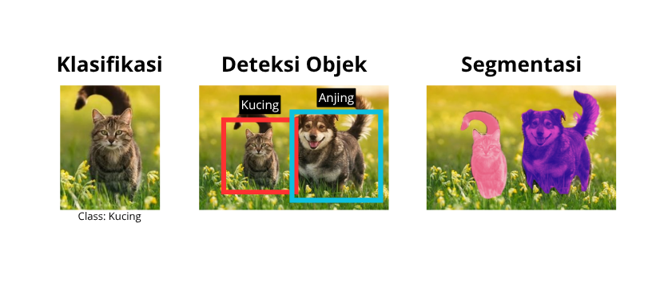

**Gambar 2.1 Perbandingan Klasifikasi, Deteksi Objek, dan Segmentasi**

Deteksi objek merupakan tugas yang relevan untuk inspeksi visual karena tidak hanya mengenali jenis cacat, tetapi juga menunjukkan lokasinya. Representasi dan sistem koordinat *bounding box* ditunjukkan pada Gambar 2.2.

**Gambar 2.2 Anatomi dan Representasi Koordinat *Bounding Box***

### 2.1.3 Deep Learning

*Deep Learning* adalah cabang dari *machine learning* yang mempelajari representasi data dengan banyak lapisan pemrosesan (Goodfellow et al., 2016). *Machine learning* konvensional membutuhkan ekstraksi fitur secara *manual*, sedangkan *deep learning* memperoleh fitur secara otomatis dari data mentah (Han et al., 2017). Perbedaan alur kerja keduanya ditunjukkan pada Gambar 2.3.

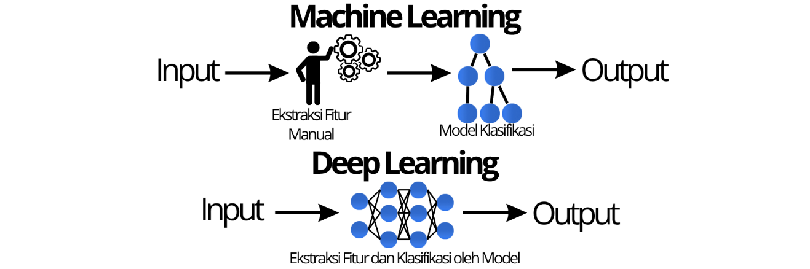

**Gambar 2.3 Perbedaan cara kerja *Machine Learning* dan *Deep Learning***

Pelatihan jaringan saraf tiruan terdiri atas empat komponen utama.

1.  ***Forward Propagation***

Propagasi maju menghasilkan prediksi dari data masukan melalui operasi berlapis. Pada tiap lapisan, keluaran lapisan sebelumnya dikalikan matriks bobot, ditambah bias, lalu dilewatkan ke fungsi aktivasi (Goodfellow et al., 2016).

2.  **Fungsi Aktivasi**

Fungsi aktivasi memberikan sifat non-linear pada jaringan sehingga model mampu memodelkan hubungan yang kompleks. Fungsi yang umum digunakan adalah *Rectified Linear Unit* (ReLU) pada Persamaan 2.1, karena ringan secara komputasi dan mengurangi masalah *vanishing gradient* (LeCun et al., 2015).

$$
f(x) = \max(0,x)
$$

(2.1)

dengan $x$ nilai masukan dan $f(x)$ nilai keluaran *neuron*.

3.  ***Loss Function***

*loss function* mengukur selisih antara prediksi model dengan nilai sebenarnya (*ground truth*). *Loss function* yang umum digunakan untuk klasifikasi banyak kelas adalah *Cross-Entropy Loss* pada Persamaan 2.2 (Goodfellow et al., 2016).

$$
L = - \sum_{i = 1}^{K}y_{i}\log\left( p_{i} \right)
$$

(2.2)

dengan $K$ jumlah kelas, $y_{i}$ label sebenarnya kelas ke-*i* dalam bentuk *one-hot encoding*, dan $p_{i}$ probabilitas prediksi kelas ke-*i*.

4.  ***Back propagation***

Propagasi mundur menghitung gradien *loss function* terhadap setiap parameter menggunakan aturan rantai (*chain rule*) dengan proses perhitungan dari lapisan keluaran menuju lapisan masukan (LeCun et al., 2015). *Stochastic Gradient Descent* (SGD) digunakan untuk memperbarui parameter, sebagaimana dinyatakan pada Persamaan 2.3 (Goodfellow et al., 2016).

$$
w \leftarrow w - \eta\frac{\partial L}{\partial w}
$$

(2.3)

dengan $w$ parameter bobot, $\eta$ laju pembelajaran (*learning rate*), dan $\frac{\partial L}{\partial w}$ gradien fungsi kerugian terhadap bobot.

Siklus propagasi maju dan mundur diulang hingga model konvergen, sebagaimana diilustrasikan pada Gambar 2.4.

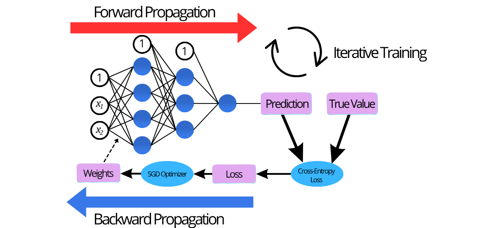

**Gambar 2.4 Diagram Alur Kerja Siklus Pelatihan Jaringan Saraf Tiruan**

### 2.1.4 Convolution Neural Network (CNN)

*Convolutional Neural Network�* (CNN) adalah jaringan saraf tiruan yang dirancang untuk data berbentuk *grid*, seperti citra (Goodfellow et al., 2016; LeCun et al., 2015). Efisiensinya terletak pada penerapan konektivitas lokal dan penggunaan parameter filter yang sama pada berbagai bagian citra (LeCun et al., 2015). Arsitektur umum CNN ditunjukkan pada Gambar 2.5.

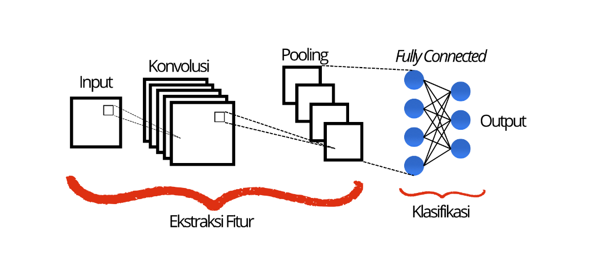

**Gambar 2.5 Ilustrasi Arsitektur *Convolutional Neural Network* (CNN)**

Pada Gambar 2.5, arsitektur CNN terdiri atas tiga jenis lapisan utama.

1.  ***Convolutional Layer***

Layer ini mengekstraksi fitur lokal dengan menggeser filter (*kernel*) di atas citra atau peta fitur (*feature map*). Setiap filter mengenali pola tertentu seperti tepi, sudut, atau tekstur (Zhao et al., 2024; Goodfellow et al., 2016). Keluarannya dilewatkan ke fungsi aktivasi seperti ReLU pada Persamaan 2.1.

2.  ***Pooling Layer***

Berfungsi untuk memperkecil dimensi spasial *feature map* (*downsampling*), misalnya dengan *max pooling* yang mengambil nilai terbesar pada setiap jendela, sehingga beban komputasi berkurang dan model lebih tahan terhadap pergeseran kecil.

3.  ***Fully Connected Layer***

Berupa *Multi-Layer Perceptron* (MLP) yang menggabungkan fitur tingkat tinggi menjadi keputusan akhir (*classifier*). Masukannya berupa *flatten vector* dari *feature map*. Skor mentah (*logit*) keluaran kepala klasifikasi diubah menjadi probabilitas oleh fungsi *softmax* pada Persamaan 2.4.

$$
p_{i} = \frac{e^{z_{i}}}{\sum_{j = 1}^{K}e^{z_{j}}}
$$

(2.4)

dengan $p_{i}$ probabilitas kelas ke-*i*, $z_{i}$ *logit* kelas ke-*i*, dan $K$ jumlah kelas.

Lapisan konvolusi dan *pooling* menghasilkan *feature map* berukuran $C \times H \times W$, dengan setiap kanal merepresentasikan hasil satu filter dan posisi $(h,w)$ menunjukkan lokasinya (Goodfellow et al., 2016). *Stride* menyatakan langkah pergeseran filter, sedangkan *stride* total lapisan ke-*l* dan koordinat citra yang berkorespondensi dengan posisi $(h,w)$ dinyatakan pada Persamaan 2.5 dan 2.6 (Araujo et al., 2019).

$$
S_{l} = \prod_{i = 1}^{l}s_{i}
$$

(2.5)

$$
(u,v) = \left( S_{l} \cdot w,S_{l} \cdot h \right)
$$

(2.6)

dengan $S_{l}$ *stride* total lapisan ke-*l*, $s_{i}$ *stride* lapisan ke-*i*, $\left( h,w \right)$ indeks baris dan kolom pada *feature map*, dan $\left( u,v \right)$ koordinat pada citra.

Luas daerah (*region*) citra yang memengaruhi nilai satu sel *feature map* disebut *Receptive Field* (Goodfellow et al., 2016; Luo et al., 2016). Ukurannya membesar seiring kedalaman jaringan, sebagaimana dinyatakan pada Persamaan 2.7 (Araujo et al., 2019).

$$
r_{l} = r_{l - 1} + \left( k_{l} - 1 \right)\prod_{i = 1}^{l - 1}s_{i},\quad r_{0} = 1
$$

(2.7)

dengan $r_{l}$ ukuran *receptive field* lapisan ke-*l* dalam piksel, $k_{l}$ ukuran kernel lapisan ke-*l*, dan $s_{i}$ *stride* lapisan ke-*i*.

*Stride* total pada Persamaan 2.5 menentukan posisi pusat region citra yang diwakili setiap sel *feature map*, sedangkan *receptive field* pada Persamaan 2.7 menentukan luas region tersebut. Keduanya memungkinkan setiap sel dipetakan kembali ke *region* citra, sehingga bobot pada feature map dapat diterjemahkan menjadi *explanation* spasial pada citra, sebagaimana digunakan pada Subbab 2.1.8. *Receptive field* antarsel dapat saling tumpang-tindih, seperti ditunjukkan pada Gambar 2.6 (Luo et al., 2016).

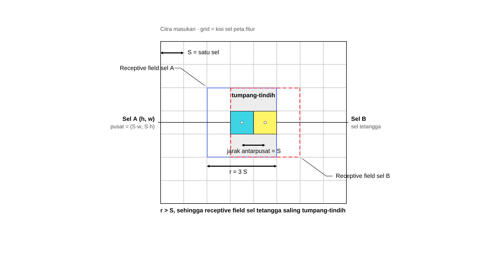

**Gambar 2.6 Ilustrasi Stride dan Receptive Field**

### 2.1.5 *Faster* R-CNN

*Faster�* R-CNN adalah arsitektur deteksi objek dua tahap (*two-stage*) yang menyatukan pengusulan area dan klasifikasi dalam satu jaringan yang dilatih secara *end-to-end* (Ren et al., 2017). Keunggulannya terletak pada *Region Proposal Network* (RPN) yang menggantikan metode pencarian area eksternal, sehingga seluruh komponen berbagi *feature map* yang sama. Arsitektur standarnya ditunjukkan pada Gambar 2.7.

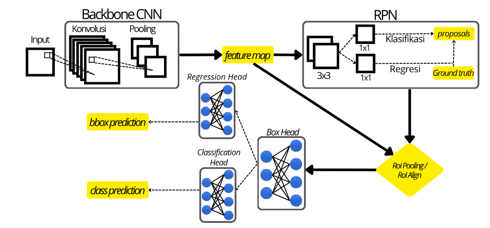

**Gambar 2.7 Arsitektur *Faster* R-CNN Standar**

Salah satu varian *Faster* R-CNN untuk PCB adalah SF-PSPyramid (Fung et al., 2024), yaitu *Faster* R-CNN dengan *neck* yang dirancang untuk cacat berukuran mikro pada PCB, sebagaimana ditunjukkan pada Gambar 2.8.

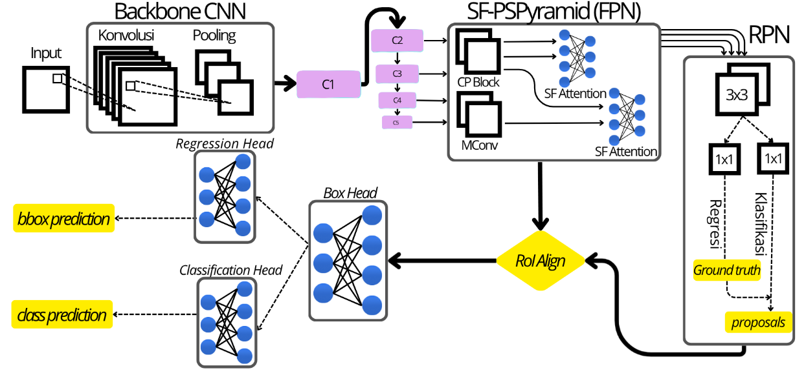

**Gambar 2.8 Arsitektur modifikasi *Faster* R-CNN dengan SF-PSPyramid**

Pada Gambar 2.8, arsitektur tersebut terdiri atas enam komponen berikut.

1.  **Backbone** 

*Backbone�* adalah jaringan CNN yang mengubah citra menjadi *feature map*. SF-PSPyramid menggunakan ResNet-50, yang terdiri atas empat kelompok lapisan ($C_{2}$, $C_{3}$, $C_{4}$, $C_{5}$) dengan resolusi menurun dan makna semantik meningkat (He et al., 2016), masing-masing ber-*stride* total 4, 8, 16, dan 32 piksel.

2.  ***Neck (SF-PSPyramid)***

*Neck�* adalah modul yang menggabungkan fitur berbagai skala dari *backbone* menjadi piramida fitur. Dasarnya adalah *Feature Pyramid Network (FPN)*, yang menggabungkan jalur *bottom-up*, jalur *top-down*, dan koneksi lateral antartingkat (Lin et al., 2017). SF-PSPyramid menyempurnakan FPN dengan tiga perbedaan (Fung et al., 2024).

a.  ***CP Block***

CP Block adalah modul pembesar resolusi berbasis penataan ulang kanal (*pixel shuffle*) (Shi et al., 2016), bukan interpolasi, sehingga pembesarannya bersifat terpelajar, sebagaimana dinyatakan pada Persamaan 2.8.

$$
PS(T)_{c,h,w} = T_{c \cdot r^{2} + r \cdot \text{mod}(h,r) + \text{mod}(w,r),\left\lfloor h/r \right\rfloor,\left\lfloor w/r \right\rfloor}
$$

(2.8)

dengan $T$ tensor masukan, $r$ faktor pembesaran, serta $c,h,w$ indeks kanal, baris, dan kolom keluaran.

b.  ***Selective Feature Attention***

*Selective Feature Attention* menggabungkan dua tingkat fitur menggunakan bobot yang dipelajari dan dinormalisasi dengan *softmax* (Li et al., 2019), sebagaimana dinyatakan pada Persamaan 2.9.

$$
P' = \alpha_{1} \odot U + \alpha_{2} \odot V,\quad\left\lbrack \alpha_{1},\alpha_{2} \right\rbrack = \text{softmax}\left( W_{2}\delta\left( W_{1}z \right) \right)
$$

(2.9)

dengan $U$ *feature map* tingkat lebih dalam, $V$ *feature map* beresolusi lebih tinggi, $z$ hasil *global average pooling*, $W_{1}$ dan $W_{2}$ bobot lapisan kompresi dan perluasan, $\delta$ fungsi ReLU, dan $\odot$ perkalian per kanal.

c.  **Susunan piramida tanpa koneksi lateral**

SF-PSPyramid membentuk $P_{2}'$ dan $P_{3}'$ langsung dari gabungan $C_{2}$ hingga $C_{5}$ melalui CP Block pada Persamaan 2.8, bukan dari koneksi lateral seperti FPN standar, sehingga tetap beresolusi tinggi namun memuat informasi semantik penuh yang membantu deteksi cacat sangat kecil (Fung et al., 2024), sebagaimana ditunjukkan pada Gambar 2.8.

Piramida fitur SF-PSPyramid terdiri atas P2′, P3′, P4, P5, dan P6 (*max pooling* dari P5) dengan *stride* 4, 8, 16, 32, dan 64 piksel dan jumlah kanal *C* yang sama.

3.  ***Region Proposal Network* (RPN)**

RPN adalah jaringan pengusul area kandidat objek. Untuk setiap *anchor box*, yaitu kotak acuan dengan beragam ukuran dan rasio pada setiap posisi *feature map*, RPN memprediksi skor objektivitas dan empat nilai penyesuaian koordinat (Ren et al., 2017) sebagaimana dinyatakan pada Persamaan 2.10 sampai 2.13.

$$
t_{x} = \frac{x - x_{a}}{w_{a}}
$$

(2.10)

$$
t_{y} = \frac{y - y_{a}}{h_{a}}
$$

(2.11)

$$
t_{w} = \log\left( \frac{w}{w_{a}} \right)
$$

(2.12)

$$
t_{h} = \log\left( \frac{h}{h_{a}} \right)
$$

(2.13)

dengan $x,y,w,h$ pusat, lebar, dan tinggi kotak prediksi, serta $x_{a},y_{a},w_{a},h_{a}$ milik *anchor*. RPN dilatih dengan *multi-task loss* pada Persamaan 2.14 (Ren et al., 2017).

$$
L = \frac{1}{N_{cls}}\sum_{i}^{}L_{cls}\left( p_{i},p_{i}^{*} \right) + \lambda\frac{1}{N_{reg}}\sum_{i}^{}p_{i}^{*}L_{reg}\left( t_{i},t_{i}^{*} \right)
$$

(2.14)

dengan $p_{i}$ probabilitas *anchor* ke-*i* memuat objek, $p_{i}^{*}$ label sebenarnya (1 positif, 0 negatif), $N_{cls},N_{reg}$ jumlah sampel tiap suku, $L_{cls}$ *binary cross-entropy*, $L_{reg}$ *loss* regresi, dan $\lambda$ faktor penyeimbang. *Loss* regresi pada SF-PSPyramid adalah L1 pada Persamaan 2.15 (Fung et al., 2024).

$$
L_{reg}\left( t,t^{*} \right) = \sum_{j}^{}\left| t_{j} - t_{j}^{*} \right|
$$

(2.15)

dengan *j* merentang pada keempat komponen koordinat, yaitu *x*, *y*, *w*, dan *h*.

4.  ***RoI Align***

*RoI Align* menyeragamkan setiap proposal menjadi *tensor* berukuran tetap tanpa pembulatan koordinat (He et al., 2020). Nilai *feature map* pada koordinat pecahan diperoleh dengan interpolasi *bilinear* pada Persamaan 2.16.

$$
f(x,y) = \sum_{i = 1}^{4}w_{i}f_{i}
$$

(2.16)

dengan $f_{i}$ nilai fitur pada empat titik grid terdekat dan $w_{i}$ bobot interpolasi yang berbanding terbalik dengan jarak.

Keluaran *RoI Align* berupa grid $G \times G$ *bin*, dengan nilai setiap *bin* didefinisikan sebagai rata-rata beberapa titik sampel di dalamnya (He et al., 2020), sebagaimana dinyatakan pada Persamaan 2.17.

$$
x_{c,p,q} = \frac{1}{N}\sum_{n = 1}^{N}{\sum_{i = 1}^{4}{w_{n,i}\, F_{c}\left( h_{n,i},v_{n,i} \right)}}
$$

(2.17)

dengan $x_{c,p,q}$ keluaran kanal ke-*c* pada *bin* $(p,q)$, $N$ jumlah titik sampel per *bin*, $w_{n,i}$ bobot interpolasi titik sampel ke-*n*, dan $F_{c}\left( h_{n,i},v_{n,i} \right)$ nilai *feature map* kanal ke-*c* pada titik grid terdekat. Dalam bentuk matriks, Persamaan 2.17 dapat ditulis sebagai Persamaan 2.18.

$$
x_{c} = A\, F_{c}
$$

(2.18)

dengan $x_{c}$ vektor keluaran kanal ke-*c* ($G \times G$ nilai), $F_{c}$ vektor nilai *feature map* kanal ke-*c*, dan $A$ matriks koefisien interpolasi yang hanya bergantung pada proposal dan sama untuk setiap kanal.

Pada piramida fitur, tingkat piramida (*pyramid level*) asal fitur setiap proposal ditentukan oleh ukurannya melalui Persamaan 2.19 (Lin et al., 2017).

$$
k = \left\lfloor k_{0} + \log_{2}\left( \frac{\sqrt{wh}}{224} \right) \right\rfloor
$$

(2.19)

dengan $k$ tingkat terpilih, $k_{0} = 4$ tingkat acuan untuk proposal 224×224 piksel, serta $w,h$ lebar dan tinggi proposal.

5.  ***Box Head***

*Box Head* adalah MLP dengan dua lapisan terhubung penuh yang memetakan keluaran *RoI Align* yang telah diratakan menjadi representasi RoI (Girshick, 2015; Ren et al., 2017).

Di atas representasi RoI terdapat dua cabang keluaran yang bekerja berdampingan (*two sibling output layers*) (Girshick, 2015; Ren et al., 2017). Cabang klasifikasi (*classification head*) menghasilkan skor untuk $K + 1$ kelas, termasuk *background*, melalui *softmax* pada Persamaan 2.4 dan dilatih dengan *cross-entropy* pada Persamaan 2.2. Cabang regresi (*regression head*) menghasilkan empat nilai koreksi koordinat untuk setiap kelas pada Persamaan 2.10–2.13 dan dilatih dengan *loss* L1 pada Persamaan 2.15.

6.  ***Soft-*NMS**

*Soft*-NMS adalah metode penyaringan deteksi tumpang-tindih yang menurunkan skor kandidat secara bertahap (Bodla et al., 2017), sehingga objek yang berdekatan tidak ikut terbuang. Penurunan skor tersebut dinyatakan pada Persamaan 2.20.

$$
s_{i} = \left\{ \begin{matrix}
s_{i}, & IoU\left( M,b_{i} \right) < N_{t} \\
s_{i}\left( 1 - IoU\left( M,b_{i} \right) \right), & IoU\left( M,b_{i} \right) \geq N_{t}
\end{matrix} \right.\
$$

(2.20)

dengan $s_{i}$ dan $b_{i}$ skor dan kotak kandidat ke-*i*, $M$ kandidat berskor tertinggi, dan $N_{t}$ ambang IoU.

### 2.1.6 *Explainable Artificial Intelligence* (XAI)

*Explainable Artificial Intelligence�* (XAI) adalah bidang yang mengembangkan cara agar keputusan model kecerdasan buatan dapat dipahami manusia (Ali et al., 2023). XAI dibutuhkan karena model *deep learning* bersifat *black-box* (Samek et al., 2019). Berdasarkan waktu explanation dibentuk, XAI terbagi atas dua pendekatan.

**1. Pendekatan *post-hoc***

Pendekatan ini menghasilkan *explanation* setelah model memprediksi tanpa mengubah struktur model, misalnya LIME, SHAP, dan Grad-CAM. *Explanation* yang dihasilkan bersifat aproksimasi dan tidak dijamin mencerminkan keputusan internal model (Rudin, 2019; Rudin et al., 2022).

**2. Pendekatan *ante-hoc***

Pendekatan ini menanamkan kemampuan menjelaskan ke dalam struktur model, misalnya pohon keputusan, model linear, dan arsitektur *neuro-symbolic* (Ali et al., 2023; Rudin et al., 2022).

*Explanation* untuk citra umumnya berupa peta atribusi (*attribution map*), yaitu peta besar kontribusi setiap posisi terhadap skor kelas (Bach et al., 2015). *Attribution map* yang divisualisasikan dengan skala warna di atas citra disebut *heatmap*. Dua metode atribusi yang relevan dijelaskan berikut.

1.  ***Gradient-weighted Class Activation Mapping* (Grad-CAM)**

Grad-CAM menghasilkan *attribution map* spesifik-kelas tanpa mengubah maupun melatih ulang model (Selvaraju et al., 2017). Bobot kepentingan *feature map* ke-*k* terhadap kelas *c* dan *attribution map* dinyatakan pada Persamaan 2.21 dan 2.22.

$$
\alpha_{k}^{c} = \frac{1}{Z}\sum_{i}^{}{\sum_{j}^{}\frac{\partial y^{c}}{\partial A_{ij}^{k}}}
$$

(2.21)

$$
L_{Grad\text{-}CAM}^{c} = ReLU\left( \sum_{k}^{}{\alpha_{k}^{c}A^{k}} \right)
$$

(2.22)

dengan $y^{c}$ skor kelas *c* sebelum *softmax*, $A^{k}$ feature map ke-*k* pada lapisan konvolusi acuan, $A_{ij}^{k}$ nilainya pada posisi $\left( i,j \right)$, dan $Z$ jumlah posisi spasial. Contoh hasil Grad-CAM ditunjukkan pada Gambar 2.9.

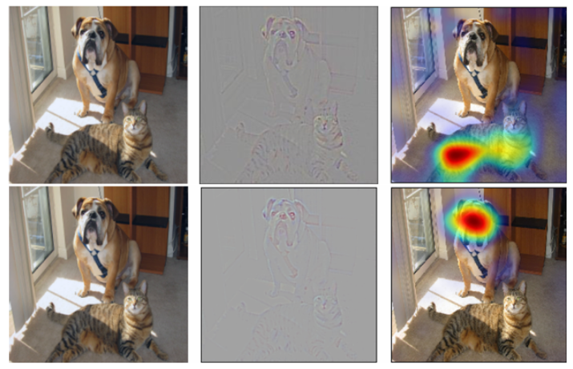

**Gambar 2.9 Hasil penjelasan dari Grad-CAM (Selvaraju et al., 2017)**

2.  **Gradient *×* Input**

*Gradient × Input* menghitung kontribusi setiap elemen masukan sebagai hasil kali nilai elemen dan gradien keluaran terhadap elemen tersebut (Shrikumar et al., 2017; Ancona et al., 2019), sebagaimana dinyatakan pada Persamaan 2.23.

$$
R_{j}(x) = x_{j} \cdot \frac{\partial f(x)}{\partial x_{j}}
$$

(2.23)

dengan $R_{j}$ kontribusi elemen ke-*j*, $x_{j}$ nilai elemen ke-*j*, dan $f(x)$ keluaran model.

Metode atribusi yang baik diharapkan memenuhi sifat *completeness*, yaitu jumlah seluruh atribusi sama dengan selisih keluaran model pada masukan dan pada masukan acuan (*baseline*) $\overline{x}$ (Sundararajan et al., 2017), sebagaimana dinyatakan pada Persamaan 2.24.

$$
\sum_{j}^{}{R_{j}(x)} = f(x) - f\left( \overline{x} \right)
$$

(2.24)

*Gradient × Input* umumnya tidak memenuhi sifat ini pada model non-linear, tetapi memenuhinya secara eksak pada model linear dengan *baseline* nol (Ancona et al., 2019), sebagaimana ditunjukkan pada Persamaan 2.25

$$
\sum_{j}^{}{w_{j}x_{j}} = w^{T}x = f(x) - f(0)
$$

(2.25)

### 2.1.7 *Neuro-Symbolic* AI (NeSy)

*Neuro-Symbolic* AI (NeSy) menggabungkan pembelajaran statistik jaringan saraf dengan penalaran berbasis aturan pada sistem simbolik (d'Avila Garcez & Lamb, 2023), untuk menyatukan kemampuan mengenali pola dari data mentah dengan transparansi penalaran (Kautz, 2022). Arsitektur NeSy ditunjukkan pada Gambar 2.10.

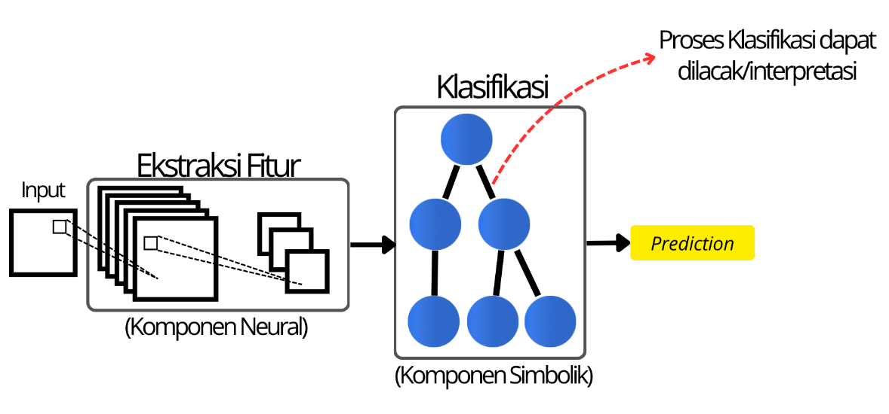

**Gambar 2.10 Arsitektur *Neuro-Symbolic***

Arsitektur NeSy terdiri atas dua komponen utama.

**1. Komponen *neural*,** berfungsi untuk mengubah data mentah menjadi representasi fitur numerik (d'Avila Garcez & Lamb, 2023).

**2. Komponen simbolik,**  mengolah representasi fitur melalui aturan yang dapat ditelusuri sehingga *explanation* yang dihasilkan bersifat *faithful*, yaitu merepresentasikan proses keputusan model itu sendiri, bukan aproksimasi (Rudin, 2019). Komponen ini dapat dibentuk melalui *model mimicking*, yaitu melatih model sederhana untuk meniru keluaran model kompleks (*teacher*) menggunakan prediksi *teacher* sebagai label pelatihan (Buciluǎ et al., 2006; Hinton et al., 2015).

Kedua komponen tersebut menghasilkan keluaran dalam bentuk yang berbeda**.** Keluaran komponen *neural* bersifat kontinu, sedangkan keluaran komponen simbolik bersifat diskrit karena berupa label kelas. Diskritisasi ini memetakan banyak nilai kontinu ke label yang sama sehingga informasi tingkat keyakinan hilang (Provost & Domingos, 2003). Informasi tersebut tetap tersimpan pada nilai keputusan sebelum diskritisasi dan dapat dinyatakan melalui dua konsep berikut.

1.  *Margin*

Pada fungsi keputusan bernilai riil, tanda keluaran menyatakan label, sedangkan besarnya menyatakan *confidence*. Keluaran yang dekat dengan nol berarti *confidence* rendah, dan yang jauh dari nol berarti *confidence* tinggi (Schapire & Singer, 1999). Besar *margin* dinyatakan pada Persamaan 2.26.

$$
m(x) = \left| f(x) \right|
$$

(2.26)

dengan $f(x)$ fungsi keputusan linear.

2.  Fungsi *Sigmoid*

Fungsi *sigmoid* adalah fungsi monoton naik yang memetakan nilai riil ke selang 0 dan 1 (Platt, 1999), sebagaimana dinyatakan pada Persamaan 2.27.

$$
\sigma(z) = \frac{1}{1 + e^{- z}}
$$

(2.27)

dengan $z$ nilai masukan dan $e$ bilangan Euler.

### 2.1.8 *Sparse Oblique Decision Tree* (SODT)

*Sparse Oblique Decision Tree�* (SODT) adalah pohon keputusan yang melakukan pemisahan linear multivariat (*oblique split*) pada setiap *node* internal, berbeda dengan pohon *axis-aligned* yang hanya memakai satu fitur per pemisahan (Hada et al., 2024). Setiap *node* internal meneruskan masukan ke salah satu dari dua anaknya, dan label pada *leaf*  yang dicapai menjadi prediksi pohon. Fungsi keputusan *node* internal ke-*i* dinyatakan pada Persamaan 2.28.

$$
w_{i}^{T}x + b_{i} \geq 0
$$

(2.28)

dengan $x$ vektor fitur berdimensi $D$, $w_{i}$ vektor bobot, dan $b_{i}$ bias *node* ke-*i*.

Arah percabangan ditentukan oleh tanda fungsi keputusan $f_{i}(x)$. Nilai $f_{i}(x) \geq 0$ mengarahkan masukan ke anak kiri, sedangkan $f_{i}(x) < 0$ ke anak kanan. Rangkaian *node* dari *root* hingga *leaf* membentuk jalur keputusan (*decision path*) (Hada et al., 2024; Kairgeldin & Carreira-Perpiñán, 2025).. Ilustrasinya ditunjukkan pada Gambar 2.11.

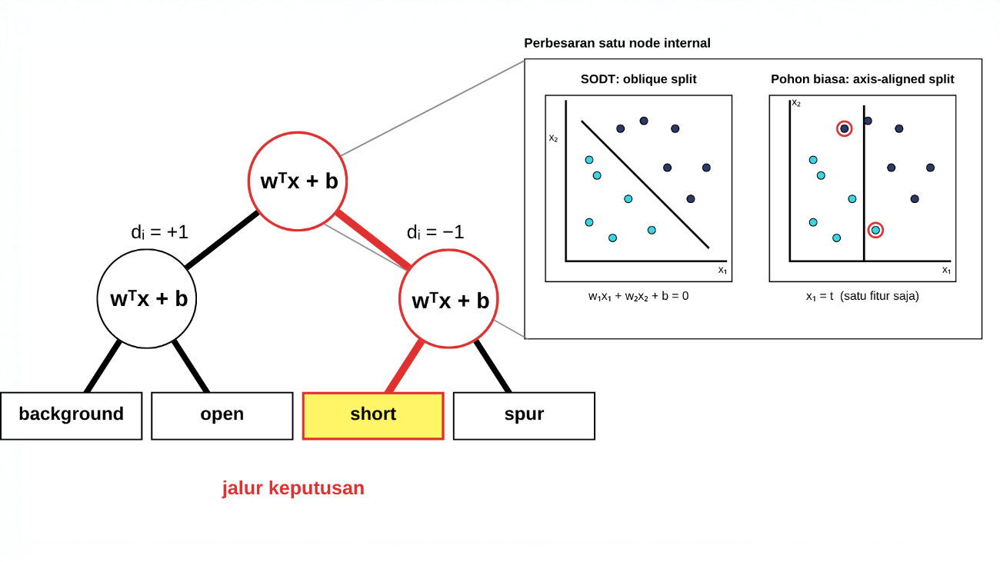

**Gambar 2.11 Ilustrasi SODT dan perbedaan dengan Decision Tree biasa**

Apabila $x$ berasal dari perataan *feature map* $C \times H \times W$ sesuai Subbab 2.1.4, setiap elemennya berkorespondensi dengan kanal dan posisi spasial tertentu pada *feature map*. Karena bobot $w_{i}$ dikalikan pada indeks yang sama pada Persamaan 2.28, bobot tersebut dapat disusun kembali menjadi grid $C \times H \times W$ untuk menunjukkan fitur yang digunakan *node* (Hada et al., 2024; Kairgeldin & Carreira-Perpiñán, 2025).

Dalam penerapannya, SODT memiliki beberapa aspek utama yang berkaitan dengan pembentukan, optimasi, dan interpretasi keputusan, yaitu sebagai berikut.

1.  **Regularisasi L1 dan Sparsitas**

Sifat *sparse* diperoleh melalui regularisasi L1 pada fungsi tujuan pelatihan pada Persamaan 2.29, yang membuat bobot fitur tidak relevan bernilai tepat nol (Hada et al., 2024).

$$
E(\Theta) = \sum_{n = 1}^{N}L\left( \mathbf{y}_{n},T\left( \mathbf{x}_{n};\Theta \right) \right) + \lambda\sum_{i \in \mathcal{D}}^{}\left\| \mathbf{w}_{i} \right\|_{1}
$$

(2.29)

dengan $\Theta$ parameter pohon, $N$ jumlah sampel, $x_{n}$ dan $y_{n}$ fitur serta label sampel ke-*n*, $T\left( x_{n};\Theta \right)$ prediksi pohon, $L$ *loss function* klasifikasi, $\mathcal{N}$ himpunan *node* internal, dan $\lambda$ pengontrol sparsitas. *Node* dengan seluruh bobot nol hanya ditentukan oleh bias sehingga selalu mengarahkan masukan ke sisi yang sama. Bobot bernilai tidak nol (*nonzero weight*) menunjukkan fitur yang digunakan dalam keputusan dan jumlahnya mencerminkan kompleksitas pohon. Sparsitas dinyatakan sebagai proporsi bobot nol terhadap seluruh bobot *node* internal (Hada et al., 2024).

2.  ***Tree Alternating Optimization (TAO)***

Persamaan 2.29 tidak dapat dioptimasi dengan metode berbasis gradien karena keputusan pohon diskrit, dan tidak didukung oleh metode pembentukan pohon konvensional. *Tree Alternating Optimization* (TAO) memecahnya menjadi masalah klasifikasi biner yang diselesaikan terpisah untuk setiap *node* (Carreira-Perpiñán & Tavallali, 2018), sebagaimana dinyatakan pada Persamaan 2.30.

$$
E_{i}(w_{i},b_{i}) = \sum_{n \in \mathcal{R}_{i}}^{}\overset{‾}{L}({\bar{y}}_{n},g_{i}(x_{n};w_{i},b_{i})) + \lambda \parallel w_{i} \parallel_{1}
$$

(2.30)

dengan $\mathcal{R}_{i}$ sampel yang mencapai *node* ke-*i* (*reduced set*), ${\overline{y}}_{n}$ *pseudo-label* arah kiri atau kanan, $g_{i}$ keputusan biner *node*, dan $\overline{L}$ *loss* 0/1.

Pada setiap *node*, tidak semua sampel dalam $\mathcal{R}_{i}$ berpengaruh. Sampel yang menghasilkan prediksi sama pada kedua arah diabaikan, sedangkan sisanya (*care set*) diberi *pseudo-label* berdasarkan arah yang menghasilkan prediksi benar. Klasifikasi biner pada setiap *node* ini disebut *reduced problem* dan diselesaikan dengan regresi logistik berregularisasi L1 sebagai *surrogate* *loss* 0/1. Setiap *leaf* diberi label kelas mayoritas dari sampel yang mencapainya. TAO menyelesaikan setiap *node* secara bergantian dari yang terdalam menuju *root*. Pembaruan *node* hanya diterima apabila memperbaiki *reduced problem* pada *node* tersebut, sehingga fungsi tujuan tidak pernah meningkat (Carreira-Perpiñán & Tavallali, 2018; Hada et al., 2024; Kairgeldin & Carreira-Perpiñán, 2025).

Pada TAO standar, penalti $\lambda$ sama untuk setiap *node*, sehingga *node* dengan lebih banyak sampel cenderung kurang *sparse*. Kairgeldin dan Carreira-Perpiñán (2025) mengatasinya dengan membobot penalti berdasarkan jumlah sampel pada *node* melalui parameter $\alpha$, sebagaimana dinyatakan pada Persamaan 2.31 dan 2.32.

$$
E(\Theta) = \sum_{n = 1}^{N}{L(}\mathbf{y}_{n},T(\mathbf{x}_{n};\Theta)) + \lambda\sum_{i \in \mathcal{D}}^{}h_{\alpha}( \mid \mathcal{R}_{i} \mid ) \parallel \mathbf{w}_{i} \parallel_{1}
$$

(2.31)

$$
h_{\alpha}(t) = \left\{ \begin{matrix}
1, & t = 0 \\
t^{\alpha}, & t > 0
\end{matrix} \right.\
$$

(2.32)

dengan $\left| \mathcal{R}_{i} \right|$ jumlah sampel yang mencapai *node* ke-*i*. Nilai $\alpha > 0$ memperbesar penalti pada *node* yang menangani lebih banyak sampel dibandingkan TAO standar ($\alpha = 0$), sedangkan $\alpha = 1$ menghasilkan penalti yang sama per sampel pada setiap *node* (Kairgeldin & Carreira-Perpiñán, 2025).

3.  ***Class Weighting***

Pada *model mimicking* sesuai Subbab 2.1.7, label pelatihan SODT adalah prediksi *teacher*. Apabila sebagian kelas jauh lebih jarang, pohon cenderung mengabaikannya. *Cost-sensitive learning* mengatasinya dengan memberi biaya kesalahan yang berbeda antarkelas (Elkan, 2001; He & Garcia, 2009), sebagaimana dinyatakan pada Persamaan 2.33.

$$
E_{\omega}(\Theta) = \sum_{n = 1}^{N}{\omega_{y_{n}}L\left( y_{n},T\left( x_{n};\Theta \right) \right)}
$$

(2.33)

dengan $\omega_{y_{n}} \geq 0$ biaya kesalahan kelas $y_{n}$.

5.  ***Explanation* melalui *Weight Node***

Setiap *node* bersifat linear dan *sparse*, sehingga bobot $w_{i}$ menunjukkan fitur yang digunakan *node*. Bobot nol menunjukkan fitur yang tidak digunakan, sedangkan tanda dan besarnya bobot menunjukkan arah dan kekuatan pengaruh. Hada et al. (2024) memvisualisasikan bobot tersebut untuk menelusuri fitur yang membedakan antarkelas.

Kairgeldin dan Carreira-Perpiñán (2025) menerapkannya pada model hibrida CNN dan SODT. Karena setiap fitur berasal dari sel *feature map* CNN dengan *Receptive Field* sesuai subbab 2.1.4, bobot *node* dapat dipetakan ke citra melalui peta kepadatan *Receptive Field* (RF *density map*) untuk setiap *node*, sebagaimana dinyatakan pada Persamaan 2.34.

$$
\rho_{i}(u) = \sum_{j = 1}^{D}{\left| w_{ij} \right| \cdot \mathbb{1}\left\lbrack u \in {RF}_{j} \right\rbrack}
$$

(2.34)

dengan $\rho_{i}(u)$ kepadatan pada posisi citra $u$ untuk *node* ke-*i*, $w_{ij}$ bobot fitur ke-*j*, $RF_{j}$ *Receptive Field* fitur ke-*j*, dan $\mathbb{1}\lbrack \cdot \rbrack$ fungsi indikator. Kepadatan nol menunjukkan *region* tersebut tidak digunakan oleh *node* (Kairgeldin & Carreira-Perpiñán, 2025). Peta ini disusun untuk setiap *node* dan hanya bergantung pada bobot, sehingga bersifat statis.

### 2.1.9 Metrik Evaluasi

Evaluasi dibagi menjadi evaluasi kinerja deteksi objek dan evaluasi kualitas *explanation*.

1.  **Metrik Evaluasi Deteksi Objek**

*Intersection over Union�* (IoU) mengukur rasio luas irisan terhadap luas gabungan *bounding box* prediksi dan *ground truth* pada Persamaan 2.35. Berdasarkan ambang IoU, prediksi dikelompokkan menjadi *True Positive�* (TP), *False Positive* (FP), dan *False Negative* (FN), yang menjadi dasar *Precision* dan *Recall* yang didefinisikan pada Persamaan 2.36 dan 2.37.

$$
IoU = \frac{\text{Area~Prediksi} \cap \text{Area~Ground~Truth}}{\text{Area~Prediksi} \cup \text{Area~Ground~Truth}}
$$

(2.35)

$$
\text{Precision} = \frac{TP}{TP + FP}\text{ }
$$

(2.36)

$$
\text{Recall} = \frac{TP}{TP + FN}
$$

(2.37)

*Precision* mengukur ketepatan prediksi positif, sedangkan *Recall* mengukur kelengkapan deteksi. F1-*score* adalah rata-rata harmonik *Precision* dan *Recall* (Persamaan 2.38) (Sokolova & Lapalme, 2009).

$$
F1 = \frac{2 \cdot Precision \cdot Recall}{Precision + Recall}
$$

(2.38)

*Average Precision* (AP) adalah luas di bawah kurva *Precision-Recall* pada Persamaan 2.39, dan *mean Average Precision* (mAP) adalah rata-rata AP seluruh kelas pada Persamaan 2.40 (Everingham et al., 2010).

$$
AP = \int_{0}^{1}{Precision(Recall)\, d(Recall)}
$$

(2.39)

$$
mAP = \frac{1}{K}\sum_{i = 1}^{K}{AP}_{i}
$$

(2.40)

dengan $K$ jumlah kelas dan ${AP}_{i}$ AP kelas ke-*i*. mAP@0,5 dihitung pada ambang IoU 0,5, sedangkan mAP@0,5:0,95 merupakan rata-rata mAP pada ambang IoU 0,5 hingga 0,95 dengan kenaikan 0,05 (Lin et al., 2014).

2.  **Metrik Evaluasi Fidelitas SODT**

Fidelitas SODT terhadap *teacher* diukur menggunakan *mimic accuracy*, *macro*-F1, dan *agreement* per kelas. *Mimic accuracy* merupakan proporsi RoI yang memiliki label sama dengan *teacher*, sedangkan *agreement* per kelas merupakan proporsi RoI yang diberi suatu kelas oleh *teacher* dan juga diberi kelas tersebut oleh SODT.

3.  **Metrik Evaluasi *Explainability***

Evaluasi XAI tidak melibatkan pengguna melalui ukuran kuantitatif (*functionally-grounded*) (Doshi-Velez & Kim, 2017; Nauta et al., 2023). Penelitian ini berfokus pada evaluasi *functionally-grounded*, khususnya *faithfulness* dan lokalisasi.

a.  ***Faithfulness***

*Faithfulness* umumnya diuji melalui perturbasi, yaitu dengan menghapus (*masking*) atau mempertahankan bagian masukan yang disorot *explanation* dan mengamati perubahan keluaran model (Petsiuk et al., 2018).

*Necessity* (DeYoung et al., 2020; Canha et al., 2025) menguji apakah fitur yang disorot diperlukan dengan menghapusnya lalu mengamati perubahan prediksi, sebagaimana Persamaan 2.41. Sebaliknya, *Sufficiency* menguji apakah fitur tersebut cukup dengan hanya mempertahankannya lalu mengamati apakah prediksi tetap, sebagaimana Persamaan 2.42.

$$
\text{Necessity~Flip~Rate} = \frac{1}{N}\sum_{n = 1}^{N}{\mathbb{1}\left\lbrack \widehat{y}\left( x_{n}^{- S} \right) \neq \widehat{y}\left( x_{n} \right) \right\rbrack}
$$

(2.41)

$$
\text{Sufficiency~Preservation} = \frac{1}{N}\sum_{n = 1}^{N}{\mathbb{1}\left\lbrack \widehat{y}\left( x_{n}^{S} \right) = \widehat{y}\left( x_{n} \right) \right\rbrack}
$$

(2.42)

dengan $S$ himpunan fitur atau *region* yang disorot paling penting oleh *explanation*, $x_{n}^{- S}$ masukan tanpa $S$ (dinolkan), $x_{n}^{S}$ masukan yang hanya mempertahankan $S$, $\widehat{y}$ keluaran model, dan $\mathbb{1}\lbrack \cdot \rbrack$ fungsi indikator. Nilai tinggi pada kedua metrik menunjukkan *explanation* yang *faithful*.

*Faithfulness* juga dapat diukur secara bertahap dengan *Deletion* AUC dan *Insertion* AUC (Petsiuk et al., 2018), yaitu luas di bawah kurva skor seiring fitur dihapus atau ditambahkan dalam $K$ tahap seperti pada Persamaan 2.43.

$$
AUC = \sum_{k = 1}^{K - 1}{\frac{s_{k} + s_{k + 1}}{2} \cdot \Delta x_{k}}
$$

(2.43)

dengan $s_{k}$ skor ternormalisasi pada tahap ke-*k* dan $\Delta x_{k}$ proporsi area yang dimodifikasi antartahap.

Pada *Deletion*, fitur terpenting dihapus lebih dulu, sehingga AUC rendah menandakan *necessity* yang baik. Pada *Insertion*, fitur terpenting ditambahkan lebih dulu, sehingga AUC tinggi menandakan *sufficiency* yang baik.

b.  ***Localization***

*Localization* mengukur kesesuaian area yang disorot *heatmap* dengan lokasi objek. *Pointing Game* menghitung proporsi kasus ketika titik tertinggi *heatmap* jatuh di dalam *bounding box ground truth* seperti pada Persamaan 2.44 (Zhang et al., 2018), sedangkan IoU *Heatmap* mengukur IoU antara *heatmap* terbinerisasi dan *bounding box ground truth* (Zhou et al., 2016) yang didefinisikan pada Persamaan 2.45.

$$
{Acc}_{PG} = \frac{Hits}{Hits + Misses}
$$

(2.44)

$$
{IoU}_{Heatmap} = \frac{\left| H_{bin} \cap B_{gt} \right|}{\left| H_{bin} \cup B_{gt} \right|}
$$

(2.45)

dengan $Hits$ dan $Misses$ jumlah kasus yang titik maksimumnya berada di dalam dan di luar *ground truth*, $H_{bin}$ *heatmap* yang hanya mempertahankan sejumlah posisi bernilai tertinggi, dan $B_{gt}$ daerah *ground truth*.

## 2.2 Penelitian Terkait

Penelitian terkait yang menjadi landasan penelitian ini dirangkum pada Tabel 2.2.

**Tabel 2.2 Ringkasan dan Perbandingan Penelitian Terkait**

| **No.** | **Judul / Penulis** | **Masalah** | **Tujuan** | **Metode** | **Hasil** | **Keterkaitan** |
|:--:|--------------|------------|-------------|------------|----------|---------|
| 1\. | *Improving PCB defect detection using selective feature attention and pixel shuffle pyramid (Fung et al., 2024)* | Deteksi cacat mikroskopis pada sirkuit PCB memiliki tingkat *false negative* yang tinggi pada model deteksi standar. | Meningkatkan kemampuan model melokalisasi target berukuran kecil pada citra PCB. | *Faster* R-CNN dengan *Feature Pyramid Network* (FPN), *Pixel Shuffle Pyramid* (PSPyramid), *Selective Feature Attention*, dan *Soft*-NMS. | Terjadi peningkatan *Mean Average Precision* (mAP) yang signifikan pada pengujian *dataset* DeepPCB. | Penelitian ini menjadi referensi utama arsitektur dasar (*baseline*) komponen *neural* (ekstraktor fitur dan lokalisasi) yang digunakan dalam tugas akhir ini. |
| 2\. | *Neuro-Symbolic Methods for Trustworthy AI: A Systematic Review With a Focus on Interpretability (Michel-Delétie & Sarker, 2026)* | Kemajuan *deep learning* memunculkan kekhawatiran terhadap *trustworthiness* model, terutama karena keputusannya sulit diinterpretasikan. | Meninjau cara metode *neuro-symbolic* digunakan untuk meningkatkan *trustworthiness* model, dengan fokus pada interpretabilitas. | Tinjauan sistematis terhadap artikel terbaru dari konferensi utama, lalu pengategorian kontribusinya berdasarkan struktur simbolik yang dimanfaatkan dan jenis interpretabilitas yang dihasilkan. | Metode *neuro-symbolic* menunjukkan potensi besar bagi *trustworthiness*, khususnya interpretabilitas, dengan kontribusi yang terpetakan menurut struktur simbolik dan jenis interpretabilitasnya. | Memberikan landasan konseptual bahwa integrasi komponen simbolik ke dalam model *deep learning* dapat menghadirkan interpretabilitas, yang mendasari pemilihan arsitektur *neuro-symbolic* pada penelitian ini. |
| 3\. | *Sparse oblique decision trees: a tool to understand and manipulate neural net features (Hada et al., 2024)* | Fitur internal jaringan *deep learning* sulit diinterpretasikan sehingga tidak diketahui fitur mana yang menentukan suatu kelas (*black-box*). | Memahami dan memanipulasi fitur internal jaringan saraf dengan meniru (*mimic*) bagian *classifier*-nya menggunakan pohon keputusan yang akurat sekaligus *interpretable*. | *Sparse Oblique Decision Tree (SODT)* dengan regularisasi L1 yang dilatih menggunakan TAO untuk meniru *classifier* jaringan saraf*.* | Menghasilkan pohon yang ramping dengan akurasi mendekati jaringan saraf yang ditiru, serta mengungkap subset fitur yang menentukan kelas tertentu. | Menjadi landasan teoritis komponen simbolik untuk menggantikan MLP pada *box head* jaringan *Faster* R-CNN. |
| 4\. | *Neurosymbolic models based on hybrids of convolutional neural networks and decision trees (Kairgeldin & Carreira-Perpiñán, 2025)* | Model *end-to-end* berbasis jaringan saraf tidak menyediakan penalaran yang dapat ditelusuri, sedangkan sparsitas SODT hasil TAO standar tidak merata antar-*node* (*node* dekat *root* kurang *sparse*). | Membangun model *neurosymbolic* berupa lapisan CNN yang dikomposisikan dengan SODT, serta mengatur distribusi sparsitas antar-*node*. | CNN (LeNet) dan SODT yang dilatih dengan TAO termodifikasi (*hyperparameter* α untuk membobot penalti L1 berdasarkan jumlah sampel *node*), serta *RF density map* per *node*. | SODT yang lebih *sparse* dengan akurasi kompetitif; sekelompok kecil neuron menentukan kelas tertentu dan *receptive field*-nya terpusat pada *region* citra yang diskriminatif. | Menjadi dasar arsitektur hibrida CNN–SODT, pembobotan penalti L1 pada Persamaan 2.31 dan 2.32, serta dasar gagasan *heatmap* per *node* (*RF density map*). |
| 5\. | *A Systematic Literature Review on Artificial Intelligence and Explainable Artificial Intelligence for Visual Quality Assurance in Manufacturing (Hoffmann & Reich, 2023)* | Proses *quality assurance* manual di manufaktur mahal dan memakan waktu, sedangkan sistem AI yang menggantikannya perlu dapat dipahami oleh penggunanya. | Meninjau pendekatan AI dan XAI untuk *visual quality assurance* (VQA) di manufaktur serta mengidentifikasi celah penelitiannya. | Tinjauan pustaka sistematis (*systematic literature review*) terhadap penelitian AI dan XAI untuk VQA di berbagai industri manufaktur. | Sistem AI didominasi *visual quality control* untuk deteksi cacat berbasis CNN, sedangkan penelitian yang memanfaatkan XAI paling jarang. Integrasi XAI meningkatkan transparansi, interpretabilitas, dan kepercayaan terhadap sistem AI. | Menunjukkan peran XAI dalam inspeksi visual manufaktur untuk mendukung kepercayaan teknisi, sekaligus menunjukkan bahwa penerapan XAI pada inspeksi visual masih jarang diteliti. |
| 6\. | *Explainable AI Methods for Identification of Glue Volume Deficiencies in Printed Circuit Boards (Tziolas et al., 2025)* | Inspeksi volume lem pada PCB sulit dilakukan secara manual dan model *deep learning* yang digunakan tidak memberikan *explanation* atas deteksi defisiensi. | Mengidentifikasi defisiensi volume lem pada PCB menggunakan model *deep learning* dan menyediakan *explanation* visual atas prediksi model. | CenterNet-MobileNetV2 untuk lokalisasi PCB dan CNN *custom* (GlueVolNet) untuk klasifikasi volume lem ke dalam tiga kelas, dengan Grad-CAM dan *Deep* SHAP untuk menghasilkan *heatmap*. | GlueVolNet mencapai akurasi 92,2% dalam mengklasifikasikan volume lem, dan Grad-CAM/Deep SHAP berhasil menyoroti area dengan volume lem tidak memadai yang menjadi dasar keputusan model. | Memperkuat justifikasi penggunaan Grad-CAM sebagai metode *post-hoc* yang telah teruji dalam inspeksi visual PCB, serta menunjukkan keterbatasan *post-hoc* yang mendorong kebutuhan pendekatan *faithful*. |
| 7\. | *Benchmarking saliency methods for chest X-ray interpretation (Saporta et al., 2022)* | Peta *saliency* sering disajikan kepada klinisi sebagai alat bantu keputusan diagnosis, tetapi akurasi dan keandalannya belum diuji secara ketat. | Mengevaluasi secara kuantitatif kemampuan metode *saliency* dalam melokalisasi patologi pada citra *chest X-ray* dibandingkan dengan *benchmark* manusia. | Tujuh metode *saliency*, termasuk Grad-CAM, diuji pada beberapa arsitektur jaringan saraf dengan dua metrik evaluasi, lalu dibandingkan dengan *benchmark* segmentasi dari ahli. | Grad-CAM melokalisasi patologi paling baik di antara metode *saliency* yang diuji, tetapi ketujuh metode berkinerja jauh di bawah *benchmark* manusia, terutama pada patologi berukuran kecil dan berbentuk kompleks. | Menunjukkan bahwa *explanation* *post-hoc*, termasuk Grad-CAM, belum dapat diandalkan pada domain berisiko tinggi. |

# BAB III METODOLOGI PENELITIAN

Penelitian ini membangun, mengintegrasikan, dan mengevaluasi sistem deteksi cacat PCB berbasis arsitektur *neuro-symbolic*. Alur penelitian ditunjukkan pada Gambar 3.1.

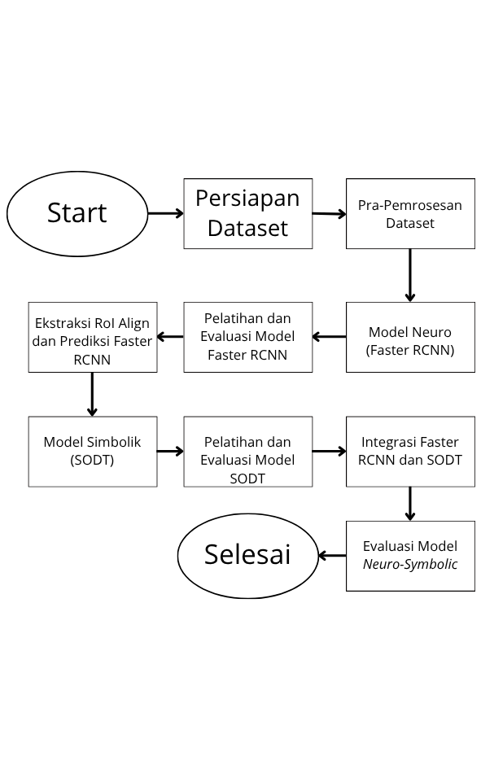

**Gambar 3.1 Diagram Alur Penelitian**

Penelitian dimulai dengan persiapan dan pra-pemrosesan *dataset* DeepPCB, dilanjutkan pelatihan *Faster* R-CNN, ekstraksi *dataset* simbolik, pelatihan SODT, integrasi keduanya, lalu evaluasi akhir.

## 3.1 Persiapan Dataset

*Dataset* DeepPCB (Tang et al., 2019) dibagi menjadi data latih dan data uji berdasarkan berkas indeks bawaannya yang ditunjukkan pada Tabel 3.1, sehingga tidak ada kebocoran data antarfase.

**Tabel 3.1 Pembagian *dataset* berdasarkan kategori**

| **Kategori** | **Berkas Indeks** | **Jumlah Citra** | **Persentase (%)** |
|:------------:|-------------------|------------------|--------------------|
| *Train Set*  | *trainval.txt*    | 1.000            | 66,67%             |
|  *Test Set*  | *test.txt*        | 500              | 33,33%             |

Penelitian ini bersifat non-referensial, yaitu model mendeteksi cacat tanpa membandingkan citra uji dengan citra *template*, sesuai kondisi inspeksi nyata ketika citra referensi sering tidak tersedia. Oleh karena itu, dari setiap pasangan citra hanya citra target (*\_test.jpg*) yang dimuat, sedangkan citra *template* (*\_temp.jpg*) diabaikan.

Koordinat cacat pada berkas anotasi diubah menjadi *bounding box*, sedangkan ID kelas 1–6 dipakai langsung sebagai indeks kelas, yaitu *open*, *short*, *mousebite*, *spur*, *spurious copper*, dan *pinhole*. Contoh sampel beserta anotasinya ditunjukkan pada Gambar 3.2.

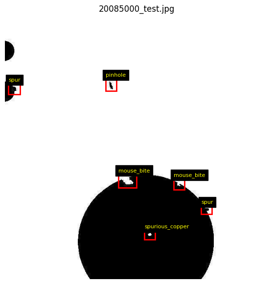

**Gambar 3.2 Contoh sampel dataset PCB beserta anotasinya**

## 3.2 Pra-pemrosesan *Dataset*

Citra diproses melalui dua *pipeline*, yaitu di luar model untuk konversi dan augmentasi, serta di dalam model untuk normalisasi dan pengaturan resolusi. Konfigurasinya dirangkum pada Tabel 3.2 dan Tabel 3.3.

**Tabel 3.2 Parameter Normalisasi dan Standardisasi *Input***

| **Parameter** | **Nilai Konfigurasi** | **Tujuan** |
|:----------------------:|---------------------|---------------------------|
| Rentang Intensitas | \[0,0; 1,0\] | Penyeragaman *dynamic range* piksel |
| Rata-rata (*Mean*) | \[0,485; 0,456; 0.406\] | Penyelarasan distribusi ImageNet |
| Deviasi Standar (*Std*) | \[0,229; 0,224; 0,225\] | Penyelarasan distribusi ImageNet |

**Tabel 3.3 Konfigurasi Augmentasi Data Pelatihan**

| **Jenis Augmentasi** | **Parameter** | **Dekripsi** |
|:----------------------:|------------------------|------------------------|
| *Random Horizontal Flip* | Probabilitas: 0,5 | Variasi Arah |
| *Multi-resolution Scaling* | Sisi terpendek: {480, 560, 640, 720, 800, 880}; sisi terpanjang maks. 880 | Ketahanan terhadap skala |
| *Coordinate Sync* | Enabled | Penyesuaian otomatis lokasi *box* saat gambar berubah |

Pada fase latih, citra diubah menjadi *tensor* berintensitas \[0,0; 1,0\], lalu dibalik secara horizontal secara acak beserta koordinat *bounding box*. Di dalam model, citra dinormalisasi per kanal sesuai Tabel 3.2, diskalakan, dan diseragamkan ukurannya melalui *padding*. Resolusi dipilih acak sesuai Tabel 3.3 saat latih, sedangkan saat inferensi dan ekstraksi fitur digunakan sisi terpendek 640 piksel agar fitur komponen simbolik tetap stabil.

## 3.3 Model Neuro (*Faster* R-CNN)

*Faster�* R-CNN berperan sebagai ekstraktor fitur, pengusul area, dan model teacher. Penelitian ini menggunakan SF-PSPyramid dari Fung et al. (2024) sesuai Subbab 2.1.5 karena neck-nya dirancang untuk cacat berukuran mikro pada PCB, dengan satu perbedaan, yaitu jumlah kanal neck 64, bukan 256, agar dimensi masukan SODT hanya $64 \times 7 \times 7 = 3.136$.

Sesuai komponen pada Subbab 2.1.5, ResNet-50 menghasilkan *feature map* C2–C5 yang kemudian dirangkai oleh *neck* SF-PSPyramid menjadi piramida P2′–P6. RPN menghasilkan proposal yang diseragamkan oleh *RoI Align* menjadi *tensor* 64×7×7, kemudian diproses oleh *box head* dan disaring oleh *Soft*-NMS.

Tiga keluaran tersebut digunakan pada tahap berikutnya. Proposal RPN menjadi kandidat RoI bagi sistem *neuro-symbolic*, sedangkan *tensor* *RoI Align* 64×7×7 menjadi masukan SODT karena masih mempertahankan informasi spasial. Keluaran *box head* digunakan dengan prediksi kelas sebagai label *teacher* pada Subbab 3.5 dan *regression head* untuk menghitung koordinat *bounding box* akhir pada Subbab 3.8. Konfigurasi tiap modul dirangkum pada Tabel 3.4.

**Tabel 3.4 Parameter utama *Faster* R-CNN**

<table style="width:95%;">
<colgroup>
<col style="width: 29%" />
<col style="width: 30%" />
<col style="width: 35%" />
</colgroup>
<thead>
<tr>
<th style="text-align: center;"><strong>Modul Fungsional</strong></th>
<th style="text-align: center;"><strong>Parameter Utama</strong></th>
<th style="text-align: center;"><strong>Nilai / Konfigurasi</strong></th>
</tr>
</thead>
<tbody>
<tr>
<td rowspan="2" style="text-align: left;"><em>Backbone &amp; Neck</em></td>
<td style="text-align: left;">Inisialisasi Bobot</td>
<td style="text-align: left;"><em>ResNet-50, Pre-trained</em> ImageNet</td>
</tr>
<tr>
<td style="text-align: left;"><em>Batch Normalization</em></td>
<td style="text-align: left;"><em>Frozen</em></td>
</tr>
<tr>
<td rowspan="2" style="text-align: left;"><em>Neck</em> (SF-PSPyramid)</td>
<td style="text-align: left;"><em>Feature map</em> FPN</td>
<td style="text-align: left;">P2, P3, P4, P5, P6</td>
</tr>
<tr>
<td style="text-align: left;">Jumlah Kanal (C)</td>
<td style="text-align: left;">64</td>
</tr>
<tr>
<td rowspan="4" style="text-align: left;"><em>RPN</em></td>
<td style="text-align: left;">Ukuran (<em>Anchor</em>)</td>
<td style="text-align: left;">[16, 32, 64, 128, 256] piksel</td>
</tr>
<tr>
<td style="text-align: left;">Rasio Aspek</td>
<td style="text-align: left;">[0,5; 1,0; 2.0]</td>
</tr>
<tr>
<td style="text-align: left;">Ambang Batas IoU</td>
<td style="text-align: left;">
<em>Foreground</em>: 0.7

<em>Background</em>: 0.3
</td>
</tr>
<tr>
<td style="text-align: left;">Batas Proposal (NMS)</td>
<td style="text-align: left;"><em>Train: 2000 | Test: 1000</em></td>
</tr>
<tr>
<td style="text-align: left;"><em>RoI Align</em></td>
<td style="text-align: left;">Dimensi <em>RoI Align</em></td>
<td style="text-align: left;"><em>7x7 piksel (Rasio sampling: 2)</em></td>
</tr>
<tr>
<td rowspan="3" style="text-align: left;"><em>Soft-NMS</em></td>
<td style="text-align: left;">Metode Penurunan (<em>Decay</em>)</td>
<td style="text-align: left;"><em>Linear</em></td>
</tr>
<tr>
<td style="text-align: left;">Parameter Sigma &amp; IoU</td>
<td style="text-align: left;">
<em>Sigma: 0.5</em>

<em>IoU Threshold: 0.5</em>
</td>
</tr>
<tr>
<td style="text-align: left;">Pemotongan Skor (<em>Score Thresh</em>)</td>
<td style="text-align: left;"><em>0.001</em></td>
</tr>
</tbody>
</table>

## 3.4 Pelatihan dan Evaluasi Model Neuro

*Faster* R-CNN dilatih selama 15 *epoch*, dibandingkan 12 *epoch* pada Fung et al. (2024), dengan *Automatic Mixed Precision* (AMP) dan *gradient accumulation* untuk mengatasi keterbatasan memori GPU. *Loss* regresi menggunakan L1 pada Persamaan 2.15 mengikuti Fung et al. (2024). *Learning rate* dinaikkan secara linear pada awal pelatihan (*warmup*) lalu diturunkan secara bertahap. *Hyperparameter* dirangkum pada Tabel 3.5.

**Tabel 3.5 *Hyperparameter* pelatihan model *Faster* R-CNN**

<table style="width:91%;">
<colgroup>
<col style="width: 31%" />
<col style="width: 30%" />
<col style="width: 29%" />
</colgroup>
<thead>
<tr>
<th style="text-align: center;"><em><strong>Hyperparameter</strong></em></th>
<th style="text-align: center;"><strong>Parameter Utama</strong></th>
<th style="text-align: center;"><strong>Nilai / Konfigurasi</strong></th>
</tr>
</thead>
<tbody>
<tr>
<td rowspan="3" style="text-align: left;">Siklus Pelatihan</td>
<td style="text-align: left;">Total <em>Epoch</em></td>
<td style="text-align: left;">15</td>
</tr>
<tr>
<td style="text-align: left;">Gradient Accumulation</td>
<td style="text-align: left;">4 langkah</td>
</tr>
<tr>
<td style="text-align: left;">Presisi Komputasi</td>
<td style="text-align: left;"><em>AMP: True</em></td>
</tr>
<tr>
<td rowspan="3" style="text-align: left;">Fungsi Pengoptimal</td>
<td style="text-align: left;">Optimizer</td>
<td style="text-align: left;">SGD</td>
</tr>
<tr>
<td style="text-align: left;">Laju Pembelajaran (<em>Learning Rate</em>)</td>
<td style="text-align: left;">0,02</td>
</tr>
<tr>
<td style="text-align: left;">Momentum &amp; <em>Weight Decay</em></td>
<td style="text-align: left;">Momentum: 0.9 | <em>Decay</em>: 0.0001</td>
</tr>
<tr>
<td rowspan="3" style="text-align: left;">Penjadwalan (Scheduler)</td>
<td style="text-align: left;">Tipe <em>Scheduler</em></td>
<td style="text-align: left;">Milestone / Step Decay</td>
</tr>
<tr>
<td style="text-align: left;"><em>Milestones</em></td>
<td style="text-align: left;"><em>Epoch</em> ke-8 dan ke-11</td>
</tr>
<tr>
<td style="text-align: left;">Faktor Penurunan (<em>Gamma</em>)</td>
<td style="text-align: left;">0.1 (Penurunan 10%)</td>
</tr>
<tr>
<td style="text-align: left;">Pemanasan (Warmup)</td>
<td style="text-align: left;">Iterasi <em>Warmup</em></td>
<td style="text-align: left;">500 batch</td>
</tr>
<tr>
<td style="text-align: left;"></td>
<td style="text-align: left;">Rasio <em>Warmup</em> Awal</td>
<td style="text-align: left;">0.001</td>
</tr>
</tbody>
</table>

Pada setiap *batch*, *multi-task loss* pada Persamaan 2.14 dihitung dan gradien diakumulasikan selama empat iterasi sebelum bobot diperbarui dengan SGD sesuai Persamaan 2.3. Setelah pelatihan, model dievaluasi pada data uji menggunakan mAP@0,5, mAP@0,5:0,95, mAP@0,75, dan mAP@0,5:0,85 untuk dibandingkan dengan Fung et al. (2024). *Precision*, *Recall*, dan F1 dihitung pada IoU 0,5 dan skor 0,5 sesuai Persamaan 2.35 sampai 2.40, termasuk per kelas dan *confusion matrix*. Bobot model kemudian dibekukan dan disimpan sebagai *teacher*.

## 3.5 Ekstraksi Fitur RoI dan Hasil Klasifikasi *Faster* R-CNN

Tahap ini membentuk dataset simbolik sesuai skema model mimicking pada Subbab 2.1.7. Fitur diambil tepat setelah RoI Align, sebelum masuk MLP pada box head, sehingga bentuk grid 7×7 tetap terjaga. Yang diekstrak adalah seluruh proposal RPN pada mode inferensi, bukan hanya deteksi akhir, agar SODT dilatih pada populasi proposal yang sama dengan saat inferensi.

Label setiap proposal adalah prediksi *teacher*, termasuk *background*, bukan *ground truth*. *Ground truth* hanya disimpan sebagai data pendamping untuk metrik lokalisasi. Ekstraksi dilakukan terpisah untuk data latih dan data uji. Mekanismenya diilustrasikan pada Gambar 3.3.

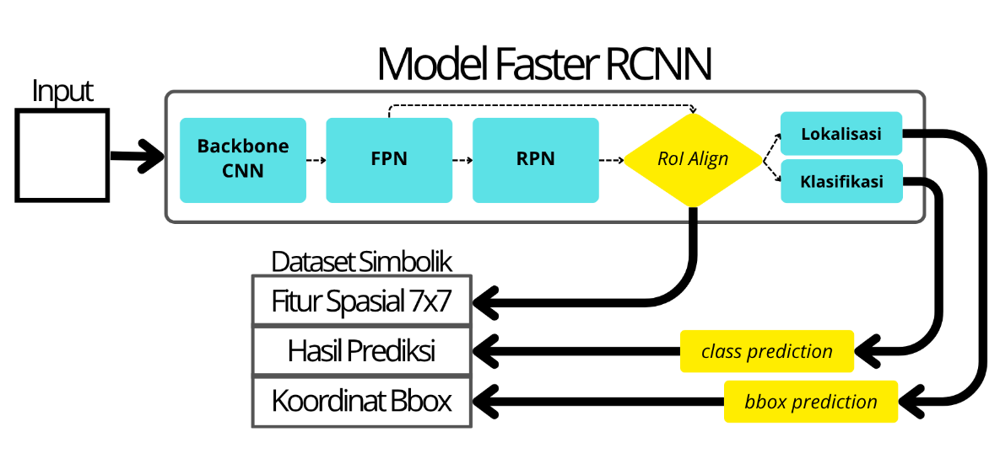

**Gambar 3.3 Pengambilan *RoI Align* dan Hasil dari *Faster* R-CNN**

Berdasarkan mekanisme tersebut, pembentukan *dataset* simbolik dirangkum pada Algoritma 3.1.

**Algoritma 3. 1 Pembentukan Dataset Simbolik**

**Input:** Model *teacher* (*frozen*) serta citra latih dan uji beserta anotasinya.

**Output:**  *Dataset�* simbolik latih dan uji berisi fitur $64 \times 7 \times 7$, koordinat proposal, label *teacher*, dan data pendamping *ground truth*.

**Langkah-langkah:**

1.  Setiap citra diproses dengan resolusi tetap sesuai Subbab 3.2, lalu RPN menghasilkan hingga 1.000 proposal.

2.  *RoI Align* mengubah setiap proposal menjadi *tensor* 64×7×7 sesuai Persamaan 2.17 dan 2.19.

3.  *Tensor* diteruskan ke *box head teacher*, lalu kelas dengan probabilitas *softmax* tertinggi sesuai Persamaan 2.4 diambil sebagai label.

4.  Setiap proposal dicocokkan dengan *ground truth* ber-IoU tertinggi sebagai data pendamping.

5.  Fitur, label, dan data pendamping disimpan sebagai *dataset* simbolik.

## 3.6 Model Simbolik (SODT)

SODT menggantikan *classification head* pada *box head*, sehingga setiap keputusan kelas berasal dari rangkaian keputusan linear yang dapat ditelusuri sesuai Subbab 2.1.8. Masukannya adalah *tensor* $64 \times 7 \times 7$ yang diratakan menjadi vektor berdimensi 3.136, dengan urutan yang dicatat agar setiap bobot dapat dikembalikan ke kanal dan posisi grid asalnya.

SODT dibentuk sebagai pohon biner lengkap dengan fungsi keputusan linear pada setiap *node* internal sesuai Persamaan 2.28 dan satu label kelas pada setiap *leaf*. Bobot dan bias setiap *node* diinisialisasi dari distribusi normal baku (Hada et al., 2024), sedangkan label *leaf* diinisialisasi secara acak, bukan dengan kelas mayoritas, agar TAO tidak terjebak pada kelas *background* yang dominan. Konfigurasinya dirangkum pada Tabel 3.6.

**Tabel 3.6 Konfigurasi struktur dan inisialisasi SODT**

| **Parameter** | **Nilai** | **Keterangan** |
|:----------------:|------------------|-------------------------------------|
| Kedalaman pohon | 6 | Batas maksimum tingkat hierarki *node* |
| Inisialisasi bobot dan bias | Distribusi normal baku N(0, 1) | Titik awal optimasi TAO |
| Inisialisasi label *leaf* | Acak | Mencegah TAO terjebak pada kelas *background* yang dominan |

## 3.7 Pelatihan dan Evaluasi Model Simbolik

SODT dilatih dengan TAO pada *dataset* simbolik latih untuk meminimalkan fungsi tujuan yang mencakup *loss* berbobot kelas pada Persamaan 2.33 serta penalti L1 berbobot ukuran *reduced set* pada Persamaan 2.31 dan 2.32. Karena sebagian besar proposal berlabel *background*, distribusi kelas sangat timpang sehingga digunakan *negative sampling* dengan mengambil sebagian proposal *background* secara acak berdasarkan rasio negatif (*negative ratio*) terhadap proposal cacat.

Pembobotan kelas diterapkan di dua tempat. Pada *reduced problem* setiap *node* sesuai Persamaan 2.30, setiap sampel diberi bobot pada Persamaan 3.1. Pada *leaf*, label ditentukan dengan mayoritas berbobot pada Persamaan 3.2.

$$
u_{n} = \left| e_{L}(n) - e_{R}(n) \right| \cdot \omega_{y_{n}}
$$

(3.1)

$$
{\widehat{y}}_{l} = \arg{\max_{c}{\omega_{c} \cdot N_{l,c}}}
$$

(3.2)

dengan $u_{n}$ bobot sampel ke-*n*, $e_{L}(n),e_{R}(n)$ *loss* 0/1 sampel ke-*n* bila diarahkan ke kiri dan ke kanan, $\omega_{c}$ bobot kelas $c$ pada Persamaan 2.33, ${\widehat{y}}_{l}$ label *leaf* ke-$l$, dan $N_{l,c}$ jumlah sampel berlabel $c$ pada *leaf* tersebut. Faktor $\left| e_{L} - e_{R} \right|$ bernilai 1 hanya untuk *care set*, sedangkan $\omega$ membuat kesalahan pengarahan pada kelas berbobot besar lebih mahal. Bobot *background* dibiarkan netral agar *false positive* tidak meningkat.

Setelah TAO, pohon dipangkas (*pruning*) dengan menghapus *dead branch* dan *pure subtree* tanpa mengubah keputusannya (Carreira-Perpiñán & Tavallali, 2018; Hada et al., 2024), sehingga *explanation* menjadi lebih ringkas dengan fidelitas tetap. Nilai $\lambda$ dan $\alpha$ ditentukan secara empiris melalui beberapa percobaan dengan memilih nilai yang menghasilkan pohon *sparse* tanpa menurunkan fidelitas secara berarti. Pengaruh kedua parameter terhadap sparsitas dan akurasi telah dikaji oleh Hada et al. (2024) serta Kairgeldin dan Carreira-Perpiñán (2025). *Hyperparameter* pelatihan dirangkum pada Tabel 3.7.

**Tabel 3.7 *Hyperparameter* pelatihan SODT**

<table style="width:97%;">
<colgroup>
<col style="width: 31%" />
<col style="width: 26%" />
<col style="width: 38%" />
</colgroup>
<thead>
<tr>
<th style="text-align: center;"><strong>Tahapan/Komponen</strong></th>
<th style="text-align: center;"><strong>Nilai</strong></th>
<th style="text-align: center;"><strong>Deskripsi</strong></th>
</tr>
</thead>
<tbody>
<tr>
<td style="text-align: left;">Iterasi Maksimum TAO</td>
<td style="text-align: left;">15</td>
<td style="text-align: left;">Jumlah siklus pembaruan seluruh <em>node</em></td>
</tr>
<tr>
<td style="text-align: left;">Lambda (<em>λ</em>)</td>
<td style="text-align: left;">20</td>
<td style="text-align: left;">Kekuatan penalti L1 pada Persamaan 2.31</td>
</tr>
<tr>
<td style="text-align: left;">Alpha (<em>α)</em></td>
<td style="text-align: left;">0.15</td>
<td style="text-align: left;">Eksponen pembobot penalti pada Persamaan 2.32</td>
</tr>
<tr>
<td style="text-align: left;">Rasio Negatif</td>
<td style="text-align: left;">2</td>
<td style="text-align: left;">Sampel <em>background</em> terhadap sampel cacat</td>
</tr>
<tr>
<td style="text-align: left;">Bobot Kelas (<em>w</em>)</td>
<td><em>Short</em>: 2 
<em>Spur</em>: 1,5 
<em>Open</em>: 1,5 
<em>Pinhole</em>: 1,25 
<em>Spurious copper</em>: 1,25</td>
<td style="text-align: left;">Biaya lebih besar untuk kelas dengan <em>recall</em> terlemah</td>
</tr>
<tr>
<td style="text-align: left;">Toleransi Konvergensi</td>
<td><math display="block" xmlns="http://www.w3.org/1998/Math/MathML"><semantics><msup><mn>10</mn><mrow><mi>−</mi><mn>6</mn></mrow></msup><annotation encoding="application/x-tex">10^{- 6}</annotation></semantics></math></td>
<td style="text-align: left;">Pelatihan berhenti jika penurunan relatif fungsi tujuan di bawah nilai ini</td>
</tr>
</tbody>
</table>

Fidelitas SODT pada *dataset* simbolik uji dievaluasi menggunakan *mimic accuracy*, *macro*-F1, dan *agreement* per kelas, disertai jumlah *node* aktif dan *nonzero weight*. Seluruh tahapan pelatihan, mulai dari *negative sampling* hingga *pruning*, dirangkum pada Algoritma 3.2.

**Algoritma 3.2 Pelatihan SODT dengan TAO**

**Input:**  *Dataset* simbolik latih dan uji, serta SODT terinisialisasi.

**Output:** SODT terlatih dan hasil evaluasi fidelitasnya.

**Langkah-langkah:**

1.  Sistem mempertahankan seluruh proposal berlabel cacat dan mengambil acak proposal *background* sesuai *negative ratio* pada Tabel 3.7.

2.  Pada setiap iterasi TAO, *node* diperbarui dari yang terdalam menuju *root* menggunakan bobot sampel Persamaan 3.1, lalu label *leaf* diperbarui dengan Persamaan 3.2.

3.  Iterasi berhenti setelah mencapai batas iterasi TAO atau ketika penurunan relatif fungsi tujuan di bawah toleransi sesuai Tabel 3.7.

4.  *Node* yang tidak dilalui sampel (*dead branch*) dan *node* yang seluruh *leaf* di bawahnya berlabel sama (*pure subtree*) dinolkan bersama sub-pohonnya, sedangkan *leaf* yang tidak dicapai sampel diberi label *background*.

5.  Fidelitas diukur pada *dataset* simbolik uji.

## 3.8 Integrasi *Faster* R-CNN dan SODT

Tahap ini menyatukan Faster R-CNN dan SODT menjadi satu alur inferensi, ditambah dua komponen, yaitu skor deteksi berbasis routing margin dan heatmap per node.

### 3.8.1 Hybrid Inference

SODT hanya menggantikan *classification head*. Koordinat *bounding box* akhir tetap dihitung oleh *regression head* *Faster* R-CNN, sehingga sifat *faithful* berlaku pada keputusan kelas, bukan pada penyesuaian lokasi kotak. Alurnya ditunjukkan pada Gambar 3.4.

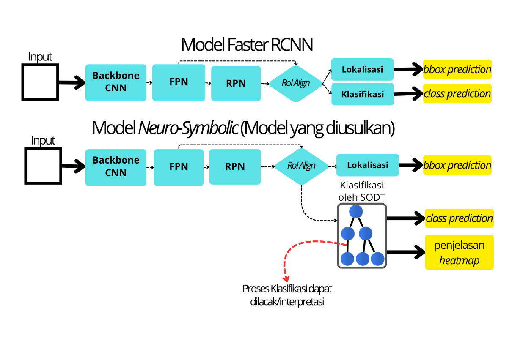

**Gambar 3.4 Diagram integrasi Neuro-Symbolic**

Penggantian *classification head* tersebut menimbulkan satu persoalan pada skor deteksi. Karena setiap *leaf* hanya menyimpan satu label, semua deteksi yang mencapai *leaf* berkelas sama akan memiliki skor identik, sebagaimana sifat keluaran simbolik yang dijelaskan pada Subbab 2.1.7. Akibatnya, AP dan *Soft*-NMS kehilangan urutan skor. Oleh karena itu, skor dibentuk dari *margin* pada Persamaan 2.26 dan *sigmoid* pada Persamaan 2.27 setiap *node* pada *decision path*, yang selanjutnya disebut skor deteksi berbasis *routing margin*, sebagaimana dinyatakan pada Persamaan 3.3.

$$
s(x) = \prod_{i \in P(x),\, w_{i} \neq 0}^{}{\sigma\left( \left| f_{i}(x) \right| \right)}
$$

(3.3)

dengan $s(x)$ skor untuk RoI $x$ pada kelas *leaf* yang dicapai (kelas lain bernilai 0), $P(x)$ *node* pada *decision path*, dan $f_{i}$ fungsi keputusan *node* ke-*i* pada Persamaan 2.28. *Node* yang telah dinolkan dilewati. Bentuk perkalian ini setara dengan probabilitas *routing* pada *soft decision tree* (Kontschieder et al., 2015), namun pada penelitian ini pohon tetap dieksekusi secara *hard* sehingga *decision path* dan label tidak berubah. Skor ini hanya berasal dari parameter pohon. Ilustrasinya ditunjukkan pada Gambar 3.5.

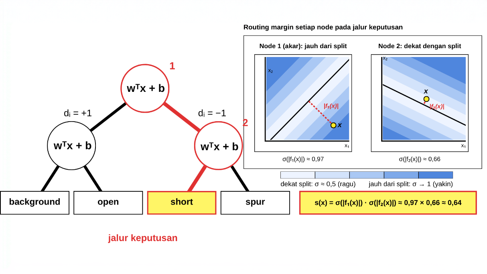

**Gambar 3.5 Ilustasi Routing Margin pada SODT**

Berbeda dengan Platt (1999), parameter *sigmoid* bernilai tetap sehingga hasilnya merupakan skor *confidence*, bukan probabilitas kelas, dengan rentang \[0,5; 1). Karena fungsi keputusan *node* pada Persamaan 2.28 merupakan *logit* regresi logistik, setiap faktor *sigmoid* pada Persamaan 3.3 merepresentasikan *confidence* lokal terhadap arah yang diambil (Carreira-Perpiñán & Tavallali, 2018; Kairgeldin & Carreira-Perpiñán, 2025). Namun, karena setiap faktor bernilai kurang dari 1, *decision path* yang lebih panjang cenderung menghasilkan skor lebih rendah sehingga skor memiliki bias terhadap panjang *decision path*.

Dengan skor tersebut, alur inferensi model hibrida dari citra uji hingga deteksi akhir dirangkum pada Algoritma 3.3.

**Algoritma 3.3 *Hybrid Inference* dengan *Routing Margin***

**Input:** Citra uji, *Faster* R-CNN (*frozen*), dan SODT terlatih.

**Output:** *Bounding box, label kelas, skor deteksi, dan jalur keputusan setiap deteksi.*

**Langkah-langkah:**

1.  *Faster* R-CNN menghasilkan proposal dan *tensor* 64×7×7 untuk setiap proposal.

2.  SODT menentukan label dari *leaf* yang dicapai, dan skor deteksi berbasis *routing* *margin* dihitung dengan Persamaan 3.3.

3.  *Regression* *head* *Faster* R-CNN menghitung koordinat *bounding* *box* akhir.

4.  Deteksi berlabel *background* atau berskor di bawah ambang skor minimum sesuai Tabel 3.4 dibuang, lalu *Soft*-NMS diterapkan sesuai Persamaan 2.20.

5.  *Decision* *path*, *pyramid* *level* sumber, dan *feature* *map* *neck* setiap deteksi disimpan untuk pembentukan *heatmap*.

### 3.8.2 Heatmap per Node

Setiap *node* pada *decision path* memperoleh satu *heatmap* yang menunjukkan *region* yang dipertimbangkan oleh *node* tersebut untuk RoI yang dijelaskan. Pendekatan ini serupa dengan *Class Activation Mapping* (CAM) yang mengalikan bobot *classifier* linear dengan *feature map* (Zhou et al., 2016), tetapi diterapkan pada setiap *node* SODT dan melalui *RoI Align*. Berbeda dengan peta Kairgeldin dan Carreira-Perpiñán (2025) pada Persamaan 2.34 yang statis, *heatmap* ini dinamis karena memakai nilai fitur RoI, dan dihitung pada *feature map neck*, bukan grid $7 \times 7$.

Fungsi keputusan *node* bersifat linear terhadap fitur RoI sesuai Persamaan 2.28, dan *RoI Align* juga bersifat linear terhadap *feature map neck* sesuai Persamaan 2.18. Dengan bobot *node* per kanal $w_{i,c}$ dan *feature map* kanal ke-*c* pada *pyramid level* terpilih $F_{c}$, bagian linear fungsi keputusan dapat ditulis sebagai Persamaan 3.4.

$$
f_{i}(x) - b_{i} = \sum_{c = 1}^{C}{w_{i,c}^{T}\, A\, F_{c}}
$$

(3.4)

dengan $A$ matriks koefisien *RoI Align* dan $C = 64$. Gradien Persamaan 3.4 terhadap $F_{c}$ adalah $A^{T}w_{i,c}$, yaitu bobot *node* yang disebar kembali ke posisi asalnya pada *feature map*. Gradien ini dikalikan dengan nilai *feature map* sesuai *Gradient × Input* pada Persamaan 2.23, sebagaimana dinyatakan pada Persamaan 3.5.

$$
r_{i}\lbrack c,p\rbrack = d_{i} \cdot \left( A^{T}w_{i,c} \right)_{p} \cdot F_{c}(p)
$$

(3.5)

dengan $r_{i}\left\lbrack c,p \right\rbrack$ kontribusi kanal ke-*c* posisi $p$ terhadap *node* ke-*i*, dan $d_{i}$ arah keputusan *node*, sehingga kontribusi positif berarti mendukung arah yang diambil. Karena seluruh operasinya linear, *completeness* yang disebutkan pada Persamaan 2.24 dan 2.25 berlaku secara eksak sebagaimana Persamaan 3.6. Bias *node* tidak diatribusikan ke posisi mana pun, sehingga jumlah seluruh kontribusi sama dengan bagian linear fungsi keputusan pada Persamaan 3.4, bukan *margin* pada Persamaan 2.26.

$$
\sum_{c = 1}^{C}{\sum_{p}^{}{c_{i}\lbrack c,p\rbrack}} = d_{i} \cdot \left( f_{i}(x) - b_{i} \right)
$$

(3.6)

Untuk ditampilkan, kontribusi seluruh kanal diringkas menjadi satu peta dengan Persamaan 3.7.

$$
H_{i}(p) = \sum_{c = 1}^{C}\left| c_{i}\lbrack c,p\rbrack \right|
$$

(3.7)

Nilai mutlak membuat $H_{i}$ menunjukkan besar pengaruh, baik yang mendukung maupun yang menentang, sedangkan arah keputusan ditampilkan pada *decision path*.

Ketelitian $H_{i}$ berada pada tingkat *region* karena perhitungan eksak berhenti pada *feature map* *neck*, tetapi tetap lebih halus daripada *grid* $7 \times 7$. Alurnya ditunjukkan pada Gambar 3.6.

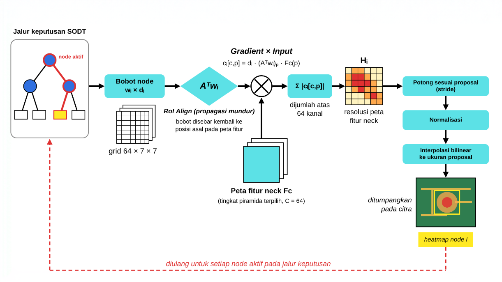

**Gambar 3.6 Alur Pembentukan Heatmap per Node**

Berdasarkan Persamaan 3.4 hingga 3.7, pembentukan *heatmap* untuk satu deteksi dirangkum pada Algoritma 3.4.

**Algoritma 3.4 Pembentukan Heatmap per Node**

**Input:** Satu deteksi beserta *tensor* RoI, jalur keputusan, tingkat piramida, dan feature map *neck*.

**Output:** Satu *heatmap* untuk setiap *node* aktif pada jalur keputusan.

**Langkah-langkah:**

1.  Bobot $w_{i}$ dikembalikan ke grid 64×7×7 dan dikalikan dengan $d_{i}$.

2.  *RoI Align* dijalankan ulang pada *feature map neck*, lalu gradien Persamaan 3.4 dihitung dengan propagasi mundur.

3.  Gradien dikalikan dengan *feature map* pada Persamaan 3.5 dan diringkas menjadi $H_{i}$ pada Persamaan 3.7.

4.  $H_{i}$ dipotong sesuai letak proposal pada *pyramid level* menggunakan *stride* pada Persamaan 2.5 dan 2.6, dinormalisasi, lalu diperbesar dengan interpolasi bilinear sesuai Persamaan 2.16 ke ukuran proposal.

5.  *Heatmap* ditumpangkan pada citra.

## 3.9 Evaluasi Model *Neuro-Symbolic*

Evaluasi mencakup dua aspek, yaitu kinerja deteksi model hibrida dan kualitas penjelasan yang dihasilkannya. Seluruh pengujian dilakukan pada data uji.

### 3.9.1 Evaluasi Deteksi

Model hibrida dibandingkan dengan Faster R-CNN menggunakan metrik pada Subbab 3.4.

Waktu per citra uji diukur sebagai rata-rata dari tiga kali pengukuran untuk tiga *pipeline*, yaitu *Faster* R-CNN yang hanya melakukan deteksi, NeSy yang melakukan deteksi beserta pembentukan *heatmap* per *node*, serta *Faster* R-CNN dengan Grad-CAM yang melakukan deteksi beserta pembentukan peta Grad-CAM. Pembentukan peta dihitung hingga peta ternormalisasi, tanpa penumpangan pada citra.

### 3.9.2 Evaluasi Penjelasan

Grad-CAM menghasilkan satu peta per deteksi, sedangkan SODT satu peta per *node*. Untuk perbandingan, *heatmap* per *node* ditumpuk menjadi satu peta dengan Persamaan 3.8.

$$
M(p) = \sum_{i \in P(x)}^{}{H_{i}(p)}
$$

(3.8)

dengan $M(p)$ peta gabungan pada posisi $p$, $P(x)$ *node* pada *decision path* RoI $x$ pada Persamaan 3.3, dan $H_{i}$ *heatmap* *node* ke-*i* pada Persamaan 3.7. Peta $M$ hanya dipakai untuk perbandingan dengan Grad-CAM.

*Explanation* diuji pada tiga aspek, yaitu *faithfulness* pada tingkat *decision path* untuk menguji apakah region yang disorot menentukan label, lokalisasi untuk menguji kesesuaiannya dengan lokasi cacat, dan *faithfulness* per *node* untuk menguji apakah setiap *heatmap* menentukan keputusan *node*-nya. Perbandingan kualitatif melengkapinya melalui telaah setiap deteksi.

Seluruh pengujian dibandingkan dengan Grad-CAM yang dihitung pada *feature map neck*, yaitu lapisan konvolusi terakhir sebelum *classification head*, sesuai Selvaraju et al. (2017), serta *random control* sebagai pembanding. Karena skor NeSy berupa *routing margin* sedangkan Grad-CAM menggunakan probabilitas kelas, masing-masing metode dibandingkan dengan *random control* yang sesuai. Prosedur pengujian dirangkum pada Algoritma 3.5.

**Algoritma 3. 5 Evaluasi Penjelasan**

**Input:** Model hibrida, Grad-CAM, data uji, dan *dataset* simbolik uji.

**Output:** Metrik *faithfulness* tingkat jalur dan per *node*, metrik lokalisasi, serta perbandingan visual.

**Langkah-langkah:**

1.  Deteksi berskor ≥ 0,5 dipilih dari 500 citra uji, masing-masing dari NeSy dan dari *Faster* R-CNN.

2.  Peta M pada Persamaan 3.8 dihitung untuk deteksi NeSy, dan peta Grad-CAM pada Persamaan 2.21 dan 2.22 untuk deteksi *Faster* R-CNN.

3.  Pada *feature map neck* di dalam proposal (diperluas 2 posisi), 50% posisi tertinggi tiap peta dipilih.

4.  Posisi tersebut dinolkan untuk *Necessity* sesuai Persamaan 2.41 dan disisakan untuk *Sufficiency* sesuai Persamaan 2.42, lalu *RoI Align* dijalankan ulang dan label diperiksa, kemudian *Deletion* dan *Insertion* AUC pada Persamaan 2.43 dihitung dengan menghapus atau menambahkan posisi tersebut secara bertahap dalam lima tahap.

5.  Langkah 3 dan 4 diulang dengan posisi yang dipilih secara acak sebagai *random control*.

6.  Setiap peta di-*resample* ke grid 7×7, lalu *Pointing Game* dan IoU *Heatmap* dihitung pada proposal ber-IoU rendah (low-IoU proposal), yaitu proposal dengan IoU 0,05–0,35 terhadap *ground truth* dan dilabeli cacat oleh kedua model, agar *Pointing Game* tidak trivial.

7.  Untuk setiap *node* aktif, 50% posisi tertinggi $H_{i}$ dihapus dan pembalikan tanda $f_{i}(x)$ diperiksa sebagai *Necessity* sesuai Persamaan 2.41, lalu *Deletion* dan *Insertion* AUC terhadap *routing margin* *node* dihitung dalam lima tahap.

8.  Deteksi kedua model dan ground truth ditampilkan berdampingan, dengan decision path dan heatmap setiap node di samping peta Grad-CAM.

# BAB IV HASIL DAN PEMBAHASAN

## 4.1 Hasil Persiapan Dataset

*Dataset* DeepPCB dipartisi menjadi 1.000 citra latih dan 500 citra uji sesuai Subbab 3.1 tanpa ada citra yang muncul di kedua himpunan. Statistik anotasinya dirangkum pada Tabel 4.1.

**Tabel 4.1 Statistik Partisi *Dataset* DeepPCB**

|       **Metrik**        | ***Train Set*** | ***Test Set*** |
|:-----------------------:|-----------------|----------------|
|      Jumlah Citra       | 1.000           | 500            |
|      Total Anotasi      | 6.873           | 3.140          |
| Rata-rata Anotasi/Citra | 6,87            | 6,28           |
|  Minimum Anotasi Citra  | 1               | 2              |
|  Maximum Anotasi Citra  | 15              | 13             |
|      Citra Kosong       | 0               | 0              |

Berdasarkan Tabel 4.1, tidak ada citra kosong dan setiap citra rata-rata memuat 6 hingga 7 cacat, sehingga seluruh data merupakan kasus deteksi multi-objek. Distribusi anotasi per kelas ditunjukkan pada Gambar 4.1 dan Gambar 4.2.

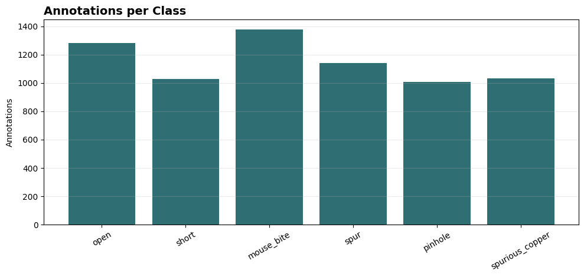

**Gambar 4.1 Distribusi anotasi per kelas pada *training set***

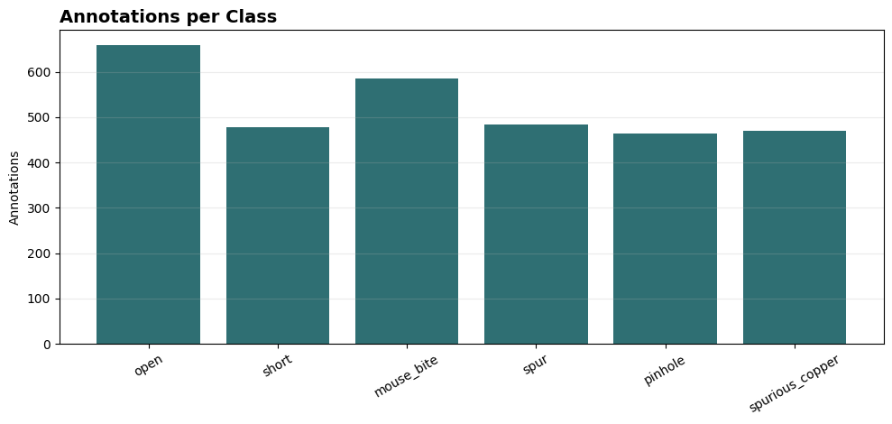

**Gambar 4.2 Distribusi anotasi per kelas pada *test set***

Berdasarkan Gambar 4.1 dan Gambar 4.2, kelas terbanyak hanya sekitar 1,4 kali kelas tersedikit pada kedua himpunan, sehingga distribusi kelas relatif seimbang.

Seluruh *bounding box* berada di dalam batas citra 640×640 piksel tanpa dimensi nol, dan kesesuaiannya dengan citra diperiksa melalui enam sampel acak pada Gambar 4.3.

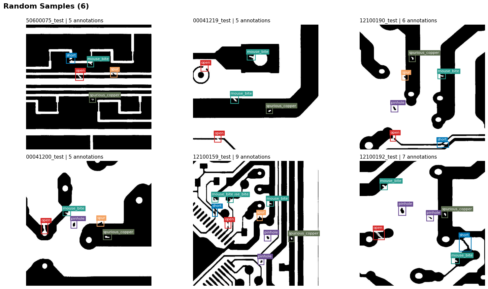

**Gambar 4.3 Sampel acak citra PCB dengan anotasi *bounding box ground truth***

Berdasarkan Gambar 4.3, setiap *bounding box* pada keenam sampel menutupi area cacat dengan label yang sesuai, sehingga anotasi dapat langsung digunakan sebagai *ground truth*.

## 4.2 Hasil Pra-Pemrosesan Dataset

Kedua transformasi pada Tabel 3.3 diterapkan dua kali pada citra contoh untuk memperlihatkan keacakannya sekaligus memastikan *bounding box* tetap sesuai. Hasil *horizontal flip* ditunjukkan pada Gambar 4.4.

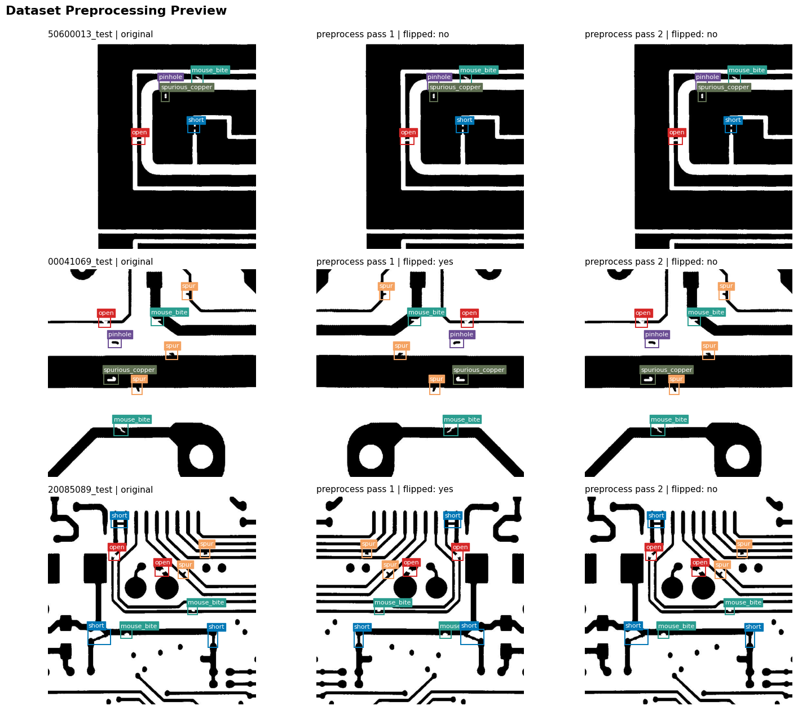

**Gambar 4.4 Hasil visualisasi augmentasi pembalikan horizontal pada citra PCB**

Berdasarkan Gambar 4.4, *flip* terjadi secara acak sehingga model menerima orientasi yang beragam, dan saat citra terbalik *bounding box* selalu ikut berpindah ke posisi cerminnya. Hasil *multi-resolution scaling* ditunjukkan pada Gambar 4.5.

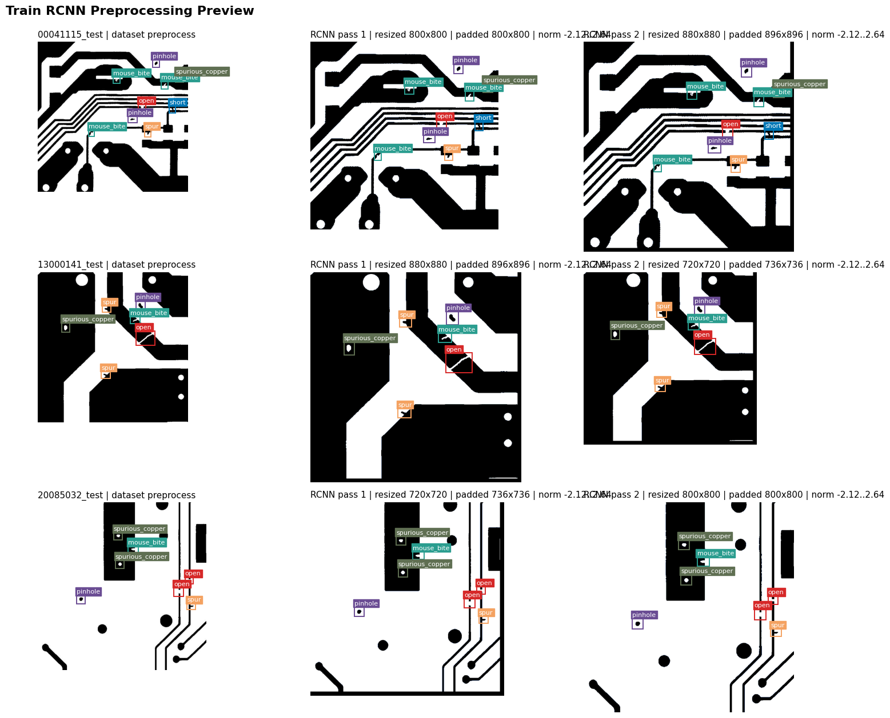

**Gambar 4. 5 Hasil visualisasi penskalaan multi-resolusi dalam arsitektur model**

Berdasarkan Gambar 4.5, resolusi juga dipilih secara acak lalu diberi *padding* hingga kelipatan 32, tetapi penskalaan yang proporsional membuat bentuk cacat tidak terdistorsi dan *bounding box* tetap pada area cacat. Normalisasi hanya menggeser rentang nilai piksel sesuai *mean* dan *std* pada Tabel 3.2 tanpa mengubah tampilan citra. Kedua transformasi tersebut menghasilkan variasi orientasi dan skala tanpa merusak kesesuaian anotasi.

## 4.3 Hasil dan Evaluasi Faster RCNN

*Faster* R-CNN dilatih selama 15 *epoch* dengan *hyperparameter* pada Tabel 3.5. Perkembangan *loss* total dan setiap komponennya ditunjukkan pada Gambar 4.6.

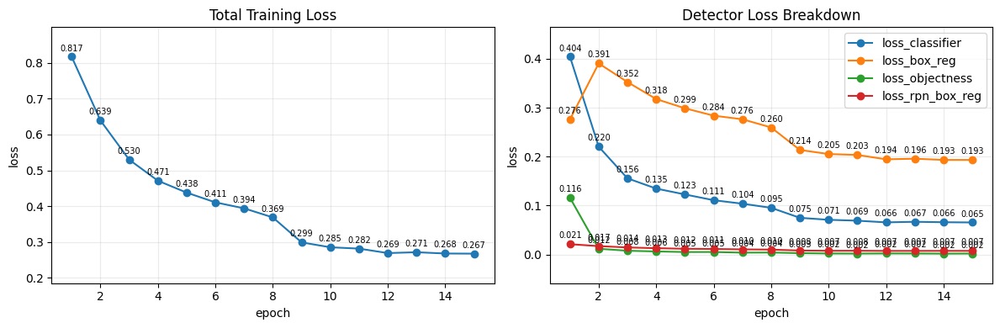

**Gambar 4. 6 Training Loss Faster R-CNN selama 15 Epoch**

Berdasarkan Gambar 4.6, *loss* total turun tajam setiap kali *learning rate* diturunkan sesuai Tabel 3.5 dan mendatar setelah *epoch* ke-12, menandakan model telah konvergen. *Loss* regresi *bounding box* tetap terbesar hingga akhir pelatihan, sedangkan *loss* RPN sudah sangat kecil sejak awal, sehingga kesulitan utama model terletak pada presisi batas *bounding box*, bukan pada menemukan cacat.

Kinerja model pada data uji dirangkum pada Tabel 4.2 bersama hasil Fung et al. (2024) pada *dataset* DeepPCB non-referensial.

**Tabel 4.2 Kinerja Deteksi *Faster* R-CNN pada Data Uji**

| **Model** | **AP50** | **AP75** | **AP@50:5:85** | **mAP@0,5:0,95** | ***Precision*** | ***Recall*** | **F1** |
|:------------|--------|--------|---------|----------|-----------|---------|--------|
| *Faster* R-CNN + SF-PSPyramid (Fung et al., 2024) | 0,986 | 0,946 | 0,932 | \- | \- | \- | \- |
| *Faster* R-CNN + SF-PSPyramid (penelitian ini) | 0,979 | 0,920 | 0,901 | 0,759 | 0,910 | 0,982 | 0,945 |

Berdasarkan Tabel 4.2, hampir seluruh cacat terdeteksi, tetapi mAP turun sekitar 0,22 saat ambang IoU dinaikkan dari mAP@0,5 ke mAP@0,5:0,95, sejalan dengan *loss* regresi *bounding box* yang tetap tinggi. Terhadap Fung et al. (2024), mAP@0,5:0,85 model ini berada di antara *Faster* R-CNN standar dan SF-PSPyramid, dengan selisih 0,031 dari SF-PSPyramid, sejalan dengan kanal *neck* yang dikurangi menjadi 64 pada Subbab 3.3 untuk membatasi dimensi masukan SODT.

Kinerja per kelas cacat dirangkum pada Tabel 4.3.

**Tabel 4.3 Kinerja *Faster* R-CNN per Kelas Cacat**

|     **Kelas**     | **AP@0,5** | ***Precision*** | ***Recall*** |
|:-----------------:|------------|-----------------|--------------|
|     *Pinhole*     | 0,992      | 0,799           | 1,000        |
| *Spurious copper* | 0,988      | 0,933           | 0,991        |
|    *Mousebite*    | 0,983      | 0,948           | 0,986        |
|      *Open*       | 0,979      | 0,960           | 0,979        |
|      *Spur*       | 0,971      | 0,961           | 0,977        |
|      *Short*      | 0,963      | 0,859           | 0,956        |

Berdasarkan Tabel 4.3, seluruh kelas mencapai AP yang tinggi dengan selisih antarkelas yang kecil. AP tertinggi dicapai *pinhole* dan *spurious copper* yang berbentuk lubang atau gumpalan, sedangkan AP terendah dicapai *short* dan *spur* yang menempel pada jalur konduktor. Karena distribusi kelas relatif seimbang sesuai Subbab 4.1, perbedaan ini tidak berasal dari jumlah data. *Precision* terendah terdapat pada *pinhole* dan *short*, yang penyebabnya ditelusuri melalui *confusion matrix* pada Gambar 4.7.

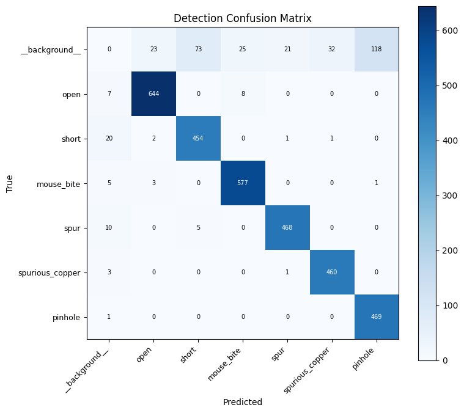

**Gambar 4. 7 Confusion Matrix Faster R-CNN pada Data Uji**

Hampir seluruh cacat terklasifikasi benar dengan sangat sedikit yang tertukar antarkelas, sedangkan kesalahan utama berasal dari *background* yang terdeteksi sebagai cacat, terutama *pinhole* dan *short*, yang menjelaskan rendahnya *precision* kedua kelas tersebut. Kesalahan ini sekitar enam kali lebih banyak daripada cacat yang terlewat, sehingga model cenderung mendeteksi berlebih. Karena SODT meniru label *teacher* sesuai Subbab 3.5, label yang diterimanya hampir tidak tertukar antarkelas, tetapi membawa kecenderungan deteksi berlebih yang sama.

## 4.4 Hasil Ekstraksi Fitur *Teacher* (*Faster* R-CNN)

Model *teacher* tersebut digunakan untuk mengekstrak fitur dan label 1.000 proposal RPN per citra sesuai Subbab 3.5. Distribusi label hasil ekstraksi ditunjukkan pada Tabel 4.4.

**Tabel 4.4 Distribusi Label *Teacher* pada RoI Hasil Ekstraksi**

| **Label *Teacher*** | **Data Latih** | **Data Uji** |
|:-------------------:|----------------|--------------|
|    *Background*     | 854.164        | 431.344      |
|       *Open*        | 29.288         | 15.116       |
|       *Short*       | 20.214         | 10.037       |
|     *Mousebite*     | 29.329         | 12.619       |
|       *Spur*        | 23.213         | 9.577        |
|  *Spurious copper*  | 20.964         | 9.894        |
|      *Pinhole*      | 22.828         | 11.413       |
|        Total        | 1.000.000      | 500.000      |

Lebih dari 85% RoI dilabeli *background* karena setiap citra hanya memuat 6 hingga 7 cacat dari 1.000 proposal. Selain itu, setiap cacat diwakili sekitar 21 proposal yang saling tumpang-tindih. Akibatnya, data SODT didominasi *background*, sedangkan setiap cacat terwakili dari berbagai posisi proposal.

Isi fitur tersebut divisualisasikan pada Gambar 4.8 dengan merata-ratakan 64 kanal setiap RoI menjadi *grid* 7×7.

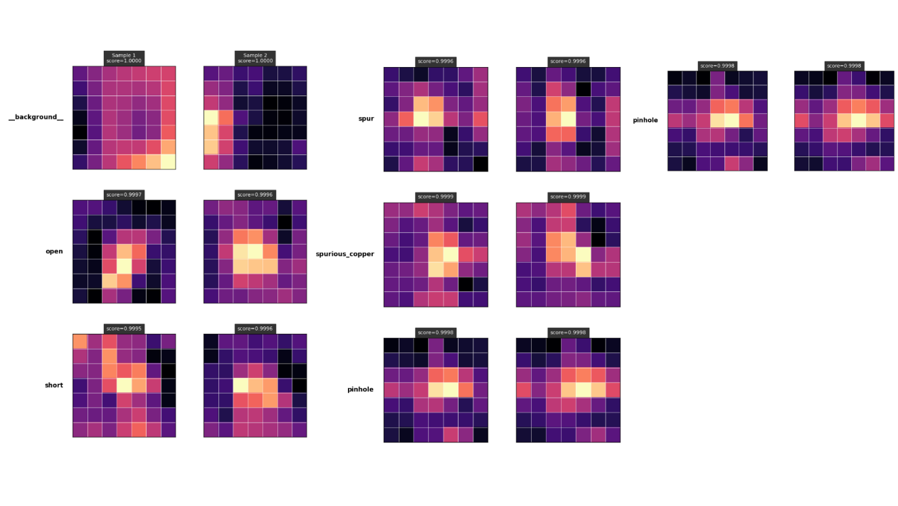

**Gambar 4.8 Visualisasi Fitur RoI 7×7 per Kelas**

Berdasarkan Gambar 4.8, aktivasi kelas cacat terkumpul di tengah *grid*, sedangkan aktivasi *background* berada di tepi atau sudut, sehingga *RoI Align* terbukti mempertahankan letak cacat. Namun, pola antarkelas sulit dibedakan, misalnya *open*, *short*, dan *pinhole* sama-sama terang di tengah *grid*, karena makna 64 kanal hasil pembelajaran *backbone* dan *neck* tidak diketahui. Keterbatasan ini ditangani SODT karena setiap bobot *node*-nya terikat pada kanal dan posisi *grid* tertentu sehingga dapat dipetakan menjadi *heatmap* sesuai Subbab 3.8.

## 4.5 Evaluasi Model Simbolik (*Sparse Oblique Decision Tree*)

Subbab ini mengevaluasi fidelitas SODT hasil Subbab 3.7, yaitu kemampuannya meniru label *teacher* pada 500.000 RoI data uji, bukan kinerjanya terhadap *ground truth* yang dibahas pada Subbab 4.6.

### 4.5.1 Pelatihan dan Fidelitas

SODT dilatih dengan *negative ratio* 2 sesuai Tabel 3.7, sehingga *background* mencakup 66,7% dari 437.508 RoI data latih. Perkembangan *mimic accuracy* dan jumlah *nonzero weight* selama pelatihan TAO ditunjukkan pada Gambar 4.9.

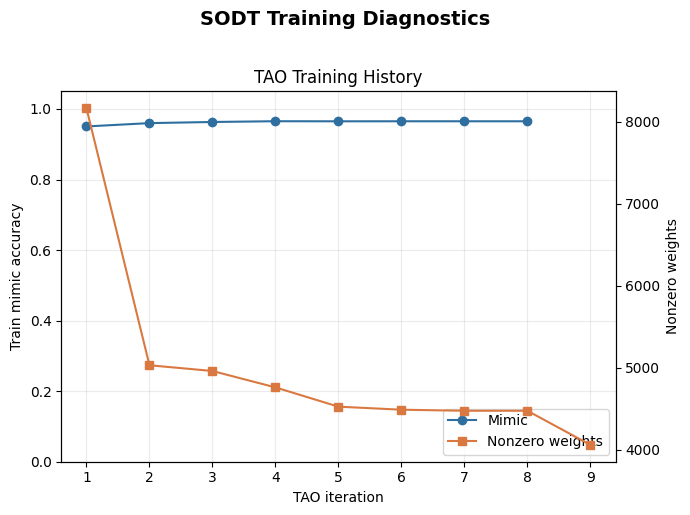

**Gambar 4. 9 Grafik Mimic Accuracy dan Nonzero Weight**

*Mimic accuracy�* sudah di atas 95% sejak iterasi pertama dan hanya naik sekitar 1,5 poin, sedangkan *nonzero weight* berkurang hampir separuhnya, sehingga TAO lebih banyak menyederhanakan pohon daripada menaikkan fidelitas. Penurunan tipis *mimic accuracy* pada iterasi ke-5 wajar karena TAO hanya menjamin penurunan fungsi tujuan pada Persamaan 2.31 dan 2.33, bukan kenaikan akurasi. Pelatihan berhenti pada iterasi ke-8 setelah penurunan fungsi tujuan di bawah toleransi 10⁻⁶, dan titik ke-9 merupakan *pruning* 14 *node* yang tidak mengubah keputusan pohon pada data latih.

**Tabel 4.5 Ringkasan Struktur dan Fidelitas SODT Terpilih**

|                 **Metrik**                  | **Nilai**                     |
|:--------------------------------------:|--------------------------------|
|               Kedalaman pohon               | 6                             |
|            *Node* internal aktif            | 32 dari 63                    |
|              *Nonzero weight*               | 4.057 dari 197.568            |
|                  Sparsitas                  | 97,9%                         |
| Rata-rata *nonzero weight* per *node* aktif | 126,8 (4,0% dari 3.136 fitur) |
|         *Mimic accuracy* data latih         | 96,51%                        |
|          *Mimic accuracy* data uji          | 96,26%                        |
|             *Macro*-F1 data uji             | 0,889                         |

SODT meniru *teacher* dengan fidelitas di atas 96% meskipun setiap *node* hanya memakai sekitar 4% fitur, sejalan dengan Hada et al. (2024) yang menunjukkan bahwa SODT yang *sparse* dapat meniru *classifier* jaringan saraf dengan akurasi yang mendekatinya. Namun, *macro*-F1 jauh lebih rendah karena *agreement* hanya setara *recall* terhadap *teacher*, sedangkan F1 juga memperhitungkan *precision* yang turun akibat sekitar 16.400 RoI *background* dilabeli cacat, lebih banyak daripada RoI kelas cacat mana pun pada Tabel 4.4. Dampak kebocoran ini terhadap deteksi dievaluasi pada Subbab 4.6.

### 4.5.2 Pengaruh Negative Ratio dan Class Weighting

Konfigurasi pada Tabel 3.7 dipilih melalui ablasi satu faktor dengan memvariasikan *negative ratio* (NR) menjadi 1, 2, 4, dan tanpa *sampling* (*full*) dengan *class weighting* (CW) aktif, lalu menonaktifkan CW pada NR 2. Konfigurasi terbaik adalah yang paling seimbang antarkelas, ditandai oleh rentang *agreement* terkecil. Hasilnya ditunjukkan pada Tabel 4.6, dengan bobot ω yang hanya berlaku pada konfigurasi dengan CW dan konfigurasi terpilih dicetak tebal.

**Tabel 4.6 Pengaruh *Negative Ratio* dan *Class Weighting* terhadap Fidelitas SODT**

| **Kelas (ω) / Metrik** | **NR 1 + CW** | **NR 2 + CW (terpilih)** | **NR 4 + CW** | **NR *full* + CW** | **NR 2 tanpa CW** |
|:------------:|------------|---------------|----------|------------|------------|
| *Background* (1) | 94,3 | **96,2** | 97,7 | 98,3 | 96,9 |
| *Open* (1,5) | 98,0 | **96,1** | 93,9 | 91,9 | 93,3 |
| *Short* (2) | 98,3 | **97,2** | 92,8 | 90,9 | 94,1 |
| *Mousebite* (1) | 98,3 | **96,9** | 92,7 | 91,4 | 96,3 |
| *Spur* (1,5) | 97,2 | **95,8** | 92,9 | 91,5 | 93,5 |
| *Spurious copper* (1,25) | 97,4 | **96,0** | 92,3 | 90,5 | 94,6 |
| *Pinhole* (1,25) | 97,7 | **96,2** | 91,9 | 89,8 | 94,3 |
| **Rentang** | 4,0 | **1,4** | 5,8 | 8,5 | 3,6 |
| ***Mimic accuracy (%)*** | 94,77 | **96,26** | 97,03 | 97,34 | 96,56 |
| ***Macro*-F1 (0 - 1)** | 0,855 | **0,889** | 0,905 | 0,913 | 0,894 |

kenaikan NR dari NR 1 hingga NR *full* menaikkan *agreement background* sekitar 4 poin, tetapi menurunkan *agreement* kelas cacat terendah lebih dari 7 poin. Pada RoI uji, RoI *background* yang dilabeli cacat turun dari sekitar 24.600 menjadi 7.300, sedangkan RoI cacat yang tidak ditiru naik dari sekitar 1.500 menjadi 6.100. *Mimic accuracy* meningkat seiring dominasi *background*, sedangkan *macro*-F1 juga meningkat meskipun *agreement* kelas cacat menurun. Kecenderungan ini terjadi karena makin banyak sampel *background* pada *care set* membuat fungsi tujuan pada Persamaan 2.30 dengan bobot sampel Persamaan 3.1 semakin dipengaruhi kesalahan *background*, sehingga batas keputusan *node* bergeser untuk menyaring *background* lebih ketat, sementara topologi pohon tetap serupa sebagaimana dibahas pada Subbab 4.5.3. Dari keempat nilai tersebut, NR 2 menghasilkan rentang *agreement* terkecil.

Tanpa CW, rentang *agreement* pada NR 2 melebar lebih dari dua kali lipat karena kelas cacat tertinggal dari *background*. CW meningkatkan *agreement* kelas cacat sesuai bobotnya, dari 3,1 poin pada *short* dengan $\omega = 2$ hingga 0,6 poin pada *mousebite* dengan $\omega = 1$, karena Persamaan 3.1 dan 3.2 membuat kesalahan pada kelas berbobot lebih mahal. Sebagai *trade-off* *cost-sensitive learning* (Elkan, 2001), *agreement background* turun 0,7 poin atau sekitar 3.000 RoI, sehingga *mimic accuracy* dan *macro*-F1 sedikit menurun. Karena penelitian menggunakan keseimbangan antarkelas sebagai kriteria, NR 2 dengan CW dipilih sebagai SODT akhir, sedangkan CW hanya diuji pada NR terpilih.

### 4.5.3 Struktur Pohon SODT

Struktur SODT terpilih setelah *pruning* ditunjukkan pada Gambar 4.10. Angka pada *node* menyatakan jumlah *nonzero weight*, label pada *leaf* menyatakan kelas keputusan, dan *node* dinomori per tingkat dari kiri ke kanan mulai dari N0 sebagai *root*, sehingga anak kiri dan kanan N*i* adalah N(2*i*+1) dan N(2*i*+2).

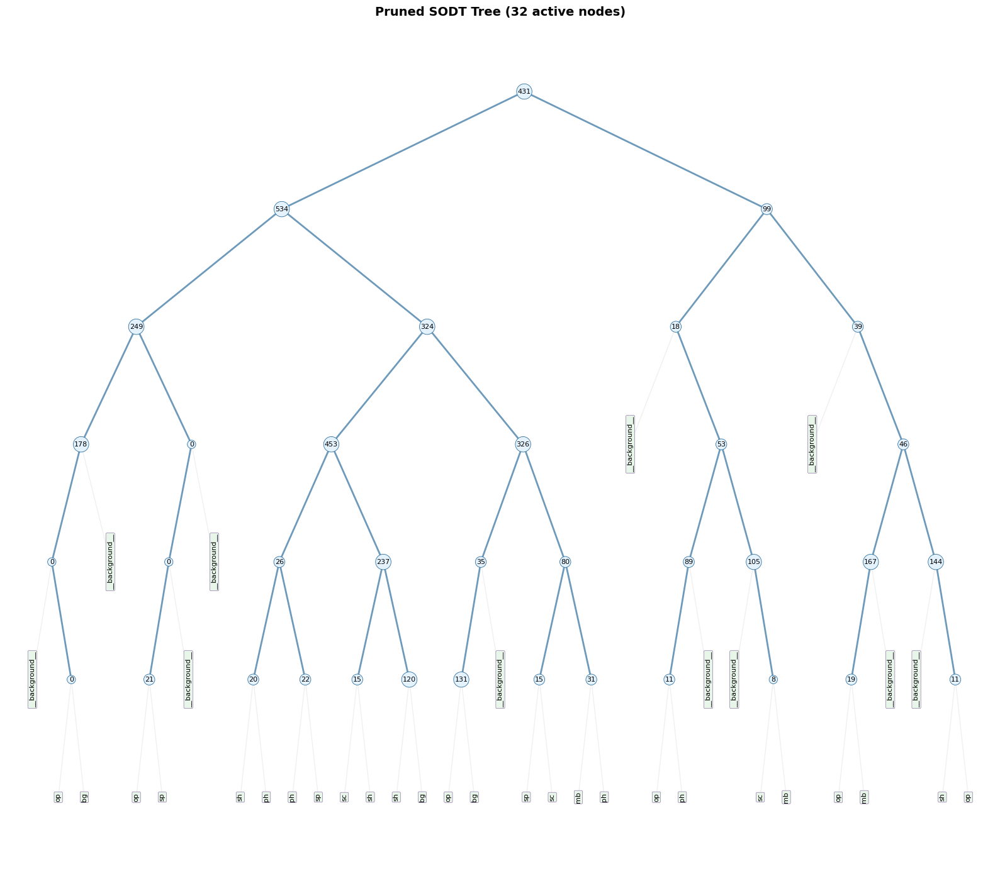

**Gambar 4. 10 Struktur SODT Terpilih setelah Pemangkasan**

Berdasarkan Gambar 4.10, *background exit* tersebar pada kedalaman 3–6, sedangkan seluruh *leaf* cacat berada pada kedalaman 6. Sebanyak 10 dari 13 pasangan *leaf* terbawah memuat dua kelas cacat berbeda, sehingga *node* tingkat atas hingga tengah terutama menyaring *background*, sedangkan *node* terbawah menentukan kelas cacat. Empat *node* berbobot nol hanya menjadi titik lewat pada *decision path*, sementara sebagian *leaf background* merupakan pengganti cabang yang tidak dilalui sampel. Ketiga konfigurasi NR lainnya memiliki topologi serupa dengan 12–14 *leaf background* karena *background* tetap menjadi kelas terbesar bahkan pada NR 1.

Sebaran sparsitas ini sesuai dengan Kairgeldin dan Carreira-Perpiñán (2025). Dengan $\alpha = 0,15$, penalti efektif per sampel pada Persamaan 2.31 dan 2.32 lebih kecil pada *node* yang menerima banyak sampel. Akibatnya, *root* dan *node* pada *decision path* utama memiliki 249–534 *nonzero weight*, sedangkan *node* pada kedalaman 5 hanya 8–131. Sementara itu, $\lambda = 20$ menjaga sparsitas keseluruhan pada 97,9%.

Namun, sub-pohon di bawah N19 dan N22 hanya memiliki *leaf* cacat tanpa *background exit*. Karena *routing* bersifat *hard* tanpa mekanisme koreksi, RoI *background* yang masuk ke kedua sub-pohon tersebut pasti diberi label cacat. Sub-pohon seperti ini muncul pada keempat konfigurasi NR dan menjadi salah satu sumber *false positive* tambahan di luar *teacher*, sebagaimana ditunjukkan pada Subbab 4.6.2.

## 4.6 Hasil dan Evaluasi Deteksi *Neuro-Symbolic*

Subbab ini mengevaluasi model NeSy terhadap *ground truth* pada 500 citra uji dengan metrik pada Subbab 3.4 dan membandingkannya dengan *Faster* R-CNN. Karena *backbone*, RPN, dan *regression head* keduanya sama, selisih kinerja sepenuhnya berasal dari penggantian *classification head* oleh SODT sesuai Subbab 3.8.

### 4.6.1 Kinerja Deteksi *Neuro-Symbolic*

Kinerja deteksi NeSy dirangkum pada Tabel 4.7 dengan *Faster* R-CNN sebagai pembanding, bersama waktu per citra sesuai Subbab 3.9.

**Tabel 4.7 Kinerja Deteksi dan Waktu Inferensi *Faster* R-CNN dan *Neuro-Symbolic***

| **Model** | **mAP@** **0,5:0,95** | **mAP@0,5** | ***Precision*** | ***Recall*** | **F1** | **Waktu (ms/citra)** |
|:---------:|----------|------------|-----------|---------|--------|-------------|
| *Faster* R-CNN | 0,759 | 0,979 | 0,910 | 0,982 | 0,945 | 76,9 ± 30,9 |
| NeSy | 0,757 | 0,974 | 0,923 | 0,973 | 0,947 | 80,9 ± 11,7 |

Berdasarkan Tabel 4.7, kinerja NeSy hampir sama dengan *Faster* R-CNN, dengan *precision* sedikit lebih tinggi dan *recall* sedikit lebih rendah. Fidelitas SODT terhadap *teacher* pada Subbab 4.5 terbawa ke tingkat deteksi, sehingga penggantian *classification head* hanya sedikit mengubah kinerja deteksi.

Meskipun sudah membentuk *heatmap* per *node*, NeSy hanya sedikit lebih lambat daripada *Faster* R-CNN tanpa *explanation*, karena bagian deteksinya lebih ringan. Setiap RoI pada NeSy hanya menghasilkan satu kandidat kelas, dan RoI yang berakhir pada *leaf background* tidak lolos ambang skor minimum. Sebaliknya, *Faster* R-CNN meneruskan hampir seluruh kelas hasil *softmax* dari setiap RoI ke *Soft*-NMS yang berjalan sekuensial, sehingga waktunya bergantung pada jumlah kandidat setiap citra dan simpangannya lebih besar.

Rincian kinerja per kelas cacat kedua model dirangkum pada Tabel 4.8 dalam bentuk AP@0,5, *precision*, dan *recall*.

**Tabel 4.8 Kinerja per Kelas Cacat *Faster* R-CNN dan *Neuro-Symbolic***

<table>
<colgroup>
<col style="width: 15%" />
<col style="width: 14%" />
<col style="width: 15%" />
<col style="width: 12%" />
<col style="width: 15%" />
<col style="width: 12%" />
<col style="width: 13%" />
</colgroup>
<thead>
<tr>
<th rowspan="2" style="text-align: center;"><strong>Kelas</strong></th>
<th colspan="2" style="text-align: center;"><strong>AP@0,5</strong></th>
<th colspan="2" style="text-align: center;"><strong>Precision</strong></th>
<th colspan="2" style="text-align: center;"><strong>Recall</strong></th>
</tr>
<tr>
<th style="text-align: center;"><strong>Faster RCNN</strong></th>
<th style="text-align: center;"><strong>NeSy</strong></th>
<th style="text-align: center;"><strong>Faster RCNN</strong></th>
<th style="text-align: center;"><strong>NeSy</strong></th>
<th style="text-align: center;"><strong>Faster RCNN</strong></th>
<th style="text-align: center;"><strong>NeSy</strong></th>
</tr>
</thead>
<tbody>
<tr>
<td style="text-align: center;">Pinhole</td>
<td style="text-align: center;">0,992</td>
<td style="text-align: center;">0,993</td>
<td style="text-align: center;">0,799</td>
<td style="text-align: center;">0,858</td>
<td style="text-align: center;">1,000</td>
<td style="text-align: center;">0,987</td>
</tr>
<tr>
<td style="text-align: center;">Spurious copper</td>
<td style="text-align: center;">0,988</td>
<td style="text-align: center;">0,978</td>
<td style="text-align: center;">0,933</td>
<td style="text-align: center;">0,983</td>
<td style="text-align: center;">0,991</td>
<td style="text-align: center;">0,981</td>
</tr>
<tr>
<td style="text-align: center;">Mousebite</td>
<td style="text-align: center;">0,983</td>
<td style="text-align: center;">0,979</td>
<td style="text-align: center;">0,948</td>
<td style="text-align: center;">0,947</td>
<td style="text-align: center;">0,986</td>
<td style="text-align: center;">0,978</td>
</tr>
<tr>
<td style="text-align: center;">Open</td>
<td style="text-align: center;">0,979</td>
<td style="text-align: center;">0,977</td>
<td style="text-align: center;">0,960</td>
<td style="text-align: center;">0,964</td>
<td style="text-align: center;">0,979</td>
<td style="text-align: center;">0,979</td>
</tr>
<tr>
<td style="text-align: center;">Spur</td>
<td style="text-align: center;">0,971</td>
<td style="text-align: center;">0,968</td>
<td style="text-align: center;">0,961</td>
<td style="text-align: center;">0,973</td>
<td style="text-align: center;">0,977</td>
<td style="text-align: center;">0,957</td>
</tr>
<tr>
<td style="text-align: center;">Short</td>
<td style="text-align: center;">0,963</td>
<td style="text-align: center;">0,950</td>
<td style="text-align: center;">0,859</td>
<td style="text-align: center;">0,817</td>
<td style="text-align: center;">0,956</td>
<td style="text-align: center;">0,954</td>
</tr>
</tbody>
</table>

Sumber perubahan *precision* dan *recall* tersebut ditelusuri melalui *confusion matrix* pada Gambar 4.11. Baris menyatakan kelas *ground truth* dan kolom menyatakan prediksi, sehingga baris *background* berisi *false positive* (FP), yaitu deteksi cacat pada *region* tanpa cacat, sedangkan kolom *background* berisi *false negative* (FN), yaitu cacat yang tidak terdeteksi.

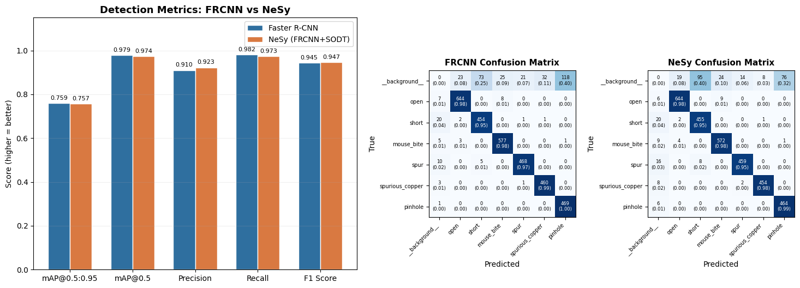

**Gambar 4.11 *Confusion Matrix Faster* R-CNN dan *Neuro-Symbolic***

Berdasarkan Tabel 4.8 dan Gambar 4.11, penurunan *recall* NeSy berasal dari FN yang bertambah dari 46 menjadi 65, sedangkan FP *background* justru turun dari 292 menjadi 236 dan menjelaskan kenaikan *precision*. Kenaikan FN ini berasal dari RoI cacat yang tidak ditiru SODT karena pelatihannya didominasi *background* dengan *negative ratio* 2, dan Subbab 4.5.2 menunjukkan bahwa jumlah RoI cacat yang tidak ditiru bertambah seiring porsi *background*.

Pada tingkat kelas, pola tersebut mengikuti *agreement* pada Tabel 4.6, meskipun selisih FN setiap kelas paling banyak enam deteksi. FN tidak bertambah pada *short*, kelas dengan bobot dan *agreement* tertinggi, maupun pada *open*, tetapi bertambah pada keempat kelas lainnya dan paling banyak pada *spur* yang *agreement*-nya terendah. Sebaliknya, kenaikan FP *background* hanya terjadi pada *short*, sesuai dengan *class weighting* yang membuat SODT lebih mudah memberi label kelas berbobot terbesar, sehingga *precision short* turun paling besar. *Precision spurious copper* dan *pinhole* justru naik karena FP *background* keduanya berkurang. Kecenderungan SODT pada Subbab 4.5, yaitu condong ke *background* dan diimbangi *class weighting* pada *short*, terbawa hingga tingkat deteksi.

### 4.6.2 Routing Margin

Peran skor berbasis *routing margin* diuji dengan mengganti skor seluruh deteksi menjadi 1, tanpa mengubah *decision path* maupun label. Hasilnya ditunjukkan pada Tabel 4.9, dengan Δ sebagai selisih antara kondisi dengan dan tanpa *routing margin*.

**Tabel 4.9 Pengaruh *Routing Margin* terhadap Kinerja Deteksi *Neuro-Symbolic***

| **Metrik** | **Dengan *Routing Margin*** | **Tanpa *Routing Margin*** | **Δ** |
|:--------------------:|---------------------|--------------------|----------|
| mAP@0,5 | 0,974 | 0,821 | +0,153 |
| *Precision* | 0,923 | 0,787 | +0,135 |
| *Recall* | 0,973 | 0,983 | −0,010 |
| F1 | 0,947 | 0,874 | +0,073 |
| AP@0,5 *open* | 0,977 | 0,855 | +0,122 |
| AP@0,5 *short* | 0,950 | 0,706 | +0,244 |
| AP@0,5 *mousebite* | 0,979 | 0,873 | +0,106 |
| AP@0,5 *spur* | 0,968 | 0,842 | +0,126 |
| AP@0,5 *spurious copper* | 0,978 | 0,847 | +0,131 |
| AP@0,5 *pinhole* | 0,993 | 0,801 | +0,192 |

*Confusion matrix* NeSy tanpa *routing margin* ditunjukkan pada Gambar 4.12.

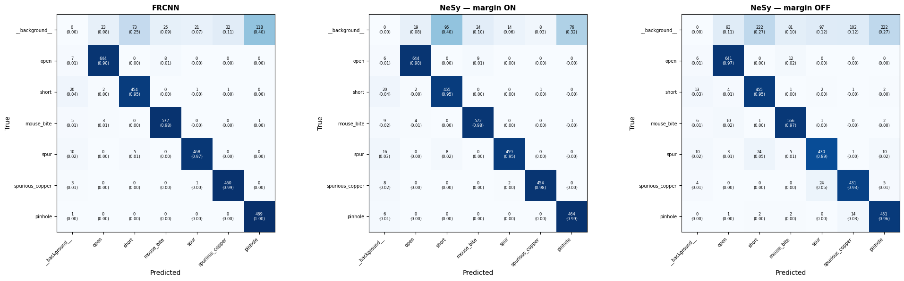

**Gambar 4.12 *Confusion Matrix Neuro-Symbolic* tanpa *Routing Margin***

Tanpa *routing margin* mAP dan *precision* turun tajam, sedangkan *recall* sedikit naik. FP *background* naik dari 236 menjadi 817, atau sekitar 3,5 kali, dan salah kelas antarcacat naik dari 27 menjadi 127. Dengan skor yang seragam, deteksi ber-*confidence* rendah tidak lagi tersaring oleh ambang skor 0,5 pada *precision* dan *recall*, dan AP kehilangan urutan antara deteksi ber-*confidence* tinggi dan rendah, sedangkan *recall* naik karena lebih sedikit deteksi yang jatuh di bawah ambang. Penurunan AP terbesar terjadi pada *short* dan *pinhole*, dua kelas dengan FP *background* terbanyak. Kebocoran RoI *background* pada Subbab 4.5.1 terbawa ke deteksi dan ditekan oleh *routing margin*.

Mekanisme penyaringan tersebut diperlihatkan pada Gambar 4.13 untuk dua deteksi *pinhole*, yaitu deteksi A berupa *true positive* dan deteksi B berupa *false positive* pada *region* *background*.

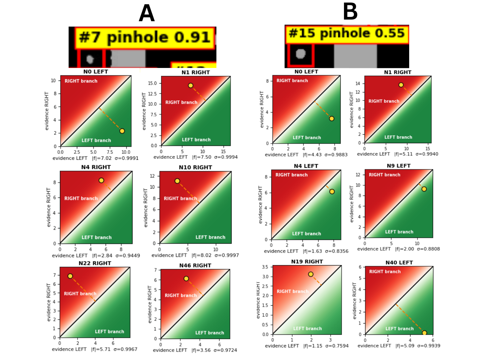

**Gambar 4.13 *Routing Margin* per *Node* pada Deteksi *True Positive* dan *False Positive***

Setiap panel pada Gambar 4.13 mewakili satu *node*, dengan garis diagonal sebagai *split* dan garis putus-putus sebagai jarak RoI ke *split* yang sebanding dengan $\left. \mid f_{i}(x) \right.\mid$ pada Persamaan 3.3. Berdasarkan Gambar 4.13, A relatif jauh dari *split* pada seluruh *node*, sedangkan B mendekati *split* pada N4, N9, dan N19. Setelah N9, *node* terakhir yang masih memiliki jalan menuju *background*, B masuk ke sub-pohon N19 dan pasti dilabeli cacat sesuai Subbab 4.5.3. *Routing margin* tidak mengubah label ini, tetapi menempatkan B pada urutan di bawah A, meskipun B tetap lolos ambang sebagai FP. Sementara itu, A melewati sub-pohon N22 dengan *confidence* tinggi, yang menunjukkan bahwa sub-pohon tanpa *background exit* tetap sah untuk cacat sebenarnya.

## 4.7 Hasil dan Evaluasi *Explanation* pada Neuro-Symbolic

*Explanation* NeSy berupa *heatmap* setiap *node* pada *decision path* sesuai Subbab 3.8. *Explanation* ini dievaluasi pada deteksi berskor minimal 0,5 dari 500 citra uji dengan prosedur pada Algoritma 3.5, dengan Grad-CAM sebagai pembanding.

### 4.7.1 *Faithfulness* dan Lokalisasi *Explanation*

Karena Grad-CAM hanya menghasilkan satu peta per deteksi, *faithfulness* NeSy dibandingkan pada peta gabungan M sesuai Persamaan 3.8, dengan *random control* masing-masing sesuai Subbab 3.9. Hasilnya ditunjukkan pada Tabel 4.10.

**Tabel 4.10 *Faithfulness Explanation Neuro-Symbolic* dan Grad-CAM**

| **Metode** | ***Necessity*** | ***Sufficiency*** | ***Deletion* AUC** | ***Insertion* AUC** |
|:---------------|------------|-------------|----------------|----------------|
| NeSy | 0,768 | 1,000 | 0,200 | 0,877 |
| NeSy acak | 0,022 | 0,981 | 0,592 | 0,590 |
| Grad-CAM | 0,126 | 0,975 | 0,599 | 0,846 |
| Grad-CAM acak | 0,018 | 0,983 | 0,758 | 0,758 |

Berdasarkan Tabel 4.10, NeSy terpisah jauh dari NeSy acak pada *Necessity*, *Deletion* AUC, dan *Insertion* AUC, sedangkan Grad-CAM hanya sedikit lebih baik daripada Grad-CAM acak. Peta NeSy merupakan dekomposisi eksak kontribusi fitur setiap *node* sesuai Persamaan 3.5 hingga 3.7, sedangkan Grad-CAM merata-ratakan gradien per kanal dan membuang bagian negatifnya melalui ReLU, sehingga menghapus *region* yang disorotnya jarang mengubah label. *Sufficiency* hampir penuh pada seluruh baris, termasuk *random control*, sehingga metrik ini tidak membedakan kedua metode.

Peta M hanya dipakai untuk perbandingan tersebut, sedangkan keluaran *explanation* NeSy yang sebenarnya adalah *heatmap* setiap *node*. Keandalannya diuji sesuai langkah 7 Algoritma 3.5 pada sekitar 3.310 deteksi di setiap kedalaman, sebagaimana ditunjukkan pada Tabel 4.11, dengan *Necessity* seluruh kotak sebagai *Necessity* saat seluruh isi proposal dihapus dan *support* sebagai porsi proposal yang mendapat kontribusi *node*.

**Tabel 4.11 *Faithfulness* per *Node* pada Setiap Kedalaman**

<table style="width:99%;">
<colgroup>
<col style="width: 9%" />
<col style="width: 10%" />
<col style="width: 14%" />
<col style="width: 21%" />
<col style="width: 14%" />
<col style="width: 16%" />
<col style="width: 12%" />
</colgroup>
<thead>
<tr>
<th style="text-align: center;"><em><strong>Depth</strong></em></th>
<th style="text-align: center;"><strong>Peta</strong></th>
<th style="text-align: center;"><em><strong>Necessity</strong></em></th>
<th style="text-align: center;"><strong><em>Necessity</em>  
Seluruh Kotak</strong></th>
<th style="text-align: center;"><strong><em>Deletion</em>  
AUC</strong></th>
<th style="text-align: center;"><strong><em>Insertion</em>  
AUC</strong></th>
<th style="text-align: center;"><em><strong>Support</strong></em></th>
</tr>
</thead>
<tbody>
<tr>
<td rowspan="2" style="text-align: center;">1</td>
<td style="text-align: center;">NeSy</td>
<td style="text-align: center;">0,057</td>
<td style="text-align: center;">0,000</td>
<td style="text-align: center;">0,611</td>
<td style="text-align: center;">0,947</td>
<td style="text-align: center;">0,544</td>
</tr>
<tr>
<td style="text-align: center;">Acak</td>
<td style="text-align: center;">0,000</td>
<td style="text-align: center;">–</td>
<td style="text-align: center;">0,859</td>
<td style="text-align: center;">0,859</td>
<td style="text-align: center;">–</td>
</tr>
<tr>
<td rowspan="2" style="text-align: center;">2</td>
<td style="text-align: center;">NeSy</td>
<td style="text-align: center;">0,298</td>
<td style="text-align: center;">0,999</td>
<td style="text-align: center;">0,641</td>
<td style="text-align: center;">0,948</td>
<td style="text-align: center;">0,544</td>
</tr>
<tr>
<td style="text-align: center;">Acak</td>
<td style="text-align: center;">0,001</td>
<td style="text-align: center;">–</td>
<td style="text-align: center;">0,889</td>
<td style="text-align: center;">0,889</td>
<td style="text-align: center;">–</td>
</tr>
<tr>
<td rowspan="2" style="text-align: center;">3</td>
<td style="text-align: center;">NeSy</td>
<td style="text-align: center;">0,364</td>
<td style="text-align: center;">0,824</td>
<td style="text-align: center;">0,624</td>
<td style="text-align: center;">0,944</td>
<td style="text-align: center;">0,544</td>
</tr>
<tr>
<td style="text-align: center;">Acak</td>
<td style="text-align: center;">0,006</td>
<td style="text-align: center;">–</td>
<td style="text-align: center;">0,859</td>
<td style="text-align: center;">0,858</td>
<td style="text-align: center;">–</td>
</tr>
<tr>
<td rowspan="2" style="text-align: center;">4</td>
<td style="text-align: center;">NeSy</td>
<td style="text-align: center;">0,336</td>
<td style="text-align: center;">0,623</td>
<td style="text-align: center;">0,629</td>
<td style="text-align: center;">0,949</td>
<td style="text-align: center;">0,544</td>
</tr>
<tr>
<td style="text-align: center;">Acak</td>
<td style="text-align: center;">0,008</td>
<td style="text-align: center;">–</td>
<td style="text-align: center;">0,886</td>
<td style="text-align: center;">0,885</td>
<td style="text-align: center;">–</td>
</tr>
<tr>
<td rowspan="2" style="text-align: center;">5</td>
<td style="text-align: center;">NeSy</td>
<td style="text-align: center;">0,353</td>
<td style="text-align: center;">0,347</td>
<td style="text-align: center;">0,566</td>
<td style="text-align: center;">0,950</td>
<td style="text-align: center;">0,416</td>
</tr>
<tr>
<td style="text-align: center;">Acak</td>
<td style="text-align: center;">0,002</td>
<td style="text-align: center;">–</td>
<td style="text-align: center;">0,877</td>
<td style="text-align: center;">0,877</td>
<td style="text-align: center;">–</td>
</tr>
<tr>
<td rowspan="2" style="text-align: center;">6</td>
<td style="text-align: center;">NeSy</td>
<td style="text-align: center;">0,386</td>
<td style="text-align: center;">0,297</td>
<td style="text-align: center;">0,570</td>
<td style="text-align: center;">0,951</td>
<td style="text-align: center;">0,297</td>
</tr>
<tr>
<td style="text-align: center;">Acak</td>
<td style="text-align: center;">0,011</td>
<td style="text-align: center;">–</td>
<td style="text-align: center;">0,855</td>
<td style="text-align: center;">0,856</td>
<td style="text-align: center;">–</td>
</tr>
</tbody>
</table>

Berdasarkan Tabel 4.11, peta setiap *node* lebih *faithful* daripada posisi acak pada semua kedalaman, sedangkan *random control* hampir tidak pernah membalik keputusan. Rendahnya *Necessity* pada kedalaman 1 tidak menandakan peta yang keliru, karena keputusan N0 tidak berbalik bahkan ketika seluruh isi proposal dihapus. Pada kedalaman 5 dan 6, *Necessity* justru melebihi *Necessity* seluruh kotak karena bukti pendukung hilang sementara bukti ke arah sebaliknya tetap tersisa, dan *support* yang menyempit menunjukkan bahwa *node* dalam menimbang *region* yang lebih kecil.

Lokalisasi diukur dengan *Pointing Game* dan IoU *Heatmap* pada *low-IoU proposal* sesuai Algoritma 3.5, sebagaimana ditunjukkan pada Tabel 4.12.

**Tabel 4.12 Lokalisasi *Explanation Neuro-Symbolic* dan Grad-CAM**

| **Metode** | ***Pointing Game*** | **IoU *Heatmap*** |
|:-----------|---------------------|-------------------|
| NeSy       | 0,863               | 0,769             |
| Grad-CAM   | 0,882               | 0,790             |
| Acak       | 0,820               | 0,760             |

Berdasarkan Tabel 4.12, lokalisasi NeSy hampir sama dengan Grad-CAM dan keduanya berada di atas peta acak, sehingga *heatmap* NeSy menunjuk *region* cacat seperti metode yang umum dipakai. Jaraknya terhadap peta acak kecil karena satu posisi *feature map neck* mencakup *region* citra yang jauh lebih luas daripada proposal. Dengan lokalisasi yang setara, pembeda kedua metode terletak pada *faithfulness*.

Pada pengukuran yang sama dengan Tabel 4.7, *Faster* R-CNN dengan Grad-CAM memerlukan 102,5 ± 32,5 ms per citra, atau sekitar 1,3 kali waktu NeSy. NeSy cukup menjalankan ulang *RoI Align* pada *feature map* yang sudah tersedia, sedangkan Grad-CAM harus menjalankan ulang *backbone* dan propagasi mundur hingga *feature map neck* untuk setiap deteksi.

### 4.7.2 Analisis Heatmap per Node

Perbedaan *explanation* NeSy dan Grad-CAM secara visual ditunjukkan pada Gambar 4.14 untuk satu deteksi *spur*, dengan *heatmap* setiap *node* NeSy disusun sesuai urutan *decision path* dan peta Grad-CAM di sampingnya.

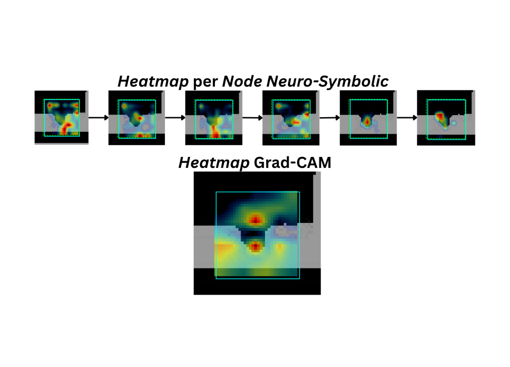

**Gambar 4.14 Perbedaan *Heatmap* pada *Neuro-Symbolic* dan Grad-CAM**

Berdasarkan Gambar 4.14, Grad-CAM hanya memberi satu peta yang menyebar hingga keluar proposal dan di sepanjang jalur tembaga, sedangkan NeSy memperlihatkan *region* yang ditimbang pada setiap langkah keputusan.

*Region* yang ditimbang setiap *node* ditelaah pada dua TP per kelas yang dipilih secara acak dari deteksi berskor minimal 0,5. Panel pada setiap gambar disusun dari kedalaman 1 di atas hingga kedalaman 6 di bawah dan dinormalisasi terhadap puncaknya masing-masing, dengan warna hitam sebagai tembaga dan abu-abu sebagai substrat. *Heatmap* per *node* untuk kelas *spur* ditunjukkan pada Gambar 4.15.

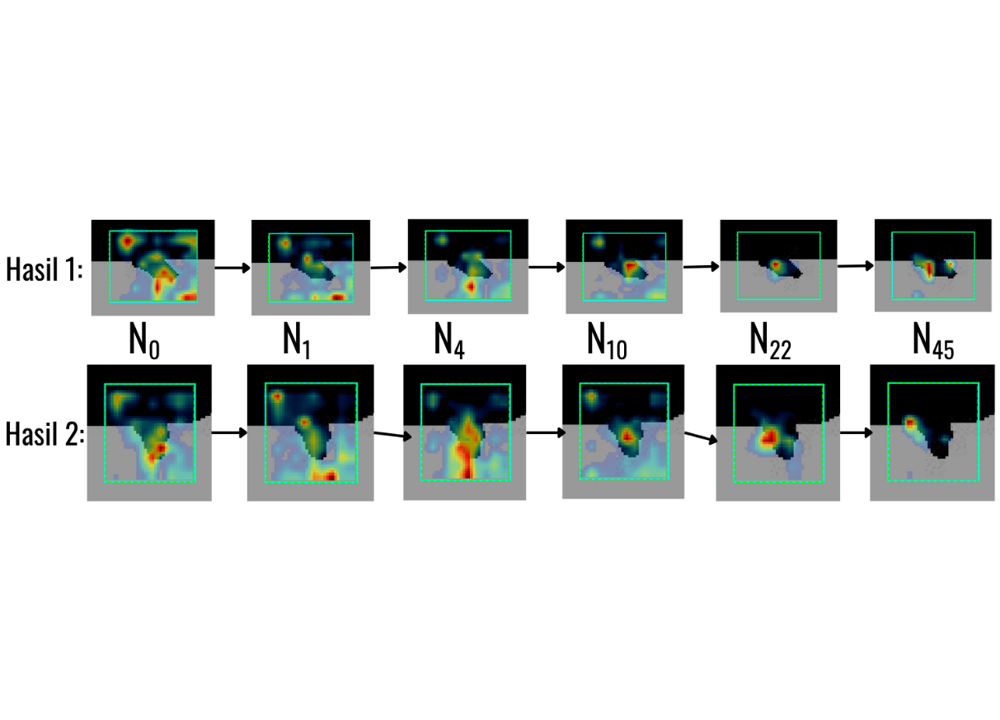

**Gambar 4.15 *Heatmap* per *Node* pada Dua Deteksi *Spur***

Kedua deteksi *spur* menempuh *decision path* yang sama, yaitu N0–N1–N4–N10–N22–N45. Pohon lebih dulu menimbang tembaga di sudut proposal dan pita di tepi bawahnya pada N0 dan N1, lalu berpindah ke badan tonjolan pada N4 dan N10. Pada N22 dan N45, penimbangan menyempit ke satu sisi tonjolan, sedangkan tembaga dan substrat di sekitarnya tidak lagi ditimbang.

*Heatmap* per *node* untuk kelas *spurious copper* ditunjukkan pada Gambar 4.16.

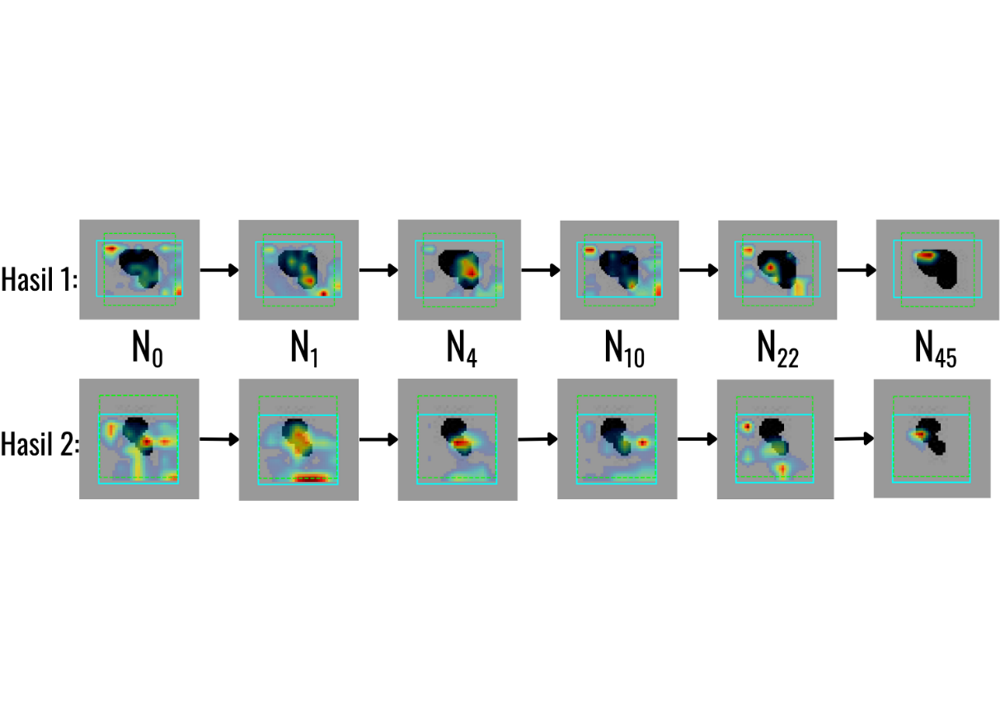

**Gambar 4. 16 *Heatmap* per *Node* pada Dua Deteksi *Spurious Copper***

Berdasarkan Gambar 4.16, kedua deteksi *spurious copper* juga menempuh *decision path* N0–N1–N4–N10–N22–N45. Pohon lebih dulu menimbang substrat utuh di sudut proposal dan tepi bawahnya pada N0 dan N1, lalu menimbang tepi bawah gumpalan tembaga pada N4. N10 kembali menimbang substrat di sekitar gumpalan, sedangkan N45 berakhir pada tepi gumpalan. Bagian tengah gumpalan tidak pernah menjadi *region* yang dominan, yang menandakan bahwa yang ditimbang adalah batas antara tembaga berlebih dan substrat.

*Heatmap* per *node* untuk kelas *pinhole* ditunjukkan pada Gambar 4.17.

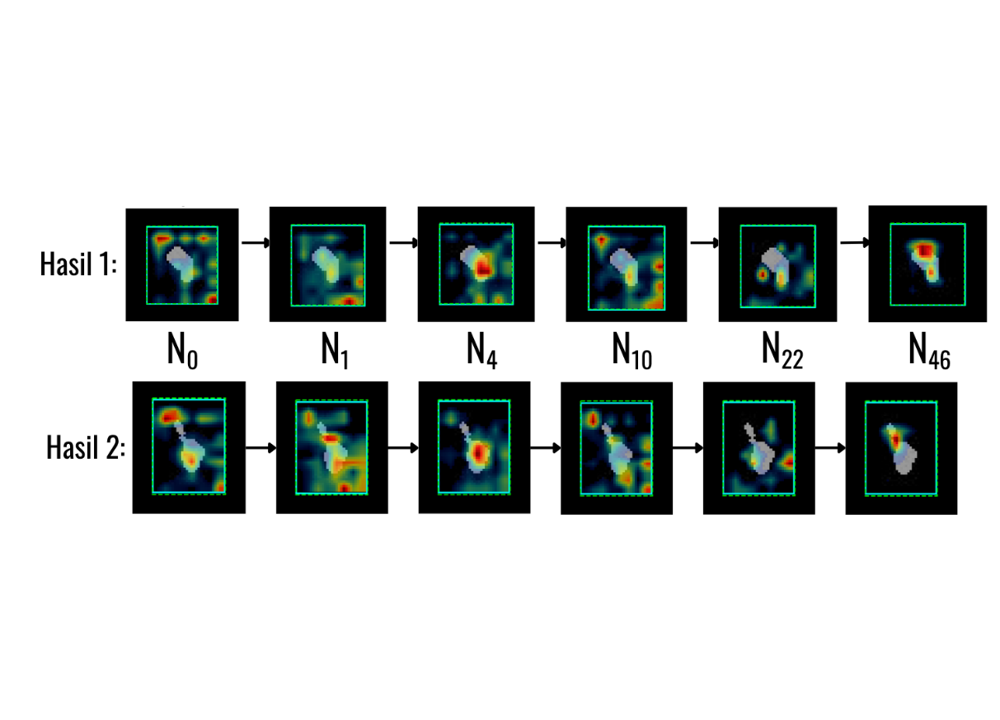

**Gambar 4.17 *Heatmap* per *Node* pada Dua Deteksi *Pinhole***

Berdasarkan Gambar 4.17, kedua deteksi *pinhole* menempuh *decision path* N0–N1–N4–N10–N22–N46. Pohon lebih dulu menimbang tembaga utuh di sekitar lubang, yaitu sudut proposal pada N0 dan tepi bawahnya pada N1, lalu memusat ke lubang pada N4. N10 dan N22 kembali menimbang tembaga di sekeliling lubang, dan N46 berakhir pada bibir lubang, bukan pada pusatnya. Urutan ini menunjukkan bahwa pohon membandingkan lubang dengan tembaga utuh di sekitarnya sebelum menetapkan label.

*Heatmap* per *node* untuk kelas *mousebite* ditunjukkan pada Gambar 4.18.

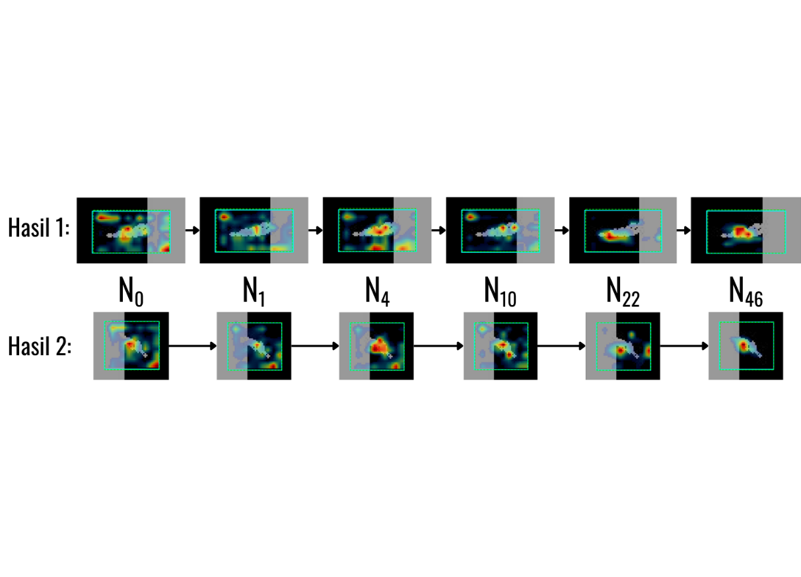

**Gambar 4.18 *Heatmap* per *Node* pada Dua Deteksi *Mousebite***

Berdasarkan Gambar 4.18, kedua deteksi *mousebite* menempuh *decision path* N0–N1–N4–N10–N22–N46. Pohon lebih dulu menimbang sudut proposal dan *region* di sepanjang tepi jalur yang tergigit pada N0 dan N1, lalu tertuju ke lekukan gigitan mulai N4. Pada N10 hingga N46, penimbangan menyempit ke beberapa titik pada kontur lekukan, sehingga keputusan akhirnya bertumpu pada bentuk tepi jalur yang hilang.

*Heatmap* per *node* untuk kelas *open* ditunjukkan pada Gambar 4.19.

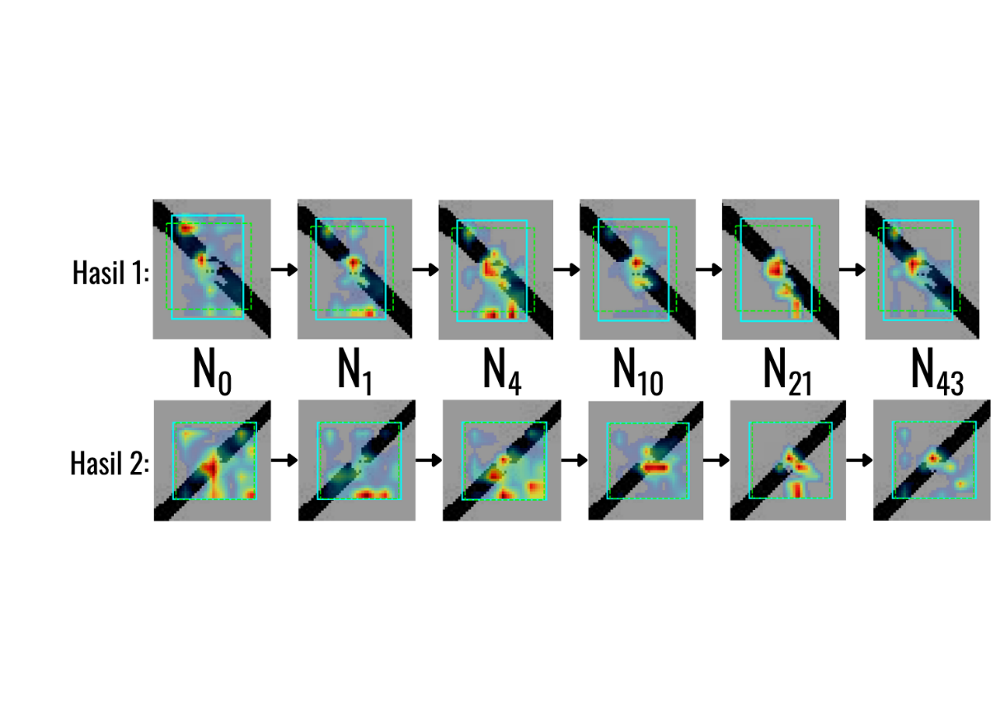

**Gambar 4.19 *Heatmap* per *Node* pada Dua Deteksi *Open***

Berdasarkan Gambar 4.19, kedua deteksi *open* menempuh *decision path* N0–N1–N4–N10–N21–N43. Pohon lebih dulu menimbang sekitar celah dan tepi bawah proposal pada N0 dan N1, lalu menimbang ujung jalur yang terputus pada N4. N10 menimbang celah di antara kedua ujung tersebut, sedangkan N21 dan N43 kembali ke ujung jalur di tepi celah. Penimbangan berpindah antara ujung jalur dan celahnya, sesuai dengan ciri *open* sebagai jalur tembaga yang terputus.

*Heatmap* per *node* untuk kelas *short* ditunjukkan pada Gambar 4.20.

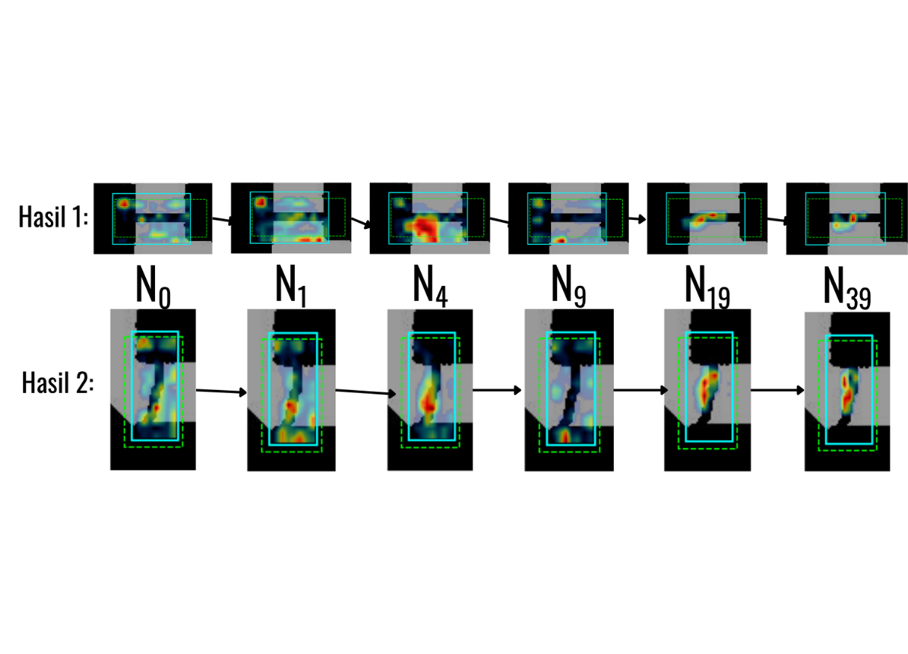

**Gambar 4.20 Heatmap per Node pada Dua Deteksi Short**

Berdasarkan Gambar 4.20, kedua deteksi *short* menempuh *decision path* N0–N1–N4–N9–N19–N39, satu-satunya *decision path* yang berbelok ke N9 setelah N4. Pohon lebih dulu menimbang sudut dan tepi bawah proposal pada N0 dan N1, lalu menimbang jembatan tembaga pada N4. N9 kembali ke tepi bawah proposal, sedangkan N19 dan N39 memusat pada pita tembaga yang menghubungkan dua jalur.

Pola dari Gambar 4.15 hingga 4.20 dirangkum pada Tabel 4.13 menurut kelompok kedalaman.*\*

**Tabel 4.13 Sintesis *Region* yang Ditimbang *Node* per Kelas Cacat**

| **Kelas** | **Kedalaman 1–2** | **Kedalaman 3–4** | **Kedalaman 5–6** |
|:----------:|-----------------------|--------------------|-----------------|
| *Spur* | Tembaga di sudut dan tepi bawah proposal | Badan tonjolan | Satu sisi tonjolan |
| *Spurious copper* | Substrat di sudut dan tepi bawah proposal | Tepi bawah gumpalan, lalu substrat di sekitarnya | Tepi gumpalan |
| *Pinhole* | Tembaga utuh di sudut dan tepi bawah proposal | Lubang, lalu tembaga di sekelilingnya | Bibir lubang |
| *Mousebite* | Sudut proposal dan tepi jalur yang tergigit | Lekukan gigitan | Kontur lekukan |
| *Open* | Sekitar celah dan tepi bawah proposal | Ujung jalur yang terputus, lalu celahnya | Ujung jalur di tepi celah |
| *Short* | Sudut dan tepi bawah proposal | Jembatan tembaga, lalu tepi bawah proposal | Pita penghubung antarjalur |

Berdasarkan Tabel 4.13, dua deteksi dari kelas yang sama selalu menempuh *decision path* yang sama, dan urutan penimbangannya berulang. Kedalaman 1 dan 2 menimbang konteks di sekitar cacat, terutama sudut dan tepi bawah proposal, dengan pola yang serupa untuk semua kelas. Mulai kedalaman 3, penimbangan berpindah ke cacat itu sendiri, lalu pada kedalaman 5 dan 6 menyempit ke tepi atau kontur cacat alih-alih pusatnya, sejalan dengan *support* yang menurun pada Tabel 4.11. Setiap langkah keputusan NeSy pun dapat dibaca sebagai *region* tertentu yang ditimbang, dan keandalan setiap peta tersebut telah ditunjukkan pada Tabel 4.11.

### 4.7.3 Pengaruh Proyeksi FPN terhadap *Heatmap*

Pilihan pada Subbab 3.8 untuk menghitung *heatmap* pada *feature map neck*, selanjutnya disebut proyeksi FPN, diuji dengan membentuk *heatmap* langsung pada grid 7×7 hasil *RoI Align*, dengan pohon dan bobot yang sama, sedangkan penghapusan posisi tetap dilakukan pada *feature map neck*. Hasilnya ditunjukkan pada Tabel 4.14, dengan kolom acak untuk metrik lokalisasi.

**Tabel 4.14 Pengaruh Proyeksi FPN terhadap *Faithfulness* dan Lokalisasi *Heatmap***

| **Metrik** | **Dengan FPN** | **Tanpa FPN** | **Acak** |
|:---------------------------------|---------------|--------------|---------|
| *Necessity* tingkat *decision path* | 0,768 | 0,712 | – |
| *Deletion* AUC tingkat *decision path* | 0,200 | 0,222 | – |
| *Insertion* AUC tingkat *decision path* | 0,877 | 0,846 | – |
| *Pointing Game* | 0,863 | 0,777 | 0,820 |
| IoU *Heatmap* | 0,769 | 0,757 | 0,760 |
| *Necessity* kedalaman 1 | 0,057 | 0,016 | – |
| *Necessity* kedalaman 2 | 0,298 | 0,065 | – |
| *Necessity* kedalaman 3 | 0,364 | 0,206 | – |
| *Necessity* kedalaman 4 | 0,336 | 0,235 | – |
| *Necessity* kedalaman 5 | 0,353 | 0,153 | – |
| *Necessity* kedalaman 6 | 0,386 | 0,276 | – |

Berdasarkan Tabel 4.14, tanpa proyeksi FPN lokalisasi turun hingga setara dengan peta acak, bahkan *Pointing Game* jatuh di bawahnya, sedangkan *faithfulness* tingkat *decision path* hanya turun sedikit. *Necessity* per *node* turun pada semua kedalaman, paling tajam pada kedalaman 2 dan 5. Pada grid 7×7 hasil *RoI Align*, setiap sel mewakili *region* proposal yang luas dan letak kontribusi di dalam sel hilang, sehingga peta tidak dapat menunjuk letak yang tepat. Sementara itu, *faithfulness* tetap berada di atas *random control* karena bobot pohonnya sama. Yang rusak adalah letak peta, bukan isi yang ditimbang.

Satu deteksi *mousebite* ditampilkan dengan *heatmap* tanpa dan dengan proyeksi FPN secara berdampingan pada Gambar 4.21.

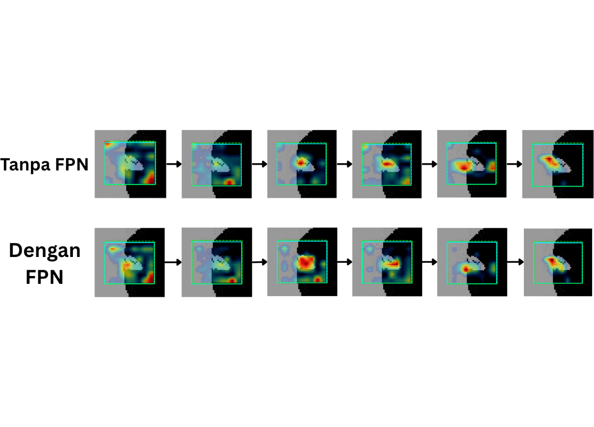

**Gambar 4.21 Perbandingan *Heatmap* per *Node* pada FPN untuk *Mousebite***

Berdasarkan Gambar 4.21, tanpa proyeksi FPN N0 kehilangan penimbangan pada pangkal gigitan sehingga yang tersisa hanya sudut proposal. Peta N4 menyusut menjadi satu titik di pangkal gigitan, padahal dengan proyeksi FPN mencakup seluruh lekukan. N22 melebar ke substrat di kiri gigitan dan tepi kanan proposal, sedangkan dengan proyeksi FPN memusat pada pangkal gigitan. N1, N10, dan N46 menunjuk *region* yang hampir sama pada kedua peta. Pola ini sejalan dengan *Necessity* per *node* yang turun pada Tabel 4.14 dan menegaskan bahwa proyeksi FPN diperlukan agar setiap peta *node* menunjuk letak yang benar.

# BAB V PENUTUP

## 5.1 Kesimpulan

Penelitian ini mengintegrasikan *Faster* R-CNN dengan SODT sebagai arsitektur *neuro-symbolic* untuk deteksi cacat PCB pada *dataset* DeepPCB. SODT yang menggantikan *classification head* mampu mempertahankan akurasi *Faster* R-CNN, dengan mAP@0,5 sebesar 0,974 terhadap 0,979 dan mAP@0,5:0,95 sebesar 0,757 terhadap 0,759, serta *precision* yang justru naik dari 0,910 menjadi 0,923. Dengan akurasi yang terjaga tersebut, NeSy menghasilkan *explanation* yang lebih *faithful* daripada Grad-CAM, ditunjukkan oleh *Necessity* sebesar 0,768 terhadap 0,126 dan *Deletion* AUC sebesar 0,200 terhadap 0,599, dengan lokalisasi yang setara dan waktu per citra yang lebih singkat, yaitu 80,9 ms terhadap 102,5 ms. *Explanation* tersebut tidak hanya berupa satu peta, tetapi *heatmap* pada setiap *node* di *decision path* yang lebih menentukan daripada posisi acak pada seluruh kedalaman, sehingga keputusan model dapat ditelusuri dan diinterpretasikan langkah demi langkah, dari konteks di sekitar cacat hingga kontur cacat itu sendiri. Kemampuan ini mendukung akuntabilitas hasil deteksi dan memungkinkan teknisi menelaah lebih dalam dasar setiap keputusan saat validasi. Kedua tujuan penelitian, yaitu mempertahankan performa deteksi sekaligus menyediakan *explanation* yang *faithful* dan lebih baik daripada Grad-CAM, telah tercapai.

## 5.2 Saran

Penelitian ini masih memiliki beberapa keterbatasan. SODT hanya meniru label *teacher*, sehingga RoI cacat yang gagal ditiru menambah *false negative*. Kanal *neck* juga dikurangi menjadi 64 untuk membatasi dimensi masukan SODT, dan evaluasi *explanation* dilakukan secara kuantitatif tanpa melibatkan teknisi. Berdasarkan keterbatasan tersebut, saran untuk penelitian selanjutnya adalah sebagai berikut.

1.  Melatih SODT langsung terhadap *ground truth* alih-alih meniru label *teacher*, agar kinerja pohon tidak lagi dibatasi oleh fidelitasnya terhadap *teacher*.

2.  Menggunakan kanal *neck* penuh sebanyak 256 seperti pada Fung et al. (2024), dengan konsekuensi dimensi masukan SODT naik dari 3.136 menjadi 12.544 dan pelatihan TAO menjadi lebih berat.

3.  Melakukan studi pengguna dengan teknisi inspeksi PCB untuk mengukur dampak *explanation* per *node* terhadap proses validasi hasil deteksi.

# DAFTAR PUSTAKA

Ali, S., Abuhmed, T., El-Sappagh, S., Muhammad, K., Alonso-Moral, J.M., Confalonieri, R., Guidotti, R., Del Ser, J., Díaz-Rodríguez, N., Herrera, F., 2023. Explainable Artificial Intelligence (XAI): What we know and what is left to attain Trustworthy Artificial Intelligence. *Information Fusion* 99, 101805.

Ancona, M., Ceolini, E., Öztireli, C., Gross, M., 2019. Gradient-based attribution methods. In: Samek, W., Montavon, G., Vedaldi, A., Hansen, L.K., Müller, K.-R. (Eds.), *Explainable AI: Interpreting, Explaining and Visualizing Deep Learning*, LNCS 11700. Springer, Cham, pp. 169–191.

Araujo, A., Norris, W., Sim, J., 2019. Computing receptive fields of convolutional neural networks. *Distill*. <https://doi.org/10.23915/distill.00021>

Bach, S., Binder, A., Montavon, G., Klauschen, F., Müller, K.-R., Samek, W., 2015. On pixel-wise explanations for non-linear classifier decisions by layer-wise relevance propagation. *PLoS ONE* 10(7), e0130140.

Bodla, N., Singh, B., Chellappa, R., Davis, L.S., 2017. Soft-NMS — Improving object detection with one line of code. In: Proceedings of the IEEE International Conference on Computer Vision (ICCV), pp. 5561–5569.

Buciluǎ, C., Caruana, R., Niculescu-Mizil, A., 2006. Model compression. In: *Proceedings of the 12th ACM SIGKDD International Conference on Knowledge Discovery and Data Mining (KDD)*, pp. 535–541.

Canha, D., Kubler, S., Främling, K., Fagherazzi, G., 2025. A functionally-grounded benchmark framework for XAI methods: Insights and foundations from a systematic literature review. *ACM Computing Surveys* 57(12), 320.

Carreira-Perpiñán, M.Á., Tavallali, P., 2018. Alternating optimization of decision trees, with application to learning sparse oblique trees. In: *Advances in Neural Information Processing Systems (NeurIPS)*, 31, pp. 1211–1221.

Chen, X., Wu, Y., He, X., Ming, W., 2023. A Comprehensive Review of Deep Learning-Based PCB Defect Detection. IEEE Access 11, 139017-139036.

Coombs, C.F., Holden, H.T., 2016. *Printed Circuits Handbook*, 7th ed. McGraw-Hill Education, New York.

d'Avila Garcez, A., Lamb, L.C., 2023. Neurosymbolic AI: the 3rd wave. *Artificial Intelligence Review*, 56(11), pp.12387-12406.

DeYoung, J., Jain, S., Rajani, N.F., Lehman, E., Xiong, C., Socher, R., Wallace, B.C., 2020. ERASER: A benchmark to evaluate rationalized NLP models. In: *Proceedings of the 58th Annual Meeting of the Association for Computational Linguistics (ACL)*, pp. 4443–4458.

Doshi-Velez, F., Kim, B., 2017. Towards a rigorous science of interpretable machine learning. *arXiv preprint* arXiv:1702.08608.

Elkan, C., 2001. The foundations of cost-sensitive learning. In: Proceedings of the 17th International Joint Conference on Artificial Intelligence (IJCAI), pp. 973–978.

Everingham, M., Van Gool, L., Williams, C.K.I., Winn, J., Zisserman, A., 2010. The PASCAL Visual Object Classes (VOC) challenge. *International Journal of Computer Vision* 88(2), 303–338.

Fung, K.C., Xue, K.-W., Lai, C.-M., Lin, K.-H., Lam, K.-M., 2024. Improving PCB defect detection using selective feature attention and pixel shuffle pyramid. Results in Engineering 21, 101992.

Girshick, R., 2015. Fast R-CNN. In: *Proceedings of the IEEE International Conference on Computer Vision (ICCV)*, pp. 1440–1448.

Goodfellow, I., Bengio, Y., Courville, A., 2016. *Deep Learning*. MIT Press, Cambridge, MA.

Hada, S.S., Carreira-Perpiñán, M.Á., Zharmagambetov, A., 2024. Sparse oblique decision trees: a tool to understand and manipulate neural net features. *Data Mining and Knowledge Discovery*, 38(5), pp.2863-2902.

Han, Z., Hong, M., Wang, D., 2017. Deep learning and applications. In: *Signal Processing and Networking for Big Data Applications*. Cambridge University Press, Cambridge, pp. 126-168.

He, H., Garcia, E.A., 2009. Learning from imbalanced data. IEEE Transactions on Knowledge and Data Engineering, 21(9), pp. 1263–1284.

He, K., Zhang, X., Ren, S., Sun, J., 2016. Deep residual learning for image recognition. In: *Proceedings of the IEEE Conference on Computer Vision and Pattern Recognition (CVPR)*, pp. 770–778.

He, K., Gkioxari, G., Dollár, P., Girshick, R., 2020. Mask R-CNN. *IEEE Transactions on Pattern Analysis and Machine Intelligence* 42(2), 386–397.

Hinton, G., Vinyals, O., Dean, J., 2015. Distilling the knowledge in a neural network. arXiv preprint arXiv:1503.02531.

Hoffmann, R., Reich, C., 2023. A systematic literature review on artificial intelligence and explainable artificial intelligence for visual quality assurance in manufacturing. *Electronics* 12(22), 4572.

IPC, 2015. IPC-6012D: Qualification and Performance Specification for Rigid Printed Boards. Association Connecting Electronics Industries.

IPC, 2020. *IPC-A-600K: Acceptability of Printed Boards*. Association Connecting Electronics Industries.

Kairgeldin, R., Carreira-Perpiñán, M.Á., 2025. Neurosymbolic models based on hybrids of convolutional neural networks and decision trees. *Proceedings of Machine Learning Research (NeSy 2025)*, 284, pp.796-813.

Kautz, H., 2022. The third AI summer: AAAI Robert S. Engelmore Memorial Lecture. *AI Magazine* 43(1), 105–125.

Khandpur, R.S., 2005. *Printed Circuit Boards: Design, Fabrication, and Assembly*. McGraw-Hill Education.

Kontschieder, P., Fiterau, M., Criminisi, A., Rota Bulò, S., 2015. Deep neural decision forests. In: *Proceedings of the IEEE International Conference on Computer Vision (ICCV)*, pp. 1467–1475.

LeCun, Y., Bengio, Y., Hinton, G., 2015. Deep learning. *Nature*, 521(7553), pp. 436-444.

Li, X., Wang, W., Hu, X., Yang, J., 2019. Selective kernel networks. In: *Proceedings of the IEEE/CVF Conference on Computer Vision and Pattern Recognition (CVPR)*, pp. 510–519.

Lin, T.-Y., Maire, M., Belongie, S., Hays, J., Perona, P., Ramanan, D., Dollár, P., Zitnick, C.L., 2014. Microsoft COCO: Common objects in context. In: *European Conference on Computer Vision (ECCV)*, LNCS 8693. Springer, Cham, pp. 740–755.

Lin, T.-Y., Dollár, P., Girshick, R., He, K., Hariharan, B., Belongie, S., 2017. Feature pyramid networks for object detection. In: *Proceedings of the IEEE Conference on Computer Vision and Pattern Recognition (CVPR)*, pp. 2117–2125.

Luo, W., Li, Y., Urtasun, R., Zemel, R., 2016. Understanding the effective receptive field in deep convolutional neural networks. In: *Advances in Neural Information Processing Systems (NeurIPS)*, 29, pp. 4898–4906.

Michel-Delétie, C., Sarker, M.K., 2026. Neuro-symbolic methods for trustworthy AI: A systematic review with a focus on interpretability. *Neurosymbolic Artificial Intelligence* 2, 29498732261469336.

Minaee, S., Boykov, Y., Porikli, F., Plaza, A., Kehtarnavaz, N., Terzopoulos, D., 2021. Image segmentation using deep learning: A survey. *IEEE Transactions on Pattern Analysis and Machine Intelligence*, 44(7), pp.3523-3542.

Nauta, M., Trienes, J., Pathak, S., Nguyen, E., Peters, M., Schmitt, Y., Schlötterer, J., van Keulen, M., Seifert, C., 2023. From anecdotal evidence to quantitative evaluation methods: A systematic review on evaluating explainable AI. *ACM Computing Surveys* 55(13s), 295.

Petsiuk, V., Das, A., Saenko, K., 2018. RISE: Randomized input sampling for explanation of black-box models. In: *Proceedings of the British Machine Vision Conference (BMVC)*, pp. 1–13.

Platt, J.C., 1999. Probabilistic outputs for support vector machines and comparisons to regularized likelihood methods. In: Advances in Large Margin Classifiers. MIT Press, Cambridge, MA, pp. 61–74.

Prince, S.J.D., 2023. *Understanding Deep Learning*. MIT Press, Cambridge, MA.

Provost, F., Domingos, P., 2003. Tree induction for probability-based ranking. *Machine Learning* 52(3), 199–215.

Ren, S., He, K., Girshick, R., Sun, J., 2017. Faster R-CNN: Towards real-time object detection with region proposal networks. *IEEE Transactions on Pattern Analysis and Machine Intelligence* 39(6), 1137–1149.

Rudin, C., 2019. Stop explaining black box machine learning models for high stakes decisions and use interpretable models instead. *Nature Machine Intelligence*, 1(5), pp.206-215.

Rudin, C., Chen, C., Chen, Z., Huang, H., Semenova, L., Zhong, C., 2022. Interpretable machine learning: Fundamental principles and 10 grand challenges. *Statistics Surveys* 16, 1–85.

Samek, W., Montavon, G., Vedaldi, A., Hansen, L.K., Müller, K.-R. (Eds.), 2019. *Explainable AI: Interpreting, Explaining and Visualizing Deep Learning*. LNCS 11700. Springer, Cham.

Saporta, A., Gui, X., Agrawal, A., Pareek, A., Truong, S.Q.H., Nguyen, C.D.T., Ngo, V.-D., Seekins, J., Blankenberg, F.G., Ng, A.Y., Lungren, M.P., Rajpurkar, P., 2022. Benchmarking saliency methods for chest X-ray interpretation. *Nature Machine Intelligence* 4(10), 867–878.

Schapire, R.E., Singer, Y., 1999. Improved boosting algorithms using confidence-rated predictions. *Machine Learning* 37(3), 297–336.

Selvaraju, R.R., Cogswell, M., Das, A., Vedantam, R., Parikh, D., Batra, D., 2017. Grad-CAM: Visual explanations from deep networks via gradient-based localization. In: *Proceedings of the IEEE International Conference on Computer Vision (ICCV)*, pp. 618–626.

Shi, W., Caballero, J., Huszár, F., Totz, J., Aitken, A.P., Bishop, R., Rueckert, D., Wang, Z., 2016. Real-time single image and video super-resolution using an efficient sub-pixel convolutional neural network. In: *Proceedings of the IEEE Conference on Computer Vision and Pattern Recognition (CVPR)*, pp. 1874–1883.

Shrikumar, A., Greenside, P., Kundaje, A., 2017. Learning important features through propagating activation differences. In: *Proceedings of the 34th International Conference on Machine Learning (ICML)*, PMLR 70, pp. 3145–3153.

Sokolova, M., Lapalme, G., 2009. A systematic analysis of performance measures for classification tasks. *Information Processing & Management* 45(4), 427–437.

Sundararajan, M., Taly, A., Yan, Q., 2017. Axiomatic attribution for deep networks. In: *Proceedings of the 34th International Conference on Machine Learning (ICML)*, PMLR 70, pp. 3319–3328.

Szeliski, R., 2022. *Computer Vision: Algorithms and Applications*, 2nd ed. Springer, Cham.

Tang, S., He, F., Huang, X., Yang, J., 2019. Online PCB Defect Detector On A New PCB Defect Dataset. arXiv preprint arXiv:1902.06197.

Tziolas, T., Papageorgiou, K., Theodosiou, T., Ioannidis, D., Dimitriou, N., Tinker, G., Papageorgiou, E., 2025. Explainable AI Methods for Identification of Glue Volume Deficiencies in Printed Circuit Boards. Applied Sciences 15(16), 9061.

Tzionis, G., Mouratidis, P., Kougka, G., Gialampoukidis, I., Vrochidis, S., Kompatsiaris, I., Vlachopoulou, M., 2026. A review of explainable AI methods and their application in manufacturing systems. Discover Applied Sciences 8, 52.

Wang, Y., Huang, J., Dipu, M.S.K., Zhao, H., Gao, S., Zhang, H., Lv, P., 2024. YOLO-RLC: An Advanced Target-Detection Algorithm for Surface Defects of Printed Circuit Boards Based on YOLOv5. Computers, Materials & Continua 80(3), 4973-4995.

Xiao, G., Hou, S., Zhou, H., 2024. PCB defect detection algorithm based on CDI-YOLO. *Scientific Reports* 14, 7351.

Zhang, J., Bargal, S.A., Lin, Z., Brandt, J., Shen, X., Sclaroff, S., 2018. Top-down neural attention by excitation backprop. *International Journal of Computer Vision* 126(10), 1084–1102.

Zhao, X., Wang, L., Zhang, Y., Han, X., Deveci, M., Parmar, M., 2024. A review of convolutional neural networks in computer vision. *Artificial Intelligence Review* 57(4), 99.

Zhou, B., Khosla, A., Lapedriza, A., Oliva, A., Torralba, A., 2016. Learning deep features for discriminative localization. In: Proceedings of the IEEE Conference on Computer Vision and Pattern Recognition (CVPR), pp. 2921–2929.
